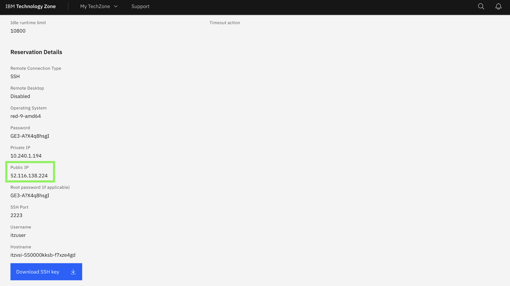
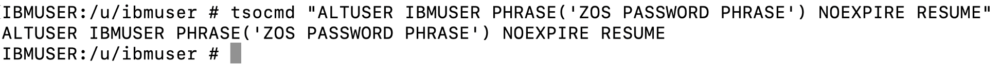

# Accessing the environments

For this Lab you will be using two different TechZone environments:

#### 1. **watsonx Orchestrate**:
A dedicated SaaS tenant of watsonx Orchestrate on IBM Cloud that you will be using to deploy and build custom agents for various Z specific use cases. 
**IBM watsonx Assistant for Z** is powered by watsonx Orchestrate, a generative AI platform for building, accessing and testing AI agents and assistants. With watsonx Assistant for Z, customers have the ability to connect their agents to a broad range of components, including IBM Z infrastructure, middleware, tools, third-party software and custom applications, forming the foundation for scalable and secure enterprise operations. 

#### 2. **Z Dev & Test for z/OS (zD&T)**:
An emulated z/OS image running on IBM Cloud which is pre-configured to simulate a running z/OS environment. The image runs locally on a Linux hypervisor, and provides a set of middleware and products, including: CICS, Db2, IMS, JES, z/OSMF, and more.  


### Logging into watsonx Orchestrate and retrieving connection details

In order to log into the ADK environment, you will need two environment details that you will locate and record in this section:

  - **WxO Service Instance URL**
  - **IBM Cloud API Key**

1. Click on the **Student URL** provided by the instructor for the **watsonx Orchestrate** environment and when prompted, enter the password. 

2. Once done, you should be taken to the environment details page for your **watsonx Orchestrate** environment.


3. As you will use **Student ID's** for accessing your cloud resource, firstly click on the **logout URL** referenced on the page:
    
    

    A pop-up window will open confirming you're logged out. You can then close that tab.

4. Navigate back to the environment details page, and record the **App ID User credentials** towards the bottom of the page. (Copy your **Username** and **Password** to a local notepad for reference). For example:
   
    

    In the above example, my Username would be `student0@techzone.ibm.com` and my Password would be `V14u8#CrmWittakd`. 

5. Then under the **App ID Instructions**, click on the `https://cloud.ibm.com/authorize/...` link in your environment details:
   
    

6. In the new tab, enter your recorded **Username** and **Password**, then click **Sign in**. 
   
    

7. Once logged in, generate a new IBM Cloud **API Key** by clicking on **Manage** --> **Access(IAM)** in the upper right hand corner. 
   
    

8. Once the appropriate Cloud account is selected from the drop-down, generate a new IBM Cloud **API Key** by clicking on **Manage** --> **Access(IAM)** in the upper right hand corner. 
   
    

9. In the **IAM** settings page, select **API keys** from the left-hand menu.
   
    

10. In the **API keys** screen, click on **Create +**. 

    

11. Enter any **Name** for your API Key and click **Create**.

    

12. You’ll then see a window appear ***“API key successfully created”***

    **IMPORTANT**: Make sure to **Download** and **Copy** your API key (this can only be retrieved once).

    

    **Copy and record your API key value in a local notepad on your workstation for later use. This will later be referenced in your agents configuration as a shared secret.**

13. Next you will retrieve and record your watsonx Orchestrate **Service Instance URL**. 
     
    After generating your API key within IBM Cloud in the previous section, click on the ‘hamburger’ menu icon in the top-left corner of the IBM Cloud window and select **Resource list**. 

    

14. Expand the **AI / Machine Learning** section and you should see the following resources available:
   
    

15. Click on the resource shown for the **watsonx Orchestrate** resource: 
    
    

16. Click **Launch watsonx Orchestrate**. 

    

17. In the watsonx Orchestrate UI, click on you **profile icon** in the top-right corner and then **Settings**.

    


16. In the Settings page, click on the **API details** tab, then **copy and record** your **Service instance URL** to a local notepad for later use.

    

    Once recorded, you can minimize the window to come back to later. 

### Set RACF Passphrase for `IBMUSER` ID on zD&T

1. Click on the **Student URL** provided by the instructor for the **zD&T** environment and when prompted, enter the password. 

2. Once done, you should be taken to the environment details page for your **zD&T** environment which will look something like this:
   
    

3. Locate and record the **Public IP** field for your environment.
   
    

4. At the bottom of the reservation page, click on **Download SSH key** to download the SSH key locally.

    

5. In order to set a new Passphrase for your IBMUSER zOS user, you will first need to SSH into z/OS USS, using port 2022.
   
    On your local machine's command line, navigate to the directory of your downloaded SSH key from the previous step, for example:

    `cd Downloads`

6. Set the permissions of your downloaded key to allow SSH access:

    `chmod 600 <ssh-key.pem>`


7. Then SSH into z/OS UNIX, by running the below command, replacing `<ssh-key.pem>` with the name of your downloaded key, and replacing `<public ip>` with the IP you recorded in the above section:

    ```
    ssh -i <ssh-key.pem> ibmuser@<public ip> -p 2022
    ```

    Once SSH'ed in successfully, you should see something similar to below:

    

8. Next, set a new zOS Passphrase for your **IBMUSER** zOS user by running the following command. This is the RACF Passphrase that you will use to log into TSO as the IBMUSER ID.
   
    Once you're SSH'ed into zOS USS, enter the following command, substituting a passphrase of your choice for the string `YOUR PASSWORD PHRASE`:

    ```
    tsocmd "ALTUSER IBMUSER PHRASE('YOUR PASSWORD PHRASE') NOEXPIRE RESUME"
    ```


    ??? Tip "Syntax rules for RACF Password Phrases (below)"
    
        - minimum length: 9 characters
        - Must contain at least 2 alphabetic characters (A - Z, a - z)
        - Must contain at least 2 non-alphabetic characters (numerics, punctuation, or special characters, including spaces)
        - Must not contain more than 2 consecutive characters that are identical
  
    **Note:** *if you typed the command yourself, be sure to include the single-quotes before and after the password.* ***Record the passphrase as it will be needed later.***

    Afterwards, you should see something similar to the following:

    

9. Exit out of z/OS USS by entering `exit` on the command-line. 
