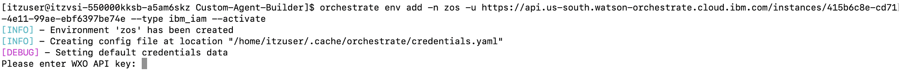
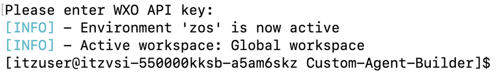
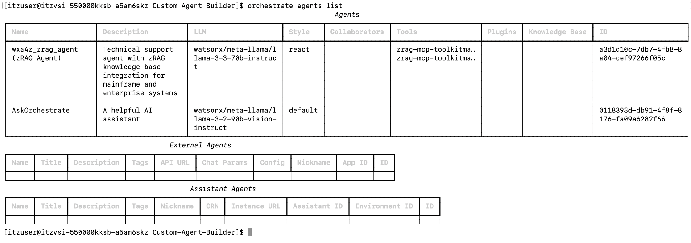

# Log into ADK environment

As mentioned previously, the ADK environment has already been setup for you with all the agent configuration files. In this section you will access the ADK command-line and log into your environment. 

Access the ADK by SSH'ing into the Linux environment hosting the watsonx Orchestrate ADK tools.

1. Previously you SSH'ed into z/OS UNIX using the SSH key you downloaded locally. You will use that same key to SSH into the Linux server. 
   
    On your local machine's command-line, **SSH into Linux** on port `2223` by running the below command, replacing `<ssh-key.pem>` with the name of your downloaded key, and replacing `<public ip>` with the IP you recorded earlier:

    ```
    ssh -i <ssh-key.pem> itzuser@<public ip> -p 2223
    ```

    You should see the following:

    

2. Navigate to the **Custom-Agent-Builder** directory on the Linux system:
   
    `cd Custom-Agent-Builder`

    

    Then type `ls` to view the configuration files.

    

3. Login and activate your ADK environment by running the following command in the Linux command-line, replacing `<your Service Instance URL>` with your unique **Service Instance URL** you recorded earlier:
   
    ```
    orchestrate env add -n zos -u <your Service Instance URL> --type ibm_iam --activate
    ```

4. After issuing the above command, you will be prompted for your **WXO API key** as shown below:

    

    **Copy and paste** the value of your **IBM Cloud API key** from the preceding steps and hit **enter**. You should then see that your environment is now active, as shown below:

    

5. Once activated, verify you’re successfully connected by running the following command to view existing agents in your environment:

    `orchestrate agents list`

    You should see the **zRAG Agent** listed which was pre-deployed for you. 

    
