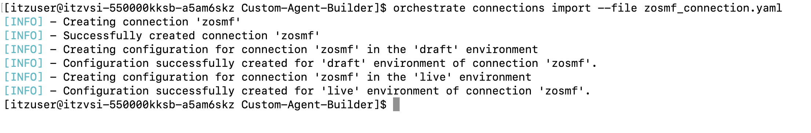
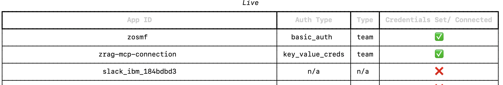

# Create connection and configure credentials

Within the **Custom-Agent-Builder** directory on Linux, you should see a `zosmf_connection.yaml` file. With watsonx Orchestrate and the ADK, connections provide a way to associate vearious tools together and assigning credentials needed for the tools to access external services on behalf of the agent. In this Lab, the tools you will use are focused on calling z/OSMF APIs to your zD&T zOS image in order to issue various commands and retrieve system details. The first step in deploying your agent is to create a connection to your zOS environment for the tools to use. 

1. Open the `zosmf_connection.yaml` file by typing the following within your **Custom-Agent-Builder** directory on Linux:
   
    ```
    nano zosmf_connection.yaml
    ```

2. Once you're viewing the file, **replace** `<public-ip>` in the `server_url` variable with the **public IP of your zD&T environment** that you recorded earlier. 
   
    

   *This must be done for the `server_url` variable in both the draft AND live sections of the file.*

3. Make sure to save the file after modifying it.
   
    To save the file, press **Ctrl+S** to save the file.

    Then exit from the editor view by clicking **Ctrl+X**.

4. Now you can import the connection to your ADK environment.

    Once back at the command-line, issue the following command to import the connection:

    ```
    orchestrate connections import --file zosmf_connection.yaml
    ```

    


5. Verify the connection was successfully imported by running the following command at the Linux command-line:
   
    ```
    orchestrate connections list
    ```

    In the output of the command, notice that your new connection is listed with *app-id* **zosmf** and that the Credentials have not yet been set (as shown below).

    

    **Note**: *you may need to scroll to the top of the connections list.*

    You will next set your connection credentials.

6. The connection credentials you provide will later be used to authenticate tools to access your environment's z/OSMF APIs. 
   
    Credentials hold the values used to authorize against external services. In the case of your previously created connection, you configured it with kind: basic which enforces username and password credentials (i.e. the username and password used by the z/OS IBMUSER ID).

    To set your connection credentials for the **draft** environment, enter the following command in the Linux command-line, replacing `<your-passphrase>` with the value of the RACF Passphrase you set earlier for **IBMUSER**.

    ```
    orchestrate connections set-credentials --app-id zosmf --env draft --username 'IBMUSER' --password '<your-passphrase>'
    ```

    For example:

    ```
    orchestrate connections set-credentials --app-id zosmf --env draft --username 'IBMUSER' --password 'YOUR PASSWORD PHRASE'
    ```

7. Next, set your connection credentials for the **live** environment by issuing the same command as above, but replace `--env draft` with `--env live`. 
   
   You should see a `Credentials successfully set...` message.

8. Now re-verify the connection with your newly set credentails by entering the following command:


    ```
    orchestrate connections list
    ```

    You should now see that your previous `zosmf` connection now has credentials set, as shown below:

    
