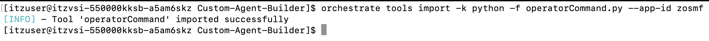

## Import the tools

Tools are essential components of agents, enabling them to perform actions such as querying data, creating documents, or executing jobs on behalf of user. Tools often require a connection to work properly, i.e. in the case of z/OSMF where the tools must authenticate before calling an API.

With the ADK, tools can be created either using OpenAPI specifications, or by using Python scripts. This section will be focused on using Python tools.

In this scenario, your ***IPL Validator Agent*** will be leveraging 2 different tools:

- ***operatorCommand***
    
    This is a Python defined tool that allows the agent to issue MVS operator commands via the z/OSMF Console API. The agent will be able to execute any operator command and receive synchronous command responses. Some examples of how it can be used include:

    - D A,L - Display active address spaces
    - D U,DASD - Display DASD usage
    - D IPLINFO - Display IPL information
    - D M=CPU - Display CPU configuration
    - F jobname,command - Modify job command


- ***tsoCommand***

    Another python defined tools that allows the agent to execute TSO commands via z/OSMF TSO/E Address Space Services API. The agent will be able to execute TSO commands on z/OS and retrieve the corresponding output from z/OS. Some examples of how it can be used include:        
    
    - TIME - Display current time and date
    - LISTDS - List dataset information
    - LISTCAT - List catalog entries
    - ALLOCATE - Allocate datasets
    - DELETE - Delete datasets
    - RENAME - Rename datasets
    - SEND - Send messages to users
    - PROFILE - Display or modify TSO profile

!!! Tip "**What about db2Command.py?**"

    In your workspace you will also see a `db2Command.py` file. This won't be used by the **IPL-validator** agent directly. But rather by a new agent that you will later create. While you will import the tool in this section, it won't be used immediately by the agent. 

In this section, you will use the provided tool files in the Linux **Custom-Agent-Builder** directory to import your agent tools for later use. 

1. From within the **Custom-Agent-Builder** directory, view the contents of the `operatorCommand.py` file by issuing the following command:
   
    ```
    nano operatorCommand.py
    ```
   
    Take some time to review the contents. Specifically, note the following section:

    ```
    get_status_url = urljoin(base_url, f'restconsoles/consoles/iserVS01')
    
    request_body = {
        "cmd": cmd,
        "sol-key": "JES"
    }
    ```

    The resulting z/OSMF API endpoint that will get called in this tool is:
    
    `https://<public-ip>:10443/zosmf/restconsoles/consoles/iserVS01`

    Within the body of the API call, `cmd` gets passed as input from the agent. Depending on the step in the IPL validation, the agent may pass `D A,L` as the command to execute, as an example. 

    Then close out of the editor view by clicking **Ctrl+X**.

2. Then do the same for the `tsoCommand.py` file and take some time to review its content as well. 

3. Import the `operatorCommand` tool by running the following command from your Linux command-line:
   
    ```
    orchestrate tools import -k python -f operatorCommand.py --app-id zosmf 
    ```

    After issuing the command, you should see a message similar to what's shown below:

    

    That indicates that the `operatorCommand` tool was imported successfully. 

4. Similarly, import the `tsoCommand` tool by running the following command:
   
    ```
    orchestrate tools import -k python -f tsoCommand.py --app-id zosmf
    ```

    Confirm that this tool was also imported successfully. 

5. Finally, import the `db2Command` tool, which is a tool used for later, by running the following command:
   
    ```
    orchestrate tools import -k python -f db2Command.py --app-id zosmf
    ```

6. Once you’ve successfully imported all 3 tools, verify they’re now active by running the following command:
    
    ```
    orchestrate tools list
    ```

    This should output a table similar to below showing all your imported tools.

    
