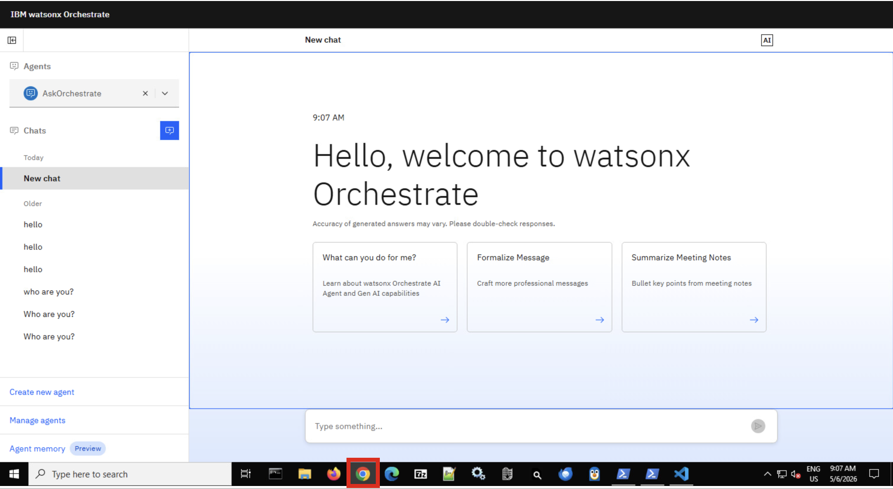
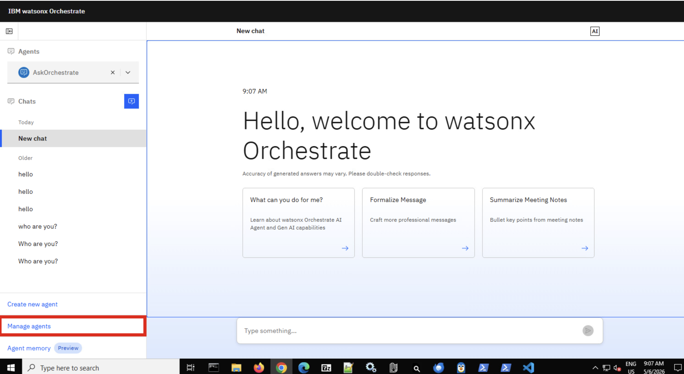
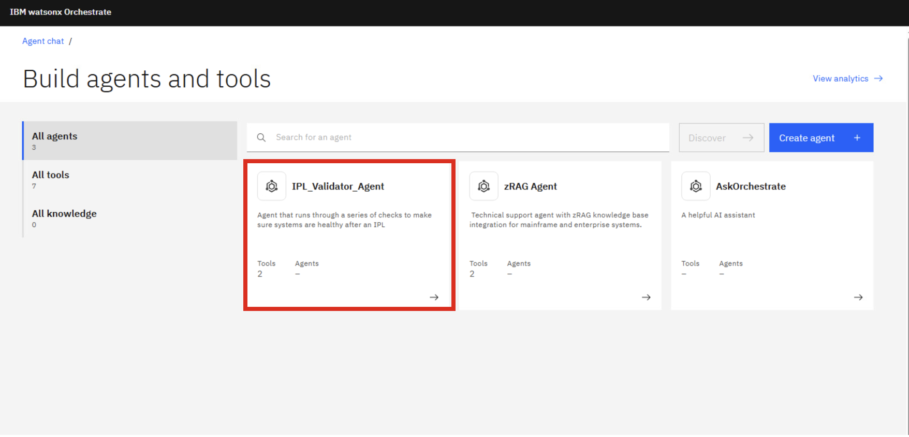

### Access the `IPL_Validator_Agent`

In this section, you will access your imported agent within your watsonx Orchestrate environment and test the agent’s execution flow. The scenario follows the following flow below, and the agent uses its two available tools to validate that your zOS system's configuration and subsystems are what you'd expect after an IPL.

1. Minimize the VS Code window you've previously been working in, then open Google Chrome. 

    You should see a pre-opened tab with the **watsonx Orchestrate UI**. 

    

2. Click on **Manage agents** to view your imported agent.

    

3. From there, you should see the list of all your existing agents, including the **IPL_Validator_Agent** you previously imported:
   
    

4. Click on your **IPL_Validator_Agent**. You'll then be taken to the Builder view for your agent, where you can see all the agent characteristics that were defined in your agent definition file, including the following:
   
    ***`Description`***
  
      {width=50%}
  
    ***`Agent style`***

  
      {width=50%}

    ***`Tools`***

      {width=50%}

    ***`Instructions`***

      {width=50%}

    
    Verify that your two tools exist and are available to your agent. 

### Test the `IPL_Validator_Agent`

Now you can test the execution flow of your agent. When the user prompts the agent to `run IPL check` or `validate my IPL` or something similar, the agent will kick off a series of steps as defined in the **Instructions** section of your agent definition. 

***In the agent chat window on the right-side of the screen, prompt the agent with `run IPL check`***. The agent will then call the appropriate tool according to the current step in the process. Wait until the agent processing is completed and the full output is returned. 

**Step 1:** The agent calls the `operatorCommand` tool, passing `D IPLINFO` as input to the tool. The results should be displayed similarly to below:

{width=50%}

**Step 2:** The agent calls the `tsoCommand` tool, passing `TIME` as the command input. This verifies that TSO is running. The output of that step should look like:

{width=50%}

**Step 3:** The agent calls the `operatorCommand` tool, passing `D OMVS` as input:

{width=50%}

**Step 4:** The agent calls the `operatorCommand` tool, passing `D OMVS,MF` as input:

{width=50%}

**Step 5:** The agent verifies if z/OSMF is running:

{width=50%}

**Step 6:** The agent checks to see if JES is running by calling the `operatorCommand` tool, passing `$D JES2` as input. 

{width=50%}

**Step 7:** The agent checks the status of JES2 by running the `operatorCommand` tool, passing `D A,JES2` as input:

{width=50%}

**Step 8:** The agent then provides a summarized list of the previous checks, with an explanation:

{width=50%}

***Congratulations! You've successfully imported and tested your first agent using the ADK with custom tools. In the following section, you will create a new custom agent using the 'low-code approach' which provides multi-agent orchestration, using other agents (including this one) as collaborators***
