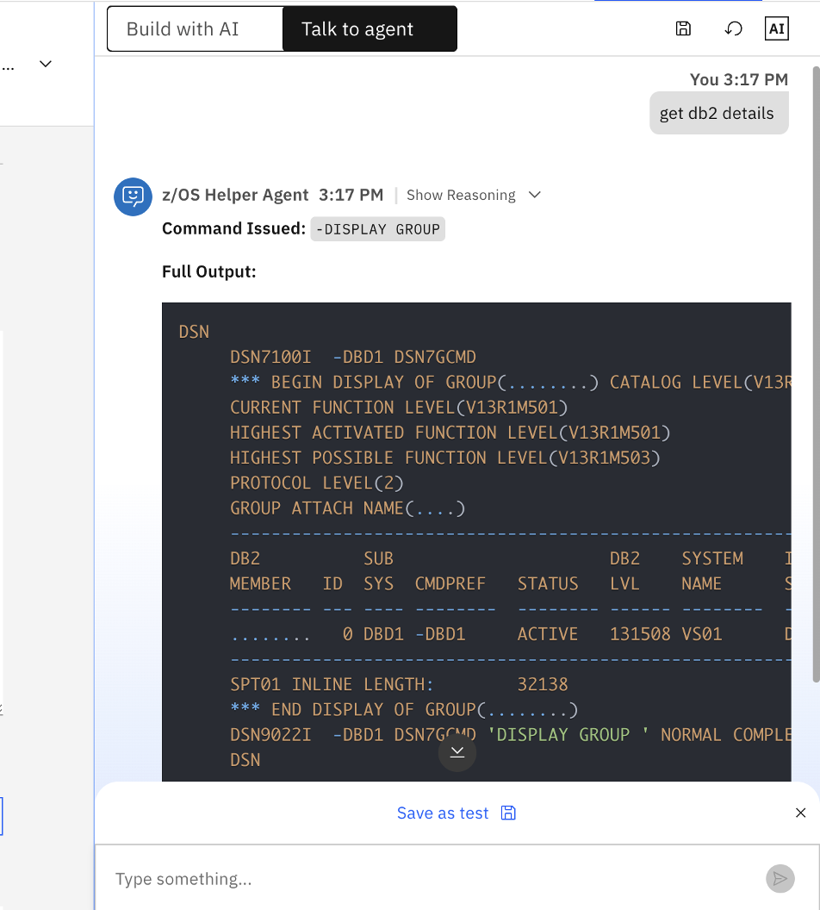
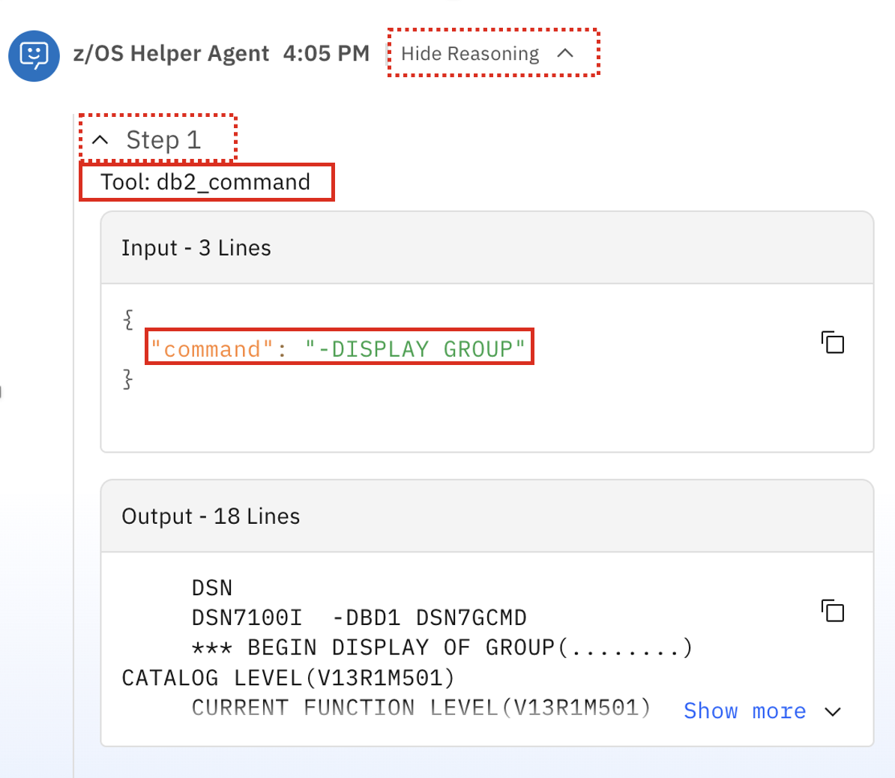
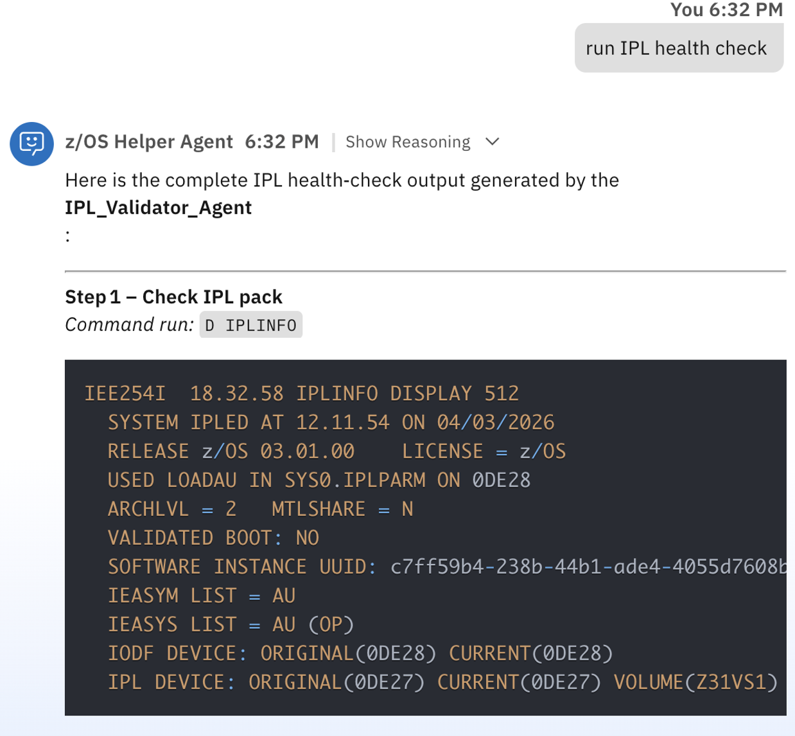

## Multi-agent Collaboration

Now that you have your `IPL_Validator_Agent` created using the ADK, you will now create an **Orchestrator Agent** via the Agent Builder Experience (WxO UI) that provides multi-agent orchestration in order to accomplish various tasks. 

In this scenario, you will create an agent named **z/OS Helper Agent** that collaborates with:

- `IPL_Validator_Agent` 
  - **Purpose**: to provide post-IPL health checks
- `zRAG Agent` which you previously deployed with watsonx Assistant for Z
  - **Purpose**: to retrieve commands used to display certain information about the Db2 for z/OS subsystem
- `db2Command` tool you previously imported in order to run Db2 for z/OS commands using the DSN TSO/E interface

### Creating your new agent within watsonx Orchestrate

The steps in this section assume you're already logged into the watsonx Orchestrate UI. 

1. From the **Agent chat** window, click on the hamburger menu icon and select **Build**

    {width=50%}


2. Click on **Create agent** in the top-right corner.

    {width=50%}

3. Select **Create from scratch**
   
    - In the **Name** field, give your agent a descriptive name that describe it's functionality. For this scenario, name your agent: `z/OS Helper Agent`
    - In the **Description**, copy and paste:
      ```
      Agent that runs various z/OS and Db2 commands to retrieve information, and leverages the zRAG to retrieve command syntax. 
      ```
    - Then click **Create**

        {width=50%}

4. Scroll down to the **Agent style** section. Select the **React** style. This style of agent allows the LLM to learn and refine its behavior. 

    {width=50%}

5. The first tool you'll test to build the scenario is the `db2Command` tool. 

    Scroll down to the **Tools** section and click **Add tool**. 

    {width=50%}

    Select **Local Instance**, as you have already imported the `db2Command` tool into your instance previously. 

    {width=50%}

    Then select the **db2Command** tool from the list and then click **Add to agent**. 

    {width=50%}

    You should then see the `db2Command` tool added to your new agent's tool list. 

    {width=50%}


### Testing the `db2Command` tool

In this step of the scenario, you will firstly test the usage of the `db2Command` tool by adding **Instructions** that define the behavior of your agent. In order to test the agent's execution of the tool, you will add very simple instructions to ensure the tool works as expected and returns the relevant output. 

1. Scroll down to the **Behavior** section. In the **Instructions field**, copy and paste the following text:
   
    ```
    You are going to run various Db2 for z/OS commands using the tools you have available to issue DISPLAY commands via TSO/E REST API’s and return the command output back to the user. You will print out to the user what command you’re issuing and the full output of the command in a pretty format. ALWAYS INCLUDE THE FULL OUTPUT OF EACH COMMAND. 

    DO NOT GUESS. DO NOT SPECULATE. ONLY USE THE INFORMATION RETURNED FROM RUNNING YOUR TOOLS

    When the user asks to "get db2 details", use the "db2Command" tool, passing the "-DISPLAY GROUP" command as input. Then return the full output back to the user. 
    ```

    {width=50%}

    The purpose is to test that the `db2Command` tool works as expected.

2. Once done, click on the agent chat window on the right-side of the screen, and issue the prompt: `get db2 details`

    {width=50%}

3. Wait until the full output is returned. It should look something like this:
  
    {width=50%}

    In the output, it should show details about the Db2 for z/OS subsystem, including:

    - Current Function Level
    - Highest Activated Function Level
    - Subsystem ID
    - Status
    - Db2 Level
    - IRLM Proc

4. At the top of the response, click on **Show reasoning**, then **Step 1**. 
   
    Notice the tool that's listed (`db2Command`) and the **command** that was used as input (`-DISPLAY GROUP`).
    
    {width=50%}

    This command was of course hard-coded in the **Instructions** you used previously. But in the next section you will enable dynamic command inputs according to what the user would like to retrieve. 

### Enabling `zRAG Agent` collaboration

In the previous sub-section, you successfully tested the execution and behavior of your tool using a hard-coded Db2 for z/OS command. 

Now you will enable a workflow where the user can tell the agent what information they'd like to view, and then the agent will retrieve the relevant command to then pass to the tool as input. To accomplish this, you will be leveraging the `zRAG Agent` for agent collaboration. The zRAG Agent is one of the **pre-built Agents supported with watsonx Assistant for Z.**

**For the purpose of this lab, the zRAG Agent was already deployed to your environment.**


1. In the **Agents** section of the Agent builder screen, click **Add agent**. 

    {width=50%}

2. Then select **Local instance** as you already deployed your **zRAG Agent**. 

    {width=50%}


3. From the list, select the **zRAG Agent** and click **Add to agent**. 

    {width=50%}


4. Once done, you should now see your **zRAG Agent** added as a collaborator to your **z/OS Helper Agent**. 


    {width=50%}

5. Next, scroll back down to the **Instructions** text field, and modify the instructions. 

    In your existing instructions, the last section you had previously added was:

    ```
    When the user asks to "get db2 details", use the "db2Command" tool, passing the "-DISPLAY GROUP" command as input. Then return the full output back to the user. 
    ``` 

    This was used to hard-code the input command to the tool. Instead, **replace that section with the following**:

    ```
    If the user asks to get or display information about Db2, call the "zRAG Agent" collaborator agent, passing the user's exact query to the agent. Wait until the zRAG Agent finishes generating a response, then return the exact response back to the user. Then extract the relevant command from the output and display it back to the user. Ensure that every Db2 command begins with "-", i.e. "-DISPLAY GROUP". THEN, pass that command as input to the "db2Command" tool. Wait until the full output is returned, then return the full output back to the user in a pretty, structured, line-by-line format. DISPLAY THE OUTPUT EXACTLY AS THE TOOL RETURNS IT WITH LINE BREAKS.    
    ```

    Now, the full set of agent **Instructions** should look like the following:

    ```
    You are going to run various Db2 for z/OS commands using the tools you have available to issue DISPLAY commands via TSO/E REST API’s and return the command output back to the user. You will print out to the user what command you’re issuing and the full output of the command in a pretty format. ALWAYS INCLUDE THE FULL OUTPUT OF EACH COMMAND. 

    DO NOT GUESS. DO NOT SPECULATE. ONLY USE THE INFORMATION RETURNED FROM RUNNING YOUR TOOLS

    If the user asks to get or display information about Db2, call the "zRAG Agent" collaborator agent, passing the user's exact query to the agent. Wait until the zRAG Agent finishes generating a response, then return the exact response back to the user. Then extract the relevant command from the output and display it back to the user. Ensure that every Db2 command begins with "-", i.e. "-DISPLAY GROUP". THEN, pass that command as input to the "db2Command" tool. Wait until the full output is returned, then return the full output back to the user in a pretty, structured, line-by-line format. DISPLAY THE OUTPUT EXACTLY AS THE TOOL RETURNS IT WITH LINE BREAKS.    
    ```

    These new set of **Instructions** will enable dynamic command input mapping. The tool execution would follow the below flow:

    - The user asks the **z/OS Helper Agent** to display certain information from the Db2 for z/OS subsystem.
    - The Agent then retrieves the relevant command by routing the query to the **zRAG Agent**.
    - The **zRAG Agent** then uses it's available tools to search the back-end watsonx Assistant for Z RAG documentation and return a response including the relevant command the user inquired about. 
    - Once the command is determined, the **z/OS Helper Agent** will pass that command as input to the **db2Command** tool to execute the command via the **DSN TSO/E** interface. 
    - Full output is returned back to the end-user. 

6. Now, test the new flow by click on the Agent Chat in the right-side of the screen and prompt the agent. 
   
    Previously, you had hard-coded the `-DISPLAY GROUP` command as input to the tool. Now let's see what happens if we instead tell the agent what we want to retrieve and allow it to determine the command on its own. 

    Prompt the agent with the following query:
    ```
    display information about my Db2 subsystem catalog and function levels 
    ```

    {width=50%}
    
    **NOTE:** You may need to restart the conversation....

7. View the full output of the response. 
   
    {width=50%}
    

    Notice the command that was issued and the full response - it should be similar to the previous query when "-DISPLAY GROUP" was hard-coded. 

8. At the top of the response, click on **Show reasoning**. 
   
    You should see that there were three steps executed:

    {width=50%}

    
    **Step 1:** Expanding Step 1, you should see the following:

    {width=50%}


    The **z/OS Helper Agent** first sent the user's query to it's collaborator agent (**zRAG Agent**).

    **Step 2:** The **zRAG Agent** then invoked its **zrag_retriever** tool with the same query in order to search the zRAG database for the relevant information and return the corresponding Db2 for z/OS command. 

    {width=50%}


    **Step 3:** The retrieved command is then passed as input to the **db2Command** tool to execute the same exact command as you previously hard-coded. 

    {width=50%}


    Then the output of the command is returned back to the user. 
9. Lets test some more example queries. 
    
     Now, prompt the agent with the following:

    ```
    display all my Db2 for z/OS bufferpools
    ```
   
    Once the full query is completed, you should see something like the following:

    {width=50%}

    We can see that the retrieved command was `-DISPLAY BUFFERPOOL` and the output is returned. 

    Similarly to before, expand the **Show reasoning** steps to review the flow.

10. Test another agent prompt:
    
    ```
    Display all defined databases
    ```

    The output should look similar to what's shown below:

    {width=50%}

    For that query, the agent determined that the `-DISPLAY DATABASE(*)` command was the appropriate command to use.

11. Lastly, test the following prompt:
    
    ```
    display information regarding the status and configuration of DDF
    ```

    The output should look similar to what's shown below:

    {width=50%}

    For that query, the agent determined that the `-DISPLAY DDF` command was the appropriate command to use. 

***Congratulations! You've successfully set up an agent collaboration use case and tested it. If time allows, continue testing other types of queries or altering the instructions***. 


### Enabling `IPL Validator Agent` collaboration

The last step in the scenario is to enable collaboration with the previous **IPL Validator Agent** you imported using the ADK. 

1. To accomplish this, navigate to the **Agents** section of the Agent builder UI and click on **Add agent**.

    {width=50%}


2. Then select **Local instance**. From the list, select your **IPL Validator Agent** and click **Add to agent**. 

    {width=50%}


3. Once done,you should now see your **IPL Validator** agent added as a collaborator (in addition to the previously added **zRAG Agent**).
   
    {width=50%}


4. You will lastly need to modify the **Instructions** to prioritize collaboration. 
   
    Navigate back to the **Instructions** field and append the following section to the existing set of Instructions:

    ```
    When the user asks something about running an "IPL check" or a "health check", route the request to the "IPL_Validator_Agent". Wait until the agent finishes all steps in the process, then display the EXACT and COMPLETE output from the agent back to the user.
    ```

5. Once modified, test your agent by entering the following query:

    ```
    run IPL health check
    ```
    
6. When the agent completes the response, it should look something like what's shown below:
  
    {width=50%}
    

    It should look very similar to what was returned from the **IPL Validator Agent** in the previous section. 

7. Click on **Show reasoning** to view the steps in the reasoning process. 


### Publish your `z/OS Helper Agent` 

If you're satisfied with the behavior of your agent, you can now publish it to the **Live** version. This makes it available across all your deployed channels in order to make it accessible to end-users. 

Follow the steps below to deploy your agent. 

1. Within the Agent Builder UI of your **Draft** agent, click on **Deploy** in the top-right corner.
   
    {width=50%}

2. On the **Pre-deployment summary** page, click **Deploy** once more. 
   

    {width=50%}

3. After waiting a few seconds, you should then get a success message as shown below. Click on **Maybe later**:
   
    {width=50%}

4. Then navigate to your deployed agent by clicking on the hamburger menu and selecting **Chat**. 

    {width=50%}

5. Finally, click on the **Agents** drop-down menu and select your deployed agent. 
   
    {width=50%}