# Hands-on Lab

**IBM® watsonx Assistant for Z** leverages generative AI solutions to simplify and optimize the way developers, operators, and programmers interact and manage the IBM Z® platform. A key part of the solution is a set of capabilities that enable conversational AI, featuring advanced agentic AI to drive greater productivity and operational efficiency. It provides intelligent, data-driven automation that understands conversational context and navigates complex, multi-step interactions.

## Key features of watsonx Assistant for Z agents

#### Foundational agentic framework
A scalable architecture designed to support the creation and management of AI agents across the mainframe ecosystem. It features multi-agent orchestration, enabling seamless collaboration between AI agents and assistants to automate complex workflows. The framework also provides an environment to run the agents and simplifies the deployment of pre-built watsonx Assistant for Z agents, IBM Z product agents, and custom third-party agents.

#### Agent integration services
Integration services allow agents to interact with the operating system or middleware to retrieve the data they need for making informed decisions. This includes support for integration with Model Context Protocol (MCP) servers, simplifying the process of importing external tools and extending the capabilities of your agents.

#### AI agent builder experience
The enhanced Agent Builder empowers teams to develop custom agents for a wide range of workflows from simple tasks to complex processes. It includes:

- A no-code interface for rapid creation of task-specific agents
- pro-code Agent Development Kit (ADK) for building advanced agent capabilities

#### Accelerated value with pre-built AI agents
Watsonx Assistant for Z includes a suite of pre-built AI agents and services, enabling teams to achieve immediate productivity gains. Customers also have the flexibility to create their own AI agents or leverage pre-built agents provided by IBM Z software products. These agents, embedded with AI chat capabilities, support decision-making and automate workflows using the watsonx Assistant™ for Z agentic AI framework. Developed across the IBM Z software stack, these agents offer an extensive set of capabilities to streamline operations and accelerate outcomes.

## Agent Development Kit (ADK)

Built on top of IBM watsonx Orchestrate, the watsonx Assistant for Z offering also enables flexible agent development for all users, empowering both business users and developers with a unified studio supporting low-code and pro-code development for key Z-specific use cases.

The **watsonx Orchestrate Agent Development Kit (ADK)** is a set of tools designed to make it easy to build and deploy agents. It is packaged as a Python library and command-line tool that allows builders to configure agents that run on the platform. The ADK also supports integrating agents and tools built on other frameworks.

The Agent Development Kit (ADK) is set of CLI utilities and python modules that helps you create agents and tools for watsonx Orchestrate.

The ADK also provides a framework for developers to easily define new tools and agents programmatically.

1. Tools are defined using one of the available binding types (Python, OpenAPI, MCP, etc.) and then imported into the Orchestrate platform using the Orchestrate CLI.

2. Agents are defined using the ADK and then imported into the Orchestrate platform using the Orchestrate CLI. Agents use the tools defined in step 1.

3. Once an agent is imported, it can be used to start conversations with users either through the Orchestrate Agent Chat UI or through the Orchestrate API.

For more information on the ADK, reference the ADK documentation **<a href="https://developer.watson-orchestrate.ibm.com/" target="_blank">here</a>**.


## Lab Overview

For this Hands-on Agent Builder Lab, you will build multiple agents augmented with tools for calling various z/OSMF REST API endpoints to assist in verifying the status and health of different z/OS components. 

You will first build an ***IPL Validator Agent*** using the **pro-code** ADK approach which has two different pre-defined tools available to it. 

Following the successful deployment and testing of this agent, you will then create a new Orchestrator Agent using the **low-code** approach which will enable multi-agent collaboration. This agent, named the **z/OS Helper Agent**, will collaborate with the previously created **IPL Validator Agent** as well as the **zRAG Agent** which is a pre-built agent included in watsonx Assistant for Z and is being made available to you as part of the Lab. 

This hands-on lab shows how easy it is to create your own agents for key IBM Z use cases, in addition to the set of pre-built Z agents that ship with the product.

The steps you will execute include:

- Installing and setting up your local ADK environment
- Configuring a connection and setting credentials
- Importing the provided tools
- Importing and testing the `IPL_Validator_Agent`
- Creating a custom `z/OS Helper Agent` which is an orchestrator agent with collaborator agents and additional tools


## Accessing the environments

For this Lab you will be using two different TechZone environments:

#### 1. **watsonx Orchestrate**:
A dedicated SaaS tenant of watsonx Orchestrate on IBM Cloud that you will be using to deploy and build custom agents for various Z specific use cases. 
**IBM watsonx Assistant for Z** is powered by watsonx Orchestrate, a generative AI platform for building, accessing and testing AI agents and assistants. With watsonx Assistant for Z, customers have the ability to connect their agents to a broad range of components, including IBM Z infrastructure, middleware, tools, third-party software and custom applications, forming the foundation for scalable and secure enterprise operations. 

#### 2. **Z Dev & Test for z/OS (zD&T)**:
An emulated z/OS image running on IBM Cloud which is pre-configured to simulate a running z/OS environment. The image runs locally on a Linux hypervisor, and provides a set of middleware and products, including: CICS, Db2, IMS, JES, z/OSMF, and more.  


### Logging into watsonx Orchestrate and retrieving connection details

In order to log into the ADK environment, you will need two environment details that you will locate and record in this section:

  - **WxO Service Instance URL**
  - **IBM Cloud API Key**

1. Click on the **Student URL** provided by the instructor for the **watsonx Orchestrate** environment and when prompted, enter the password. 

2. Once done, you should be taken to the environment details page for your **watsonx Orchestrate** environment.


3. As you will use **Student ID's** for accessing your cloud resource, firstly click on the **logout URL** referenced on the page:
    
    

    A pop-up window will open confirming you're logged out. You can then close that tab.

4. Navigate back to the environment details page, and record the **App ID User credentials** towards the bottom of the page. (Copy your **Username** and **Password** to a local notepad for reference). For example:
   
    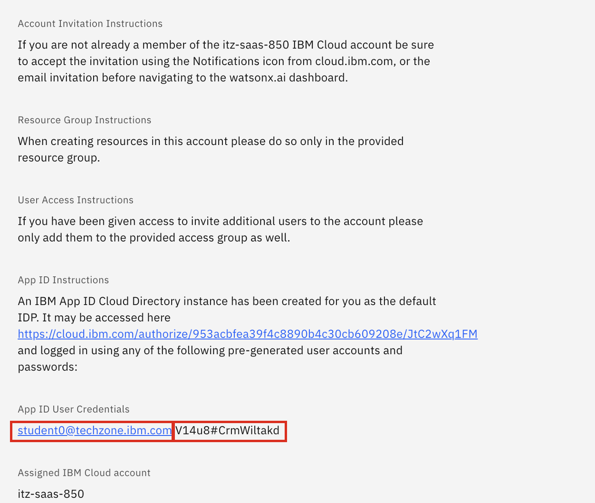

    In the above example, my Username would be `student0@techzone.ibm.com` and my Password would be `V14u8#CrmWittakd`. 

5. Then under the **App ID Instructions**, click on the `https://cloud.ibm.com/authorize/...` link in your environment details:
   
    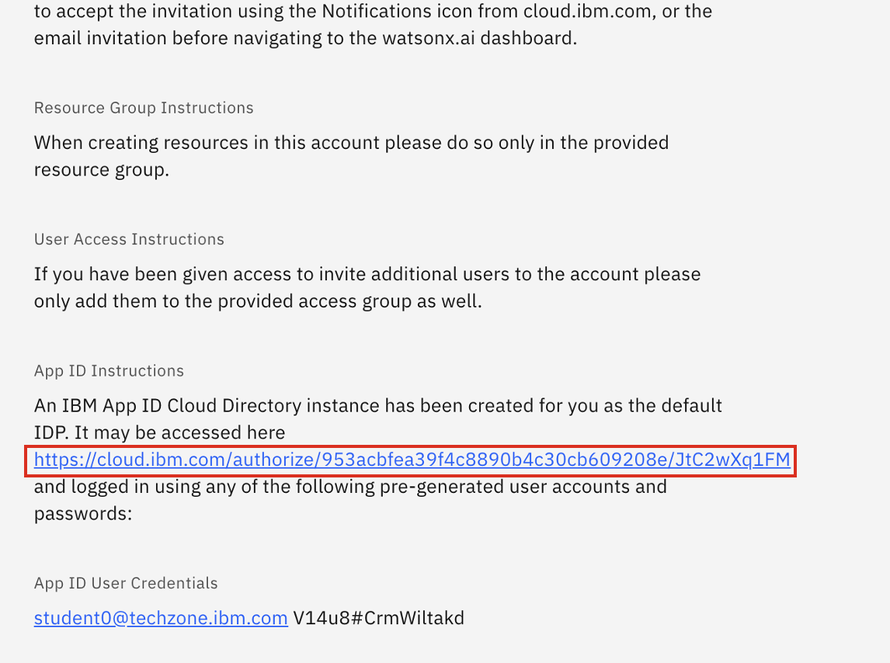

6. In the new tab, enter your recorded **Username** and **Password**, then click **Sign in**. 
   
    

7. Once logged in, generate a new IBM Cloud **API Key** by clicking on **Manage** --> **Access(IAM)** in the upper right hand corner. 
   
    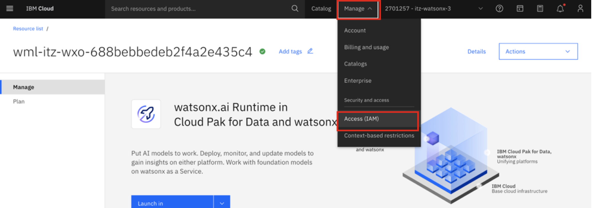

8. Once the appropriate Cloud account is selected from the drop-down, generate a new IBM Cloud **API Key** by clicking on **Manage** --> **Access(IAM)** in the upper right hand corner. 
   
    

9. In the **IAM** settings page, select **API keys** from the left-hand menu.
   
    

10. In the **API keys** screen, click on **Create +**. 

    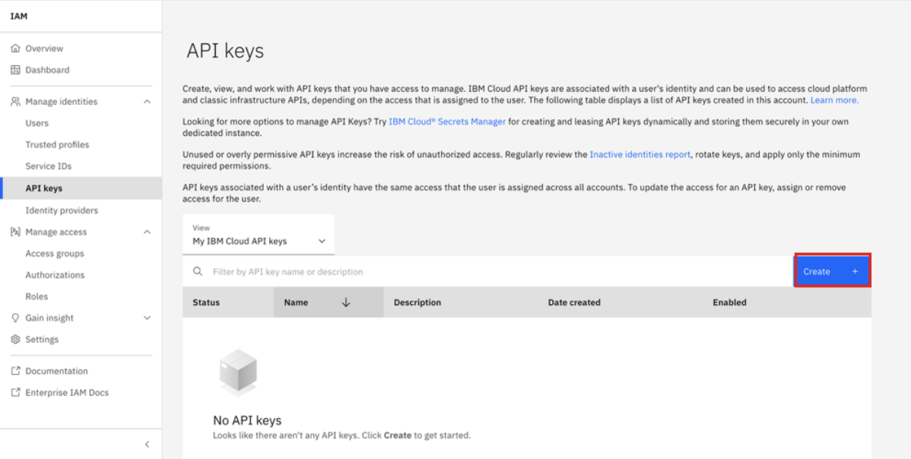

11. Enter any **Name** for your API Key and click **Create**.

    

12. You’ll then see a window appear ***“API key successfully created”***

    **IMPORTANT**: Make sure to **Download** and **Copy** your API key (this can only be retrieved once).

    

    **Copy and record your API key value in a local notepad on your workstation for later use. This will later be referenced in your agents configuration as a shared secret.**

13. Next you will retrieve and record your watsonx Orchestrate **Service Instance URL**. 
     
    After generating your API key within IBM Cloud in the previous section, click on the ‘hamburger’ menu icon in the top-left corner of the IBM Cloud window and select **Resource list**. 

    

14. Expand the **AI / Machine Learning** section and you should see the following resources available:
   
    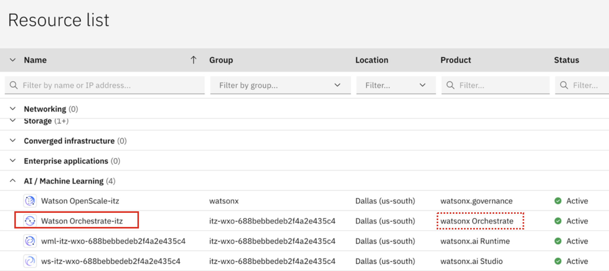

15. Click on the resource shown for the **watsonx Orchestrate** resource: 
    
    

16. Click **Launch watsonx Orchestrate**. 

    

17. In the watsonx Orchestrate UI, click on you **profile icon** in the top-right corner and then **Settings**.

    


16. In the Settings page, click on the **API details** tab, then **copy and record** your **Service instance URL** to a local notepad for later use.

    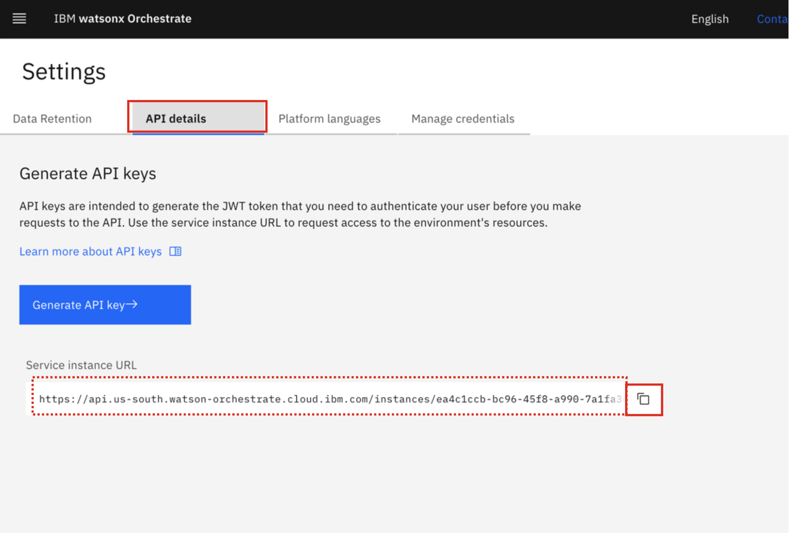

    Once recorded, you can minimize the window to come back to later. 

### Set RACF Passphrase for `IBMUSER` ID on zD&T

1. Click on the **Student URL** provided by the instructor for the **zD&T** environment and when prompted, enter the password. 

2. Once done, you should be taken to the environment details page for your **zD&T** environment which will look something like this:
   
    

3. Locate and record the **Public IP** field for your environment.
   
    

4. At the bottom of the reservation page, click on **Download SSH key** to download the SSH key locally.

    

5. In order to set a new Passphrase for your IBMUSER zOS user, you will first need to SSH into z/OS USS, using port 2022.
   
    On your local machine's command line, navigate to the directory of your downloaded SSH key from the previous step, for example:

    `cd Downloads`

6. Set the permissions of your downloaded key to allow SSH access:

    `chmod 600 <ssh-key.pem>`


7. Then SSH into z/OS UNIX, by running the below command, replacing `<ssh-key.pem>` with the name of your downloaded key, and replacing `<public ip>` with the IP you recorded in the above section:

    ```
    ssh -i <ssh-key.pem> ibmuser@<public ip> -p 2022
    ```

    Once SSH'ed in successfully, you should see something similar to below:

    

8. Next, set a new zOS Passphrase for your **IBMUSER** zOS user by running the following command. This is the RACF Passphrase that you will use to log into TSO as the IBMUSER ID.
   
    Once you're SSH'ed into zOS USS, enter the following command, substituting a passphrase of your choice for the string `YOUR PASSWORD PHRASE`:

    ```
    tsocmd "ALTUSER IBMUSER PHRASE('YOUR PASSWORD PHRASE') NOEXPIRE RESUME"
    ```


    ??? Tip "Syntax rules for RACF Password Phrases (below)"
    
        - minimum length: 9 characters
        - Must contain at least 2 alphabetic characters (A - Z, a - z)
        - Must contain at least 2 non-alphabetic characters (numerics, punctuation, or special characters, including spaces)
        - Must not contain more than 2 consecutive characters that are identical
  
    **Note:** *if you typed the command yourself, be sure to include the single-quotes before and after the password.* ***Record the passphrase as it will be needed later.***

    Afterwards, you should see something similar to the following:

    

9. Exit out of z/OS USS by entering `exit` on the command-line. 


## Log into ADK environment

As mentioned previously, the ADK environment has already been setup for you with all the agent configuration files. In this section you will access the ADK command-line and log into your environment. 

Access the ADK by SSH'ing into the Linux environment hosting the watsonx Orchestrate ADK tools.

1. Previously you SSH'ed into z/OS UNIX using the SSH key you downloaded locally. You will use that same key to SSH into the Linux server. 
   
    On your local machine's command-line, **SSH into Linux** on port `2223` by running the below command, replacing `<ssh-key.pem>` with the name of your downloaded key, and replacing `<public ip>` with the IP you recorded earlier:

    ```
    ssh -i <ssh-key.pem> itzuser@<public ip> -p 2223
    ```

    You should see the following:

    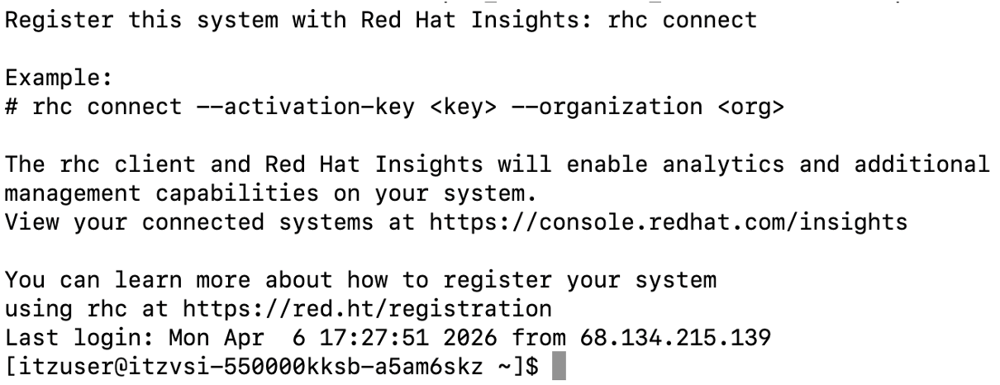

2. Navigate to the **Custom-Agent-Builder** directory on the Linux system:
   
    `cd Custom-Agent-Builder`

    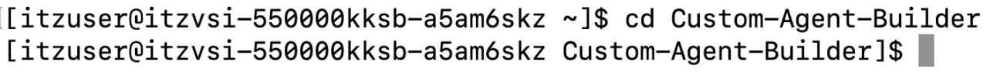

    Then type `ls` to view the configuration files.

    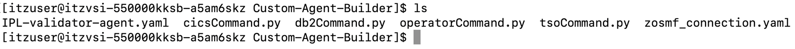

3. Login and activate your ADK environment by running the following command in the Linux command-line, replacing `<your Service Instance URL>` with your unique **Service Instance URL** you recorded earlier:
   
    ```
    orchestrate env add -n zos -u <your Service Instance URL> --type ibm_iam --activate
    ```

4. After issuing the above command, you will be prompted for your **WXO API key** as shown below:

    

    **Copy and paste** the value of your **IBM Cloud API key** from the preceding steps and hit **enter**. You should then see that your environment is now active, as shown below:

    

5. Once activated, verify you’re successfully connected by running the following command to view existing agents in your environment:

    `orchestrate agents list`

    You should see the **zRAG Agent** listed which was pre-deployed for you. 

    


## Create connection and configure credentials

Within the **Custom-Agent-Builder** directory on Linux, you should see a `zosmf_connection.yaml` file. With watsonx Orchestrate and the ADK, connections provide a way to associate vearious tools together and assigning credentials needed for the tools to access external services on behalf of the agent. In this Lab, the tools you will use are focused on calling z/OSMF APIs to your zD&T zOS image in order to issue various commands and retrieve system details. The first step in deploying your agent is to create a connection to your zOS environment for the tools to use. 

1. Open the `zosmf_connection.yaml` file by typing the following within your **Custom-Agent-Builder** directory on Linux:
   
    ```
    nano zosmf_connection.yaml
    ```

2. Once you're viewing the file, **replace** `<public-ip>` in the `server_url` variable with the **public IP of your zD&T environment** that you recorded earlier. 
   
    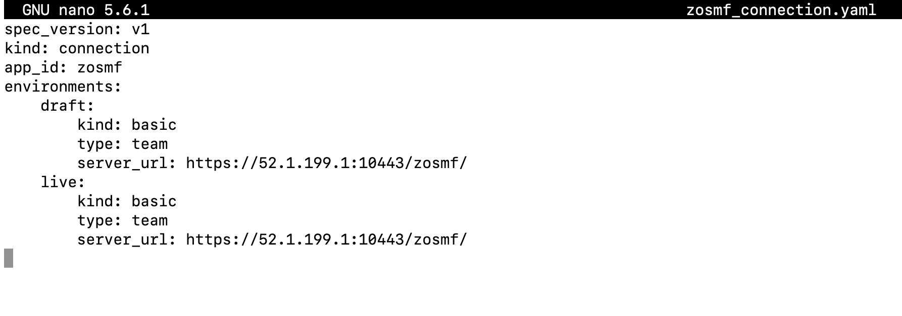

   *This must be done for the `server_url` variable in both the draft AND live sections of the file.*

3. Make sure to save the file after modifying it.
   
    To save the file, press **Ctrl+S** to save the file.

    Then exit from the editor view by clicking **Ctrl+X**.

4. Now you can import the connection to your ADK environment.

    Once back at the command-line, issue the following command to import the connection:

    ```
    orchestrate connections import --file zosmf_connection.yaml
    ```

    


5. Verify the connection was successfully imported by running the following command at the Linux command-line:
   
    ```
    orchestrate connections list
    ```

    In the output of the command, notice that your new connection is listed with *app-id* **zosmf** and that the Credentials have not yet been set (as shown below).

    

    **Note**: *you may need to scroll to the top of the connections list.*

    You will next set your connection credentials.

6. The connection credentials you provide will later be used to authenticate tools to access your environment's z/OSMF APIs. 
   
    Credentials hold the values used to authorize against external services. In the case of your previously created connection, you configured it with kind: basic which enforces username and password credentials (i.e. the username and password used by the z/OS IBMUSER ID).

    To set your connection credentials for the **draft** environment, enter the following command in the Linux command-line, replacing `<your-passphrase>` with the value of the RACF Passphrase you set earlier for **IBMUSER**.

    ```
    orchestrate connections set-credentials --app-id zosmf --env draft --username 'IBMUSER' --password '<your-passphrase>'
    ```

    For example:

    ```
    orchestrate connections set-credentials --app-id zosmf --env draft --username 'IBMUSER' --password 'YOUR PASSWORD PHRASE'
    ```

7. Next, set your connection credentials for the **live** environment by issuing the same command as above, but replace `--env draft` with `--env live`. 
   
   You should see a `Credentials successfully set...` message.

8. Now re-verify the connection with your newly set credentails by entering the following command:


    ```
    orchestrate connections list
    ```

    You should now see that your previous `zosmf` connection now has credentials set, as shown below:

    


## Import the tools

Tools are essential components of agents, enabling them to perform actions such as querying data, creating documents, or executing jobs on behalf of user. Tools often require a connection to work properly, i.e. in the case of z/OSMF where the tools must authenticate before calling an API.

With the ADK, tools can be created either using OpenAPI specifications, or by using Python scripts. This section will be focused on using Python tools.

In this scenario, your ***IPL Validator Agent*** will be leveraging 2 different tools:

- ***operatorCommand***
    
    This is a Python defined tool that allows the agent to issue MVS operator commands via the z/OSMF Console API. The agent will be able to execute any operator command and receive synchronous command responses. Some examples of how it can be used include:

    - D A,L - Display active address spaces
    - D U,DASD - Display DASD usage
    - D IPLINFO - Display IPL information
    - D M=CPU - Display CPU configuration
    - F jobname,command - Modify job command


- ***tsoCommand***

    Another python defined tools that allows the agent to execute TSO commands via z/OSMF TSO/E Address Space Services API. The agent will be able to execute TSO commands on z/OS and retrieve the corresponding output from z/OS. Some examples of how it can be used include:        
    
    - TIME - Display current time and date
    - LISTDS - List dataset information
    - LISTCAT - List catalog entries
    - ALLOCATE - Allocate datasets
    - DELETE - Delete datasets
    - RENAME - Rename datasets
    - SEND - Send messages to users
    - PROFILE - Display or modify TSO profile

!!! Tip "**What about db2Command.py?**"

    In your workspace you will also see a `db2Command.py` file. This won't be used by the **IPL-validator** agent directly. But rather by a new agent that you will later create. While you will import the tool in this section, it won't be used immediately by the agent. 

In this section, you will use the provided tool files in the Linux **Custom-Agent-Builder** directory to import your agent tools for later use. 

1. From within the **Custom-Agent-Builder** directory, view the contents of the `operatorCommand.py` file by issuing the following command:
   
    ```
    nano operatorCommand.py
    ```
   
    Take some time to review the contents. Specifically, note the following section:

    ```
    get_status_url = urljoin(base_url, f'restconsoles/consoles/iserVS01')
    
    request_body = {
        "cmd": cmd,
        "sol-key": "JES"
    }
    ```

    The resulting z/OSMF API endpoint that will get called in this tool is:
    
    `https://<public-ip>:10443/zosmf/restconsoles/consoles/iserVS01`

    Within the body of the API call, `cmd` gets passed as input from the agent. Depending on the step in the IPL validation, the agent may pass `D A,L` as the command to execute, as an example. 

    Then close out of the editor view by clicking **Ctrl+X**.

2. Then do the same for the `tsoCommand.py` file and take some time to review its content as well. 

3. Import the `operatorCommand` tool by running the following command from your Linux command-line:
   
    ```
    orchestrate tools import -k python -f operatorCommand.py --app-id zosmf 
    ```

    After issuing the command, you should see a message similar to what's shown below:

    

    That indicates that the `operatorCommand` tool was imported successfully. 

4. Similarly, import the `tsoCommand` tool by running the following command:
   
    ```
    orchestrate tools import -k python -f tsoCommand.py --app-id zosmf
    ```

    Confirm that this tool was also imported successfully. 

5. Finally, import the `db2Command` tool, which is a tool used for later, by running the following command:
   
    ```
    orchestrate tools import -k python -f db2Command.py --app-id zosmf
    ```

6. Once you’ve successfully imported all 3 tools, verify they’re now active by running the following command:
    
    ```
    orchestrate tools list
    ```

    This should output a table similar to below showing all your imported tools.

    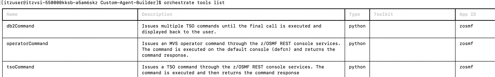

## Deploy your agent and test

In the ADK, agents can use tools to perform complex tasks defined by users. Each agent has a name and description that is configured, helping users identify each agent they can use to perform certain actions.

In this section, you will define an agent named **IPL Validator Agent** that leverages the tools you have imported into the ADK environment to help users verify the health of their z/OS system following an IPL. It will leverage two tools you've imported (`tsoCommand` and `operatorCommand`) to retrieve information about the system and provide a step-by-step summary back to the user.

1. In the Linux command-line,open the `IPL-validator-agent.yaml` file by issuing:
   
    ```
    nano IPL-validator-agent.yaml
    ```
   
2. You should then be able to see the agent definition as shown below:
   
    

    *Lets go over each of the sections...*
    
    **Section** | **Description**
    --- | ---
    kind | The kind of agent you wish to create. Options include **native** or **external** agents. In our case, we are using a **native** agent as we are building an agent from scratch and importing it directly into watsonx Orchestrate
    name | Name of the agent. In our case it is **IPL-Validator-Agent**
    llm | The Large Language Model the agent will use for reasoning and decision making. In our case we're using the `groq/openai/gpt-oss-120b` model for efficiency and performance for demos. It's important to note that only `llama-3-3-70b instruct` and `granite-3-3-8b-instruct` are officially supported by watsonx Assistant for Z at this time. 
    style | The style of agent you wish to create, which dictates it's reasoning pattern. Options include **default**, **react**, or **planner**. In our case we are using the **react** style which is perfect for multi-step tasks and complex workflows. You can learn more about agent styles here. 
    description | Agent descriptions complement agent names by providing detailed information about their purpose, capabilities, and usage. A well-written description helps users understand the agent's role and potential applications. 
    instructions | Instructions are crucial for training agents to perform their tasks efficiently. When setting instructions, it's important to consider configuring the agent's persona, context, and reasoning for using tools.
    tools | A list of tools that the agent should be able to use. In our case, we have specified 2 of the 3 tools you've imported - **operatorCommand** and **tsoCommand**
    ---

    For further details on building agents with the ADK, you can reference the ADK guide <a href="https://developer.watson-orchestrate.ibm.com/agents/overview" target="_blank">here</a>.

3. Then exit the editor view by clicking **Ctrl+X**.
   
4. Finally, deploy the agent by issuing the following command within your Linux command-line:

    ```
    orchestrate agents import -f IPL-validator-agent.yaml
    ```
5. If executed correctly, you should see a message similar to below:
   
    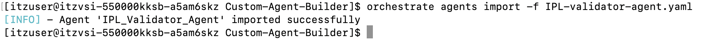

**Congratulations! You’ve deployed your first agent using the ADK and are now ready to test the execution flow**.

## Access WxO and test the agent

### Access the `IPL_Validator_Agent`

In this section, you will access your imported agent within your watsonx Orchestrate environment and test the agent’s execution flow. The scenario follows the following flow below, and the agent uses its two available tools to validate that your zOS system's configuration and subsystems are what you'd expect after an IPL.

***NOTE:*** **this step requires that you're already logged into your watsonx Orchestrate environment. You may have the UI already opened from earlier when retrieving your Service Instance URL. If so, you can skip steps 1-9 below.**

1. Click on the **Student URL** provided by the instructor for the **watsonx Orchestrate** environment and when prompted, enter the password. 

2. Once done, you should be taken to the environment details page for your **watsonx Orchestrate** environment.

3. As you will use **Student ID's** for accessing your cloud resource, firstly click on the **logout URL** referenced on the page:
    
    

    A pop-up window will open confirming you're logged out. You can then close that tab.

4. Navigate back to the environment details page, and record the **App ID User credentials** towards the bottom of the page. (Copy your **Username** and **Password** to a local notepad for reference). For example:
   
    

    In the above example, my Username would be `student0@techzone.ibm.com` and my Password would be `V14u8#CrmWittakd`. 

5. Then under the **App ID Instructions**, click on the `https://cloud.ibm.com/authorize/...` link in your environment details:
   
    

6. In the new tab, enter your recorded **Username** and **Password**, then click **Sign in**. 
   
    


7. Once logged in, navigate to the **Resource List** by clicking on the hamburger menu icon in the top-left corner and clicking on **Resources**. 
   
    

8. Expand the **AI / Machine Learning** section and you should see the following resources available:
   
    

9.  Click on the resource shown for the **watsonx Orchestrate** resource: 
    
    

10. Click **Launch watsonx Orchestrate**. 

    


10. Once you're logged into the **watsonx Orchestrate UI**, you may be taken to the **Chat** window. Click on the hamburger menu in the top-left corner and select **Build**. 
    
    

11. From there, you should see the list of all your existing agents. You should be able to see your **IPL_Validator_Agent** as shown below:
   
    {width=50%}

12. Click on your **IPL_Validator_Agent**. You'll then be taken to the Builder view for your agent, where you can see all the agent characteristics that were defined in your agent definition file, including the following:
   
   - ***Description***
  
      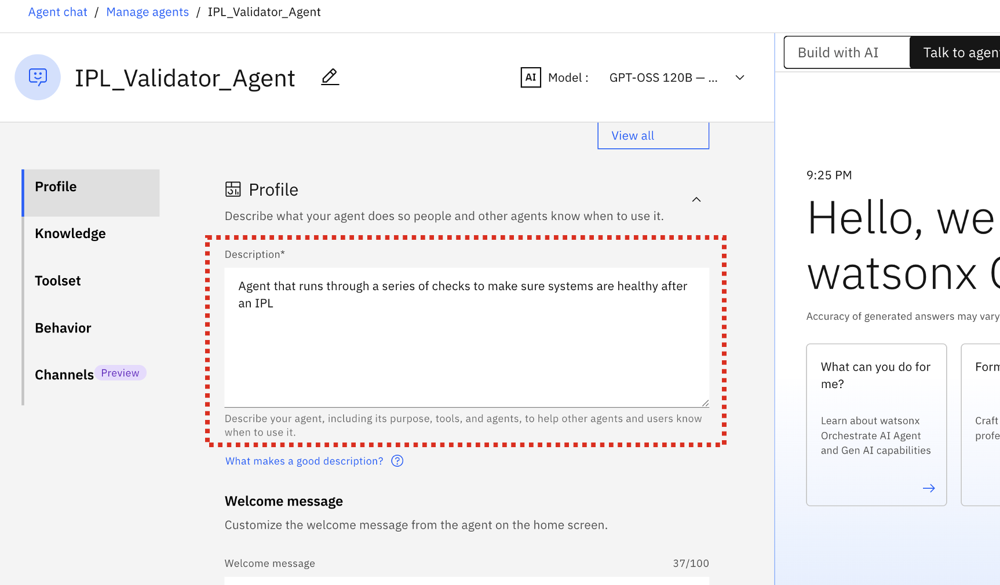{width=50%}
  
   - ***Agent style***
  
      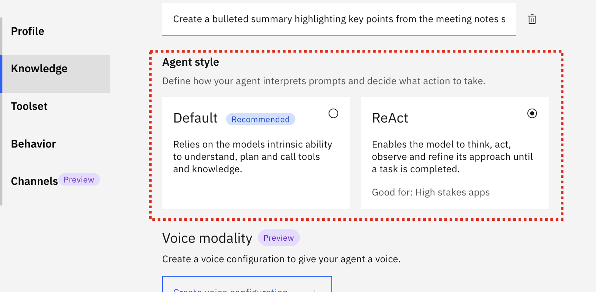{width=50%}

   - ***Tools***
      
      {width=50%}

   - ***Instructions***

      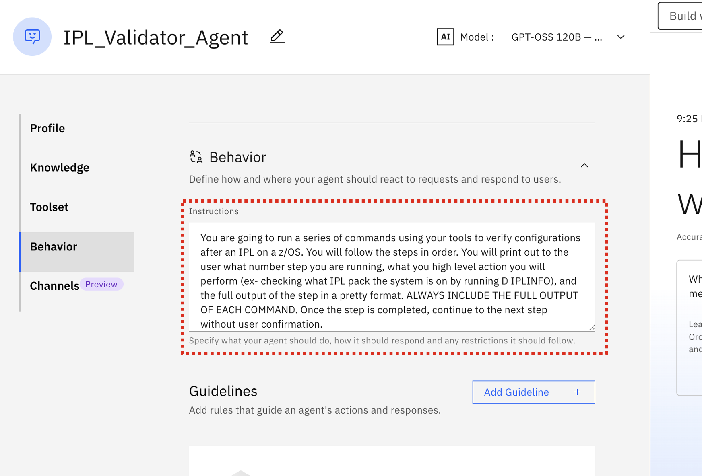{width=50%}

    
    Verify that your two tools exist and are available to your agent. 


### Test the `IPL_Validator_Agent`

Now you can test the execution flow of your agent. When the user prompts the agent to `run IPL check` or `validate my IPL` or something similar, the agent will kick off a series of steps as defined in the **Instructions** section of your agent definition. 

***In the agent chat window on the right-side of the screen, prompt the agent with `run IPL check`***. The agent will then call the appropriate tool according to the current step in the process. Wait until the agent processing is completed and the full output is returned. 

**Step 1:** The agent calls the `operatorCommand` tool, passing `D IPLINFO` as input to the tool. The results should be displayed similarly to below:

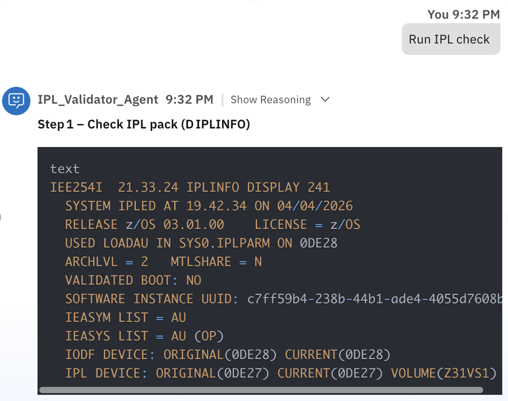{width=50%}

**Step 2:** The agent calls the `tsoCommand` tool, passing `TIME` as the command input. This verifies that TSO is running. The output of that step should look like:

{width=50%}

**Step 3:** The agent calls the `operatorCommand` tool, passing `D OMVS` as input:

{width=50%}

**Step 4:** The agent calls the `operatorCommand` tool, passing `D OMVS,MF` as input:

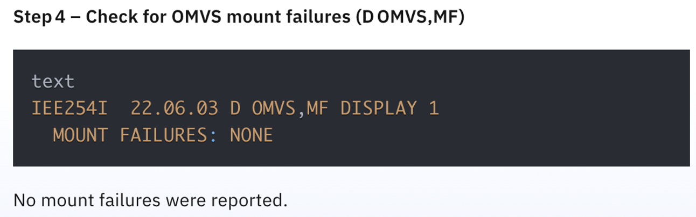{width=50%}


**Step 5:** The agent verifies if z/OSMF is running:

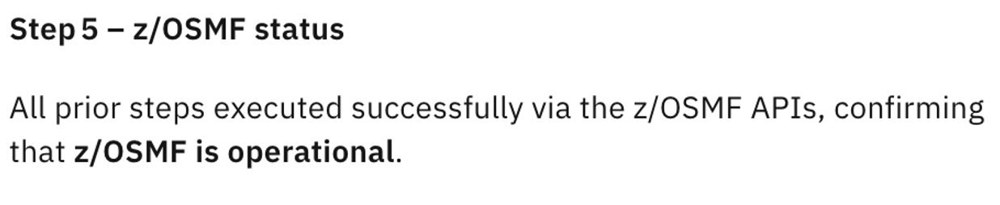{width=50%}

**Step 6:** The agent checks to see if JES is running by calling the `operatorCommand` tool, passing `$D JES2` as input. 

{width=50%}

**Step 7:** The agent checks the status of JES2 by running the `operatorCommand` tool, passing `D A,JES2` as input:

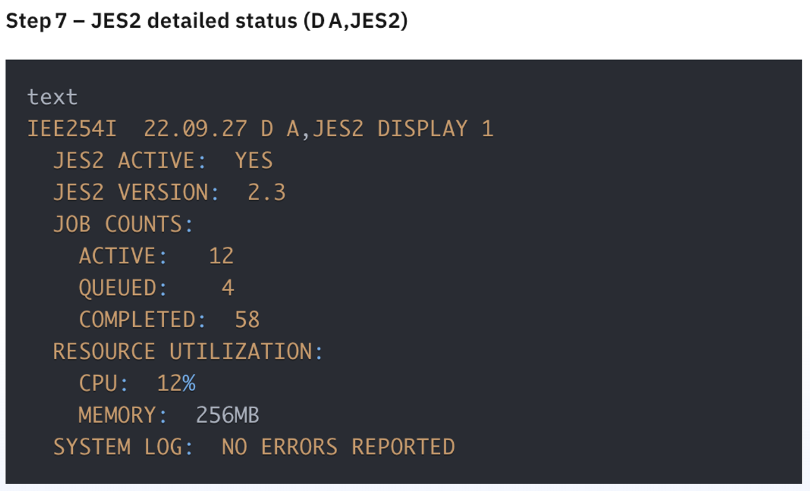{width=50%}

**Step 8:** The agent then provides a summarized list of the previous checks, with an explanation:

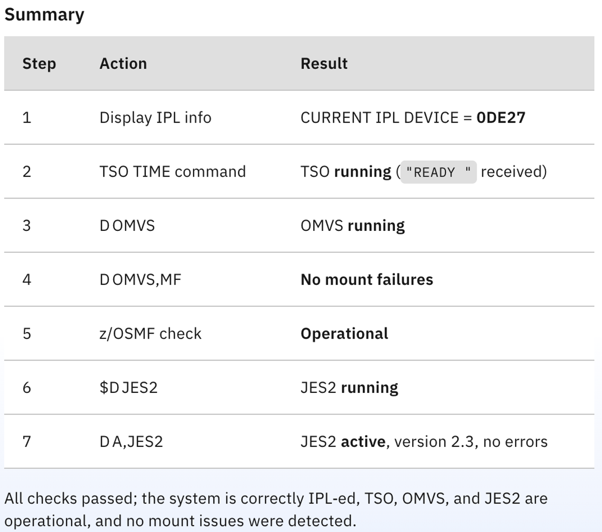{width=50%}

***Congratulations! You've successfully imported and tested your first agent using the ADK with custom tools. In the following section, you will create a new custom agent using the 'low-code approach' which provides multi-agent orchestration, using other agents (including this one) as collaborators***

## Multi-agent Collaboration

Now that you have your `IPL_Validator_Agent` created using the ADK, you will now create an **Orchestrator Agent** via the Agent Builder Experience (WxO UI) that provides multi-agent orchestration in order to accomplish various tasks. 

In this scenario, you will create an agent named **z/OS Helper Agent** that collaborates with:

- `IPL_Validator_Agent` 
  - **Purpose**: to provide post-IPL health checks
- `zRAG Agent` which you previously deployed with watsonx Assistant for Z
  - **Purpose**: to retrieve commands used to display certain information about the Db2 for z/OS subsystem
- `db2Command` tool you previously imported in order to run Db2 for z/OS commands using the DSN TSO/E interface

### Creating your new agent within watsonx Orchestrate

The steps in this section assume you're already logged into the watsonx Orchestrate UI. 

1. From the **Agent chat** window, click on the hamburger menu icon and select **Build**

    {width=50%}


2. Click on **Create agent** in the top-right corner.

    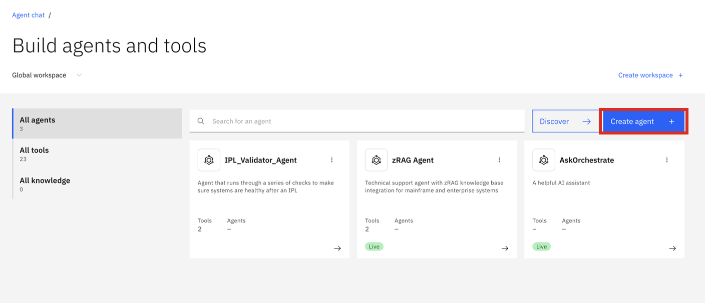{width=50%}

3. Select **Create from scratch**
   
    - In the **Name** field, give your agent a descriptive name that describe it's functionality. For this scenario, name your agent: `z/OS Helper Agent`
    - In the **Description**, copy and paste:
      ```
      Agent that runs various z/OS and Db2 commands to retrieve information, and leverages the zRAG to retrieve command syntax. 
      ```
    - Then click **Create**

        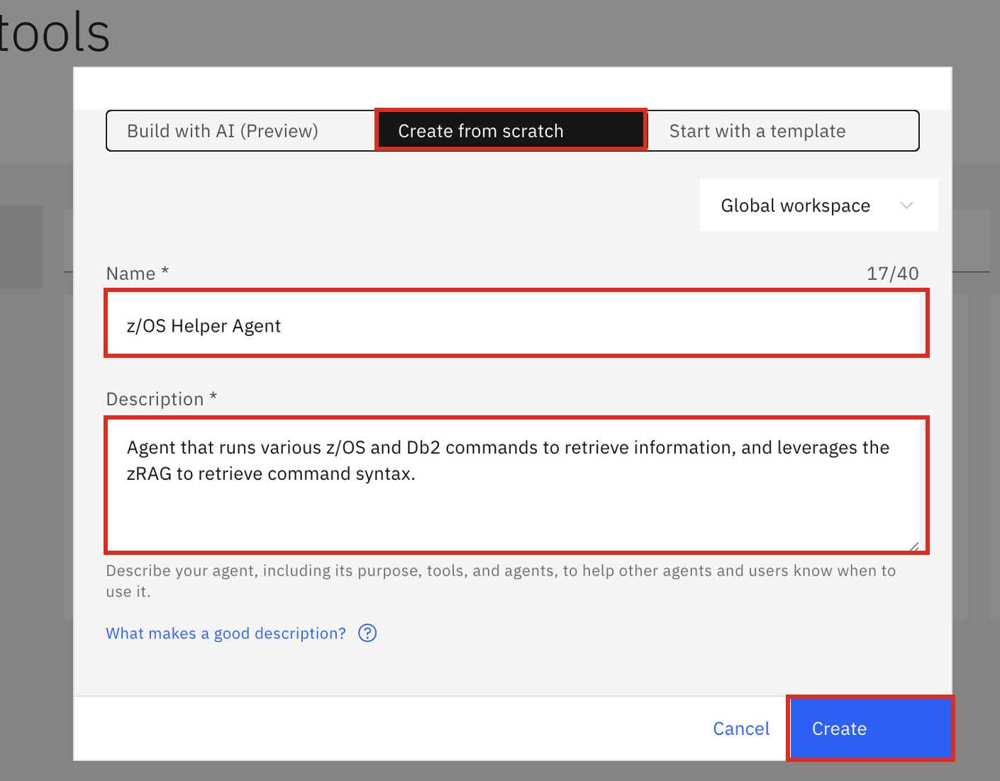{width=50%}

4. Scroll down to the **Agent style** section. Select the **React** style. This style of agent allows the LLM to learn and refine its behavior. 

    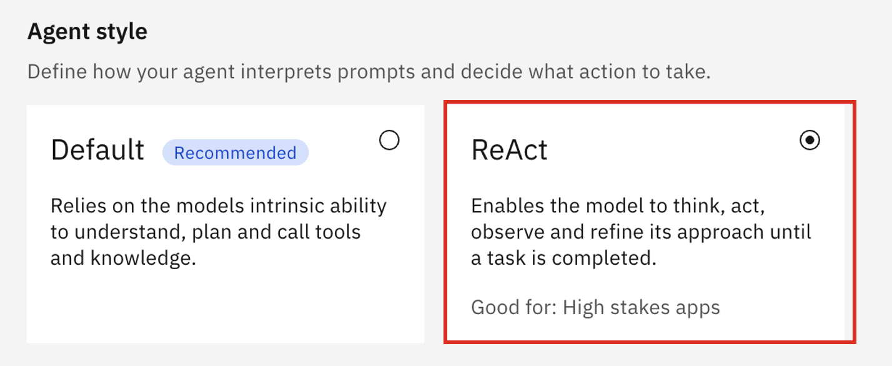{width=50%}

5. The first tool you'll test to build the scenario is the `db2Command` tool. 

    Scroll down to the **Tools** section and click **Add tool**. 

    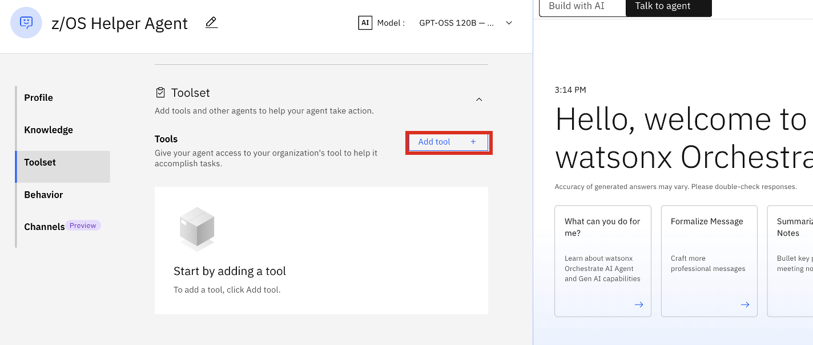{width=50%}

    Select **Local Instance**, as you have already imported the `db2Command` tool into your instance previously. 

    {width=50%}

    Then select the **db2Command** tool from the list and then click **Add to agent**. 

    {width=50%}

    You should then see the `db2Command` tool added to your new agent's tool list. 

    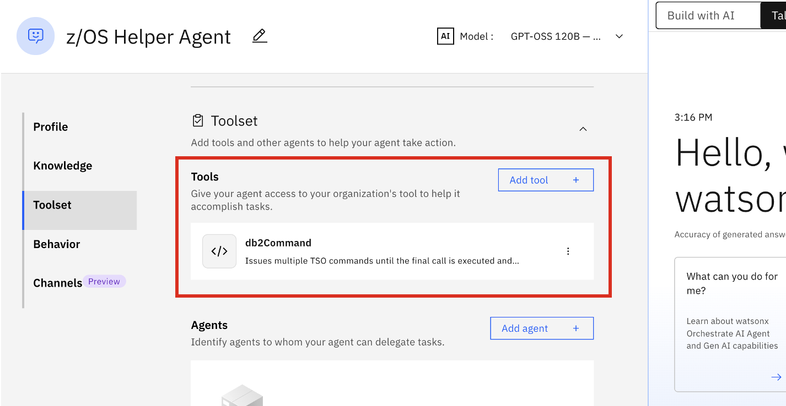{width=50%}


### Testing the `db2Command` tool

In this step of the scenario, you will firstly test the usage of the `db2Command` tool by adding **Instructions** that define the behavior of your agent. In order to test the agent's execution of the tool, you will add very simple instructions to ensure the tool works as expected and returns the relevant output. 

1. Scroll down to the **Behavior** section. In the **Instructions field**, copy and paste the following text:
   
    ```
    You are going to run various Db2 for z/OS commands using the tools you have available to issue DISPLAY commands via TSO/E REST API’s and return the command output back to the user. You will print out to the user what command you’re issuing and the full output of the command in a pretty format. ALWAYS INCLUDE THE FULL OUTPUT OF EACH COMMAND. 

    DO NOT GUESS. DO NOT SPECULATE. ONLY USE THE INFORMATION RETURNED FROM RUNNING YOUR TOOLS

    When the user asks to "get db2 details", use the "db2Command" tool, passing the "-DISPLAY GROUP" command as input. Then return the full output back to the user. 
    ```

    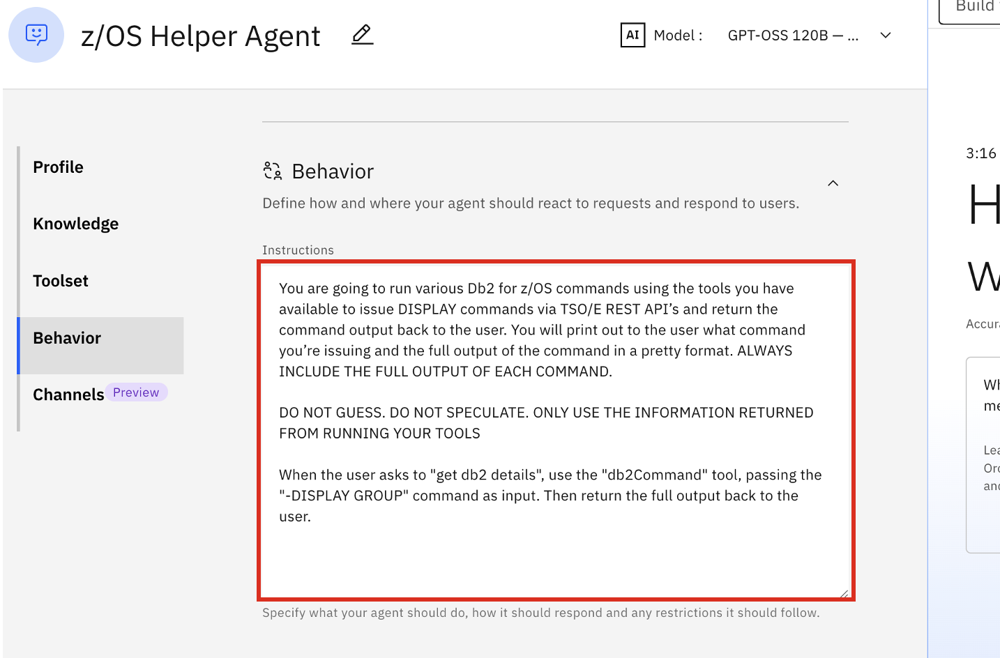{width=50%}

    The purpose is to test that the `db2Command` tool works as expected.

2. Once done, click on the agent chat window on the right-side of the screen, and issue the prompt: `get db2 details`

    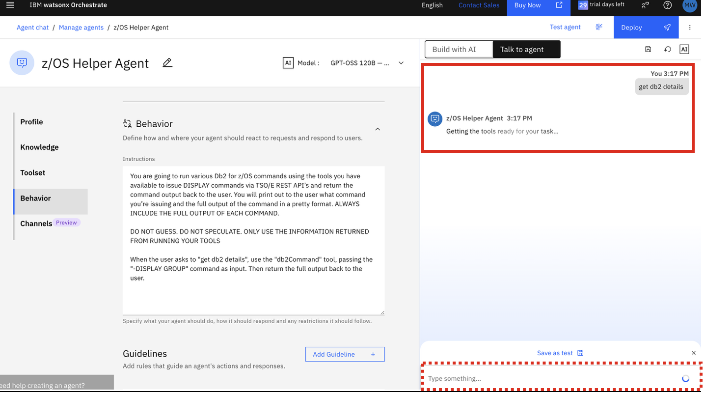{width=50%}

3. Wait until the full output is returned. It should look something like this:
  
    {width=50%}

    In the output, it should show details about the Db2 for z/OS subsystem, including:

    - Current Function Level
    - Highest Activated Function Level
    - Subsystem ID
    - Status
    - Db2 Level
    - IRLM Proc

4. At the top of the response, click on **Show reasoning**, then **Step 1**. 
   
    Notice the tool that's listed (`db2Command`) and the **command** that was used as input (`-DISPLAY GROUP`).
    
    {width=50%}

    This command was of course hard-coded in the **Instructions** you used previously. But in the next section you will enable dynamic command inputs according to what the user would like to retrieve. 

### Enabling `zRAG Agent` collaboration

In the previous sub-section, you successfully tested the execution and behavior of your tool using a hard-coded Db2 for z/OS command. 

Now you will enable a workflow where the user can tell the agent what information they'd like to view, and then the agent will retrieve the relevant command to then pass to the tool as input. To accomplish this, you will be leveraging the `zRAG Agent` for agent collaboration. The zRAG Agent is one of the **pre-built Agents supported with watsonx Assistant for Z.**

**For the purpose of this lab, the zRAG Agent was already deployed to your environment.**


1. In the **Agents** section of the Agent builder screen, click **Add agent**. 

    {width=50%}

2. Then select **Local instance** as you already deployed your **zRAG Agent**. 

    {width=50%}


3. From the list, select the **zRAG Agent** and click **Add to agent**. 

    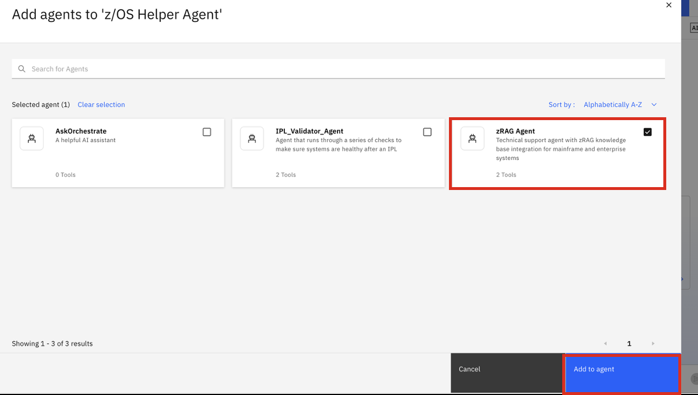{width=50%}


4. Once done, you should now see your **zRAG Agent** added as a collaborator to your **z/OS Helper Agent**. 


    {width=50%}

5. Next, scroll back down to the **Instructions** text field, and modify the instructions. 

    In your existing instructions, the last section you had previously added was:

    ```
    When the user asks to "get db2 details", use the "db2Command" tool, passing the "-DISPLAY GROUP" command as input. Then return the full output back to the user. 
    ``` 

    This was used to hard-code the input command to the tool. Instead, **replace that section with the following**:

    ```
    If the user asks to get or display information about Db2, call the "zRAG Agent" collaborator agent, passing the user's exact query to the agent. Wait until the zRAG Agent finishes generating a response, then return the exact response back to the user. Then extract the relevant command from the output and display it back to the user. Ensure that every Db2 command begins with "-", i.e. "-DISPLAY GROUP". THEN, pass that command as input to the "db2Command" tool. Wait until the full output is returned, then return the full output back to the user in a pretty, structured, line-by-line format. DISPLAY THE OUTPUT EXACTLY AS THE TOOL RETURNS IT WITH LINE BREAKS.    
    ```

    Now, the full set of agent **Instructions** should look like the following:

    ```
    You are going to run various Db2 for z/OS commands using the tools you have available to issue DISPLAY commands via TSO/E REST API’s and return the command output back to the user. You will print out to the user what command you’re issuing and the full output of the command in a pretty format. ALWAYS INCLUDE THE FULL OUTPUT OF EACH COMMAND. 

    DO NOT GUESS. DO NOT SPECULATE. ONLY USE THE INFORMATION RETURNED FROM RUNNING YOUR TOOLS

    If the user asks to get or display information about Db2, call the "zRAG Agent" collaborator agent, passing the user's exact query to the agent. Wait until the zRAG Agent finishes generating a response, then return the exact response back to the user. Then extract the relevant command from the output and display it back to the user. Ensure that every Db2 command begins with "-", i.e. "-DISPLAY GROUP". THEN, pass that command as input to the "db2Command" tool. Wait until the full output is returned, then return the full output back to the user in a pretty, structured, line-by-line format. DISPLAY THE OUTPUT EXACTLY AS THE TOOL RETURNS IT WITH LINE BREAKS.    
    ```

    These new set of **Instructions** will enable dynamic command input mapping. The tool execution would follow the below flow:

    - The user asks the **z/OS Helper Agent** to display certain information from the Db2 for z/OS subsystem.
    - The Agent then retrieves the relevant command by routing the query to the **zRAG Agent**.
    - The **zRAG Agent** then uses it's available tools to search the back-end watsonx Assistant for Z RAG documentation and return a response including the relevant command the user inquired about. 
    - Once the command is determined, the **z/OS Helper Agent** will pass that command as input to the **db2Command** tool to execute the command via the **DSN TSO/E** interface. 
    - Full output is returned back to the end-user. 

6. Now, test the new flow by click on the Agent Chat in the right-side of the screen and prompt the agent. 
   
    Previously, you had hard-coded the `-DISPLAY GROUP` command as input to the tool. Now let's see what happens if we instead tell the agent what we want to retrieve and allow it to determine the command on its own. 

    Prompt the agent with the following query:
    ```
    display information about my Db2 subsystem catalog and function levels 
    ```

    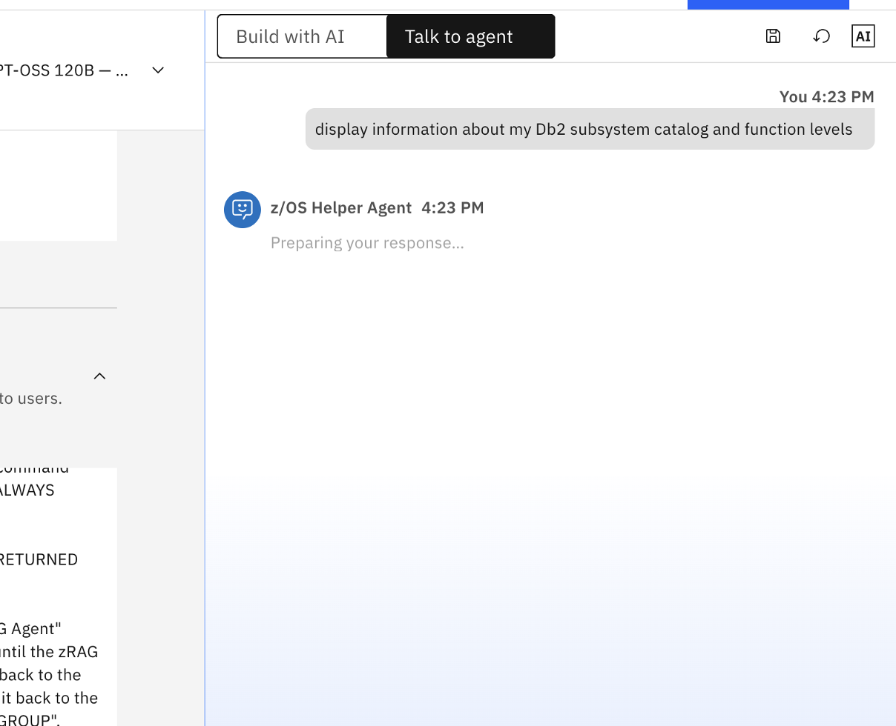{width=50%}
    
    **NOTE:** You may need to restart the conversation....

7. View the full output of the response. 
   
    {width=50%}
    

    Notice the command that was issued and the full response - it should be similar to the previous query when "-DISPLAY GROUP" was hard-coded. 

8. At the top of the response, click on **Show reasoning**. 
   
    You should see that there were three steps executed:

    {width=50%}

    
    **Step 1:** Expanding Step 1, you should see the following:

    {width=50%}


    The **z/OS Helper Agent** first sent the user's query to it's collaborator agent (**zRAG Agent**).

    **Step 2:** The **zRAG Agent** then invoked its **zrag_retriever** tool with the same query in order to search the zRAG database for the relevant information and return the corresponding Db2 for z/OS command. 

    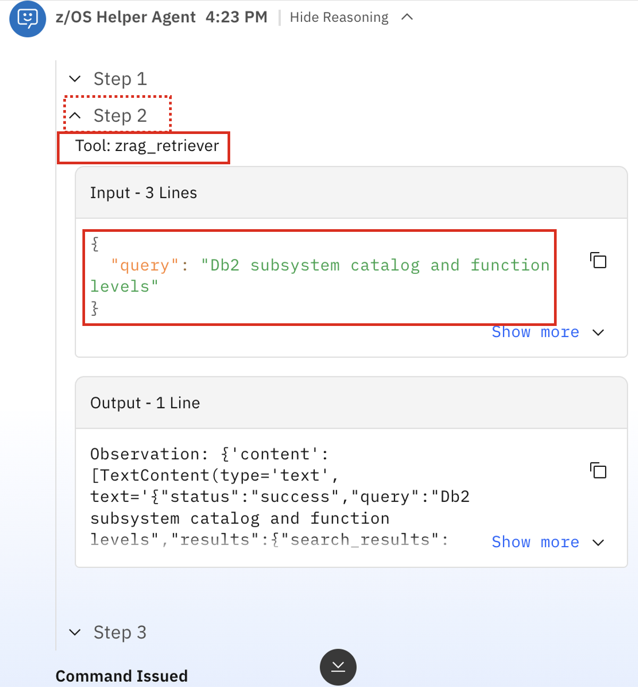{width=50%}


    **Step 3:** The retrieved command is then passed as input to the **db2Command** tool to execute the same exact command as you previously hard-coded. 

    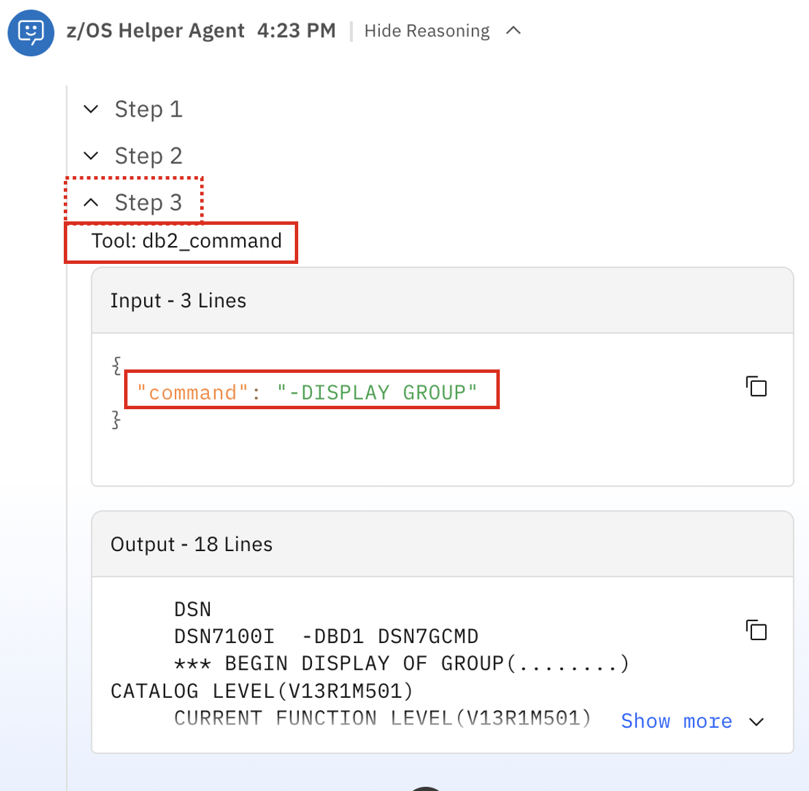{width=50%}


    Then the output of the command is returned back to the user. 
9. Lets test some more example queries. 
    
     Now, prompt the agent with the following:

    ```
    display all my Db2 for z/OS bufferpools
    ```
   
    Once the full query is completed, you should see something like the following:

    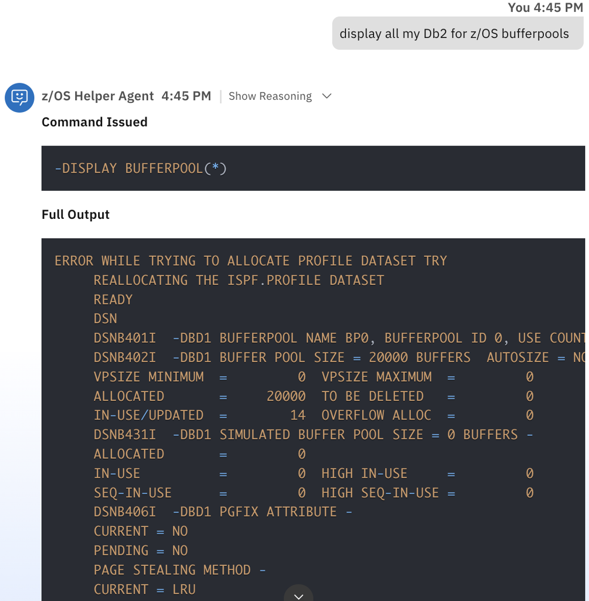{width=50%}

    We can see that the retrieved command was `-DISPLAY BUFFERPOOL` and the output is returned. 

    Similarly to before, expand the **Show reasoning** steps to review the flow.

10. Test another agent prompt:
    
    ```
    Display all defined databases
    ```

    The output should look similar to what's shown below:

    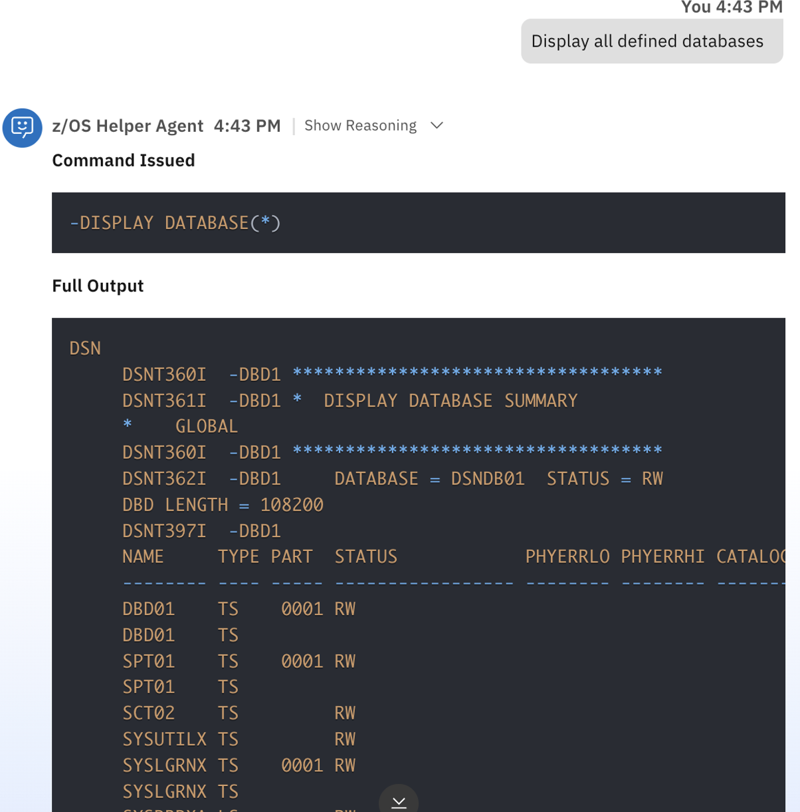{width=50%}

    For that query, the agent determined that the `-DISPLAY DATABASE(*)` command was the appropriate command to use.

11. Lastly, test the following prompt:
    
    ```
    display information regarding the status and configuration of DDF
    ```

    The output should look similar to what's shown below:

    {width=50%}

    For that query, the agent determined that the `-DISPLAY DDF` command was the appropriate command to use. 

***Congratulations! You've successfully set up an agent collaboration use case and tested it. If time allows, continue testing other types of queries or altering the instructions***. 


### Enabling `IPL Validator Agent` collaboration

The last step in the scenario is to enable collaboration with the previous **IPL Validator Agent** you imported using the ADK. 

1. To accomplish this, navigate to the **Agents** section of the Agent builder UI and click on **Add agent**.

    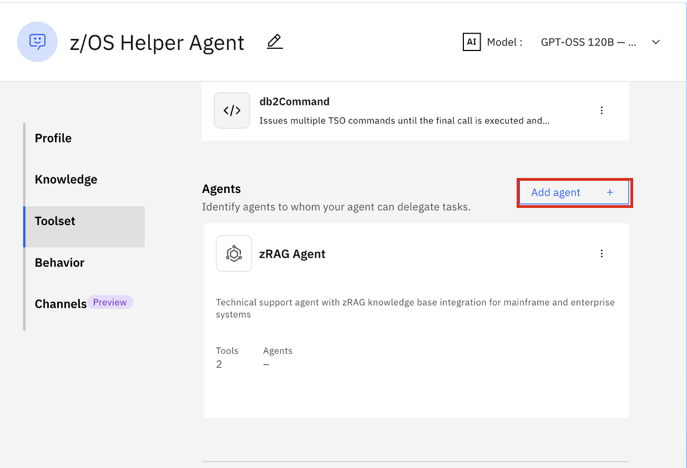{width=50%}


2. Then select **Local instance**. From the list, select your **IPL Validator Agent** and click **Add to agent**. 

    {width=50%}


3. Once done,you should now see your **IPL Validator** agent added as a collaborator (in addition to the previously added **zRAG Agent**).
   
    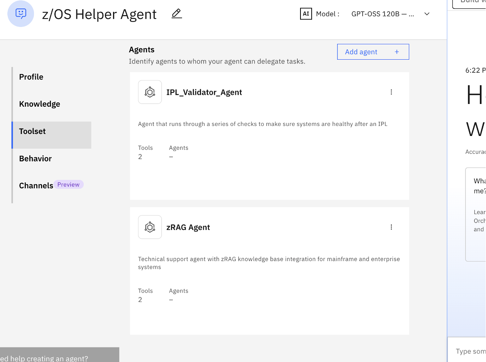{width=50%}


4. You will lastly need to modify the **Instructions** to prioritize collaboration. 
   
    Navigate back to the **Instructions** field and append the following section to the existing set of Instructions:

    ```
    When the user asks something about running an "IPL check" or a "health check", route the request to the "IPL_Validator_Agent". Wait until the agent finishes all steps in the process, then display the EXACT and COMPLETE output from the agent back to the user.
    ```

5. Once modified, test your agent by entering the following query:

    ```
    run IPL health check
    ```
    
6. When the agent completes the response, it should look something like what's shown below:
  
    {width=50%}
    

    It should look very similar to what was returned from the **IPL Validator Agent** in the previous section. 

7. Click on **Show reasoning** to view the steps in the reasoning process. 


### Publish your `z/OS Helper Agent` 

If you're satisfied with the behavior of your agent, you can now publish it to the **Live** version. This makes it available across all your deployed channels in order to make it accessible to end-users. 

Follow the steps below to deploy your agent. 

1. Within the Agent Builder UI of your **Draft** agent, click on **Deploy** in the top-right corner.
   
    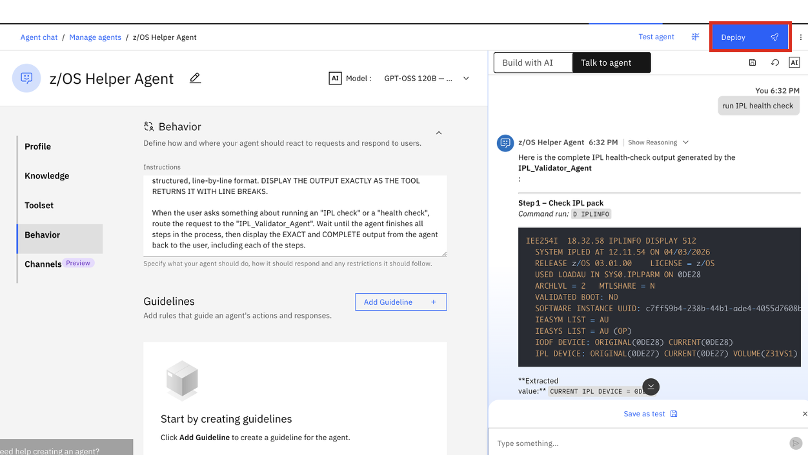{width=50%}

2. On the **Pre-deployment summary** page, click **Deploy** once more. 
   

    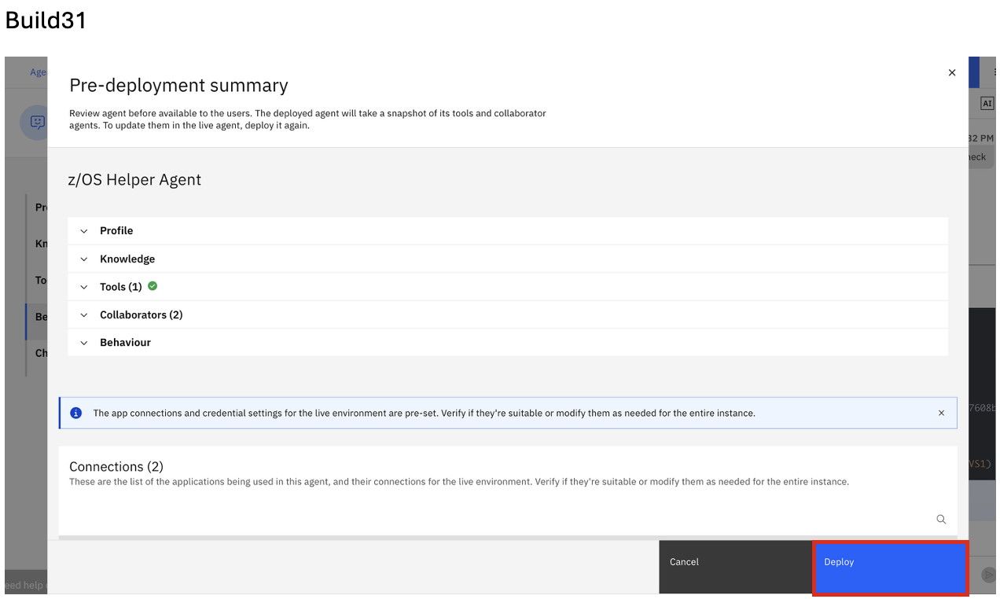{width=50%}

3. After waiting a few seconds, you should then get a success message as shown below. Click on **Maybe later**:
   
    {width=50%}

4. Then navigate to your deployed agent by clicking on the hamburger menu and selecting **Chat**. 

    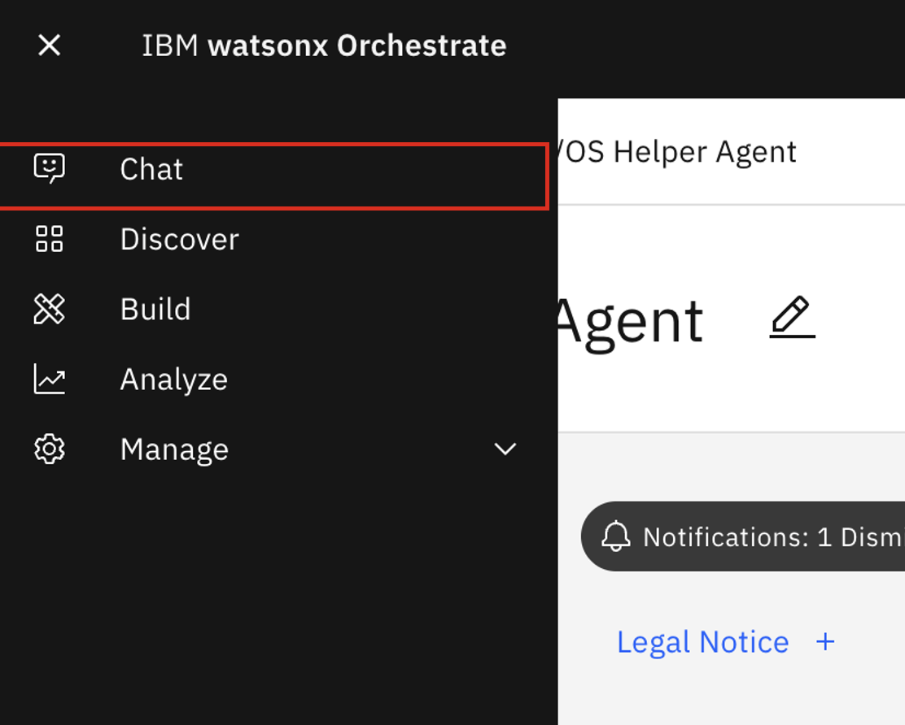{width=50%}

5. Finally, click on the **Agents** drop-down menu and select your deployed agent. 
   
    {width=50%}