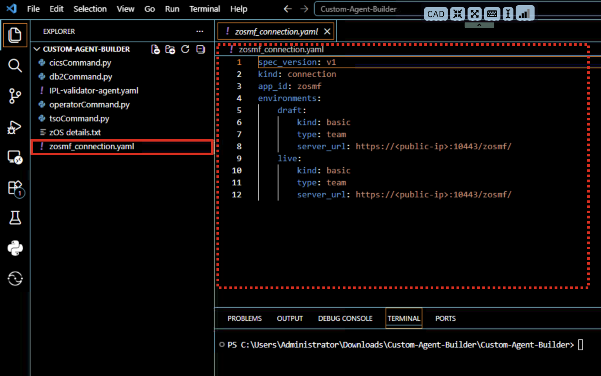
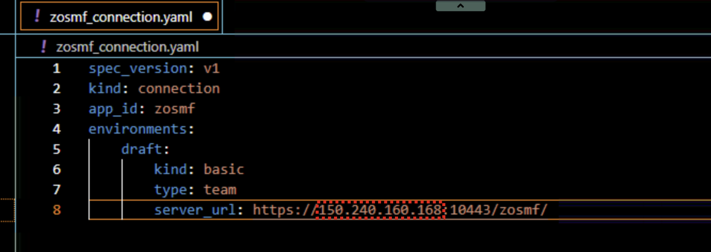
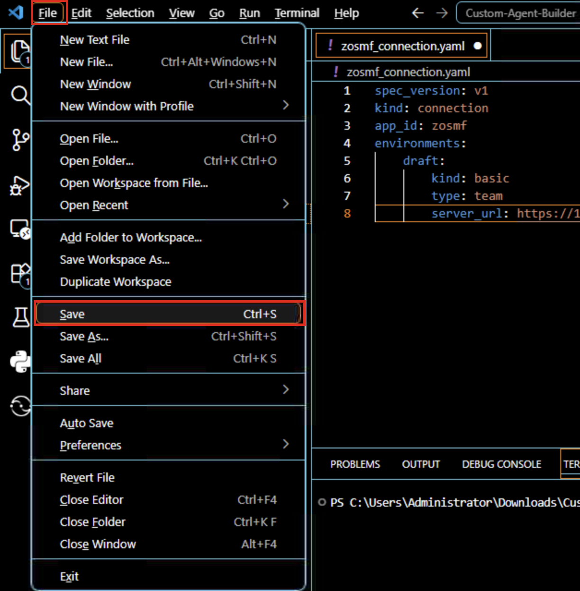
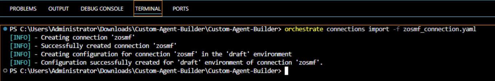
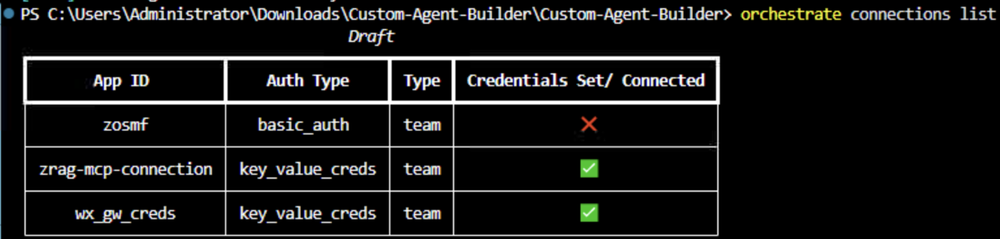
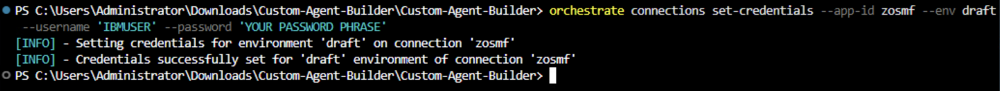
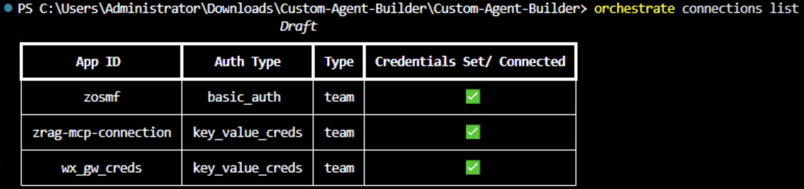

# Create agent connection and configure credentials

***Assume the user already executed `orchestrate agents list` command successfully from previous step***

Within the **Custom-Agent-Builder** workspace in VS Code, you should see a `zosmf_connection.yaml` file. With watsonx Orchestrate and the ADK, connections provide a way to associate various tools together and assigning credentials needed for the tools to access external services on behalf of the agent. In this Lab, the tools you will use are focused on calling z/OSMF APIs to your zD&T zOS image in order to issue various commands and retrieve system details. The first step in deploying your agent is to create a connection to your zOS environment for the tools to use. 

1. Within VS Code, click on the `zosmf_connection.yaml` file to view the contents.
   
    

2. Once you're viewing the file, modify it to **replace** `<public-ip>` in the `server_url` variable with the **public IP of your zD&T environment**. 
   
    

    ***NOTE: The public ip can be retrieved from the .txt file in workspace***


3. Once modified, save the `zosmf_connection.yaml` file by clicking **File --> Save**.
   
    

4. Now you can import the connection to your ADK environment.
   
    In the **Terminal** command-prompt on the bottom of the VS Code window, enter the following command to import the connection:

    ```
    orchestrate connections import --file zosmf_connection.yaml
    ```

    

5. Next, verify the connection was successsfully imported by running the following command in the Terminal:
   
    ```
    orchestrate connections list
    ```

    In the output of the command, notice that your new connection is listed with *app-id* **zosmf** and that the Credentials have not yet been set (as shown below).

    

    You will next set your connection credentials.

6. The connection credentials you provide will later be used to authenticate tools to access your environment's z/OSMF APIs. 
   
    Credentials hold the values used to authorize against external services. In the case of your previously created connection, you configured it with kind: basic which enforces username and password credentials (i.e. the username and password used by the z/OS IBMUSER ID).

    To set your connection credentials for the **draft** environment, enter the following command in the VS Code Terminal, replacing `<your-passphrase>` with the value provided in the **.txt** file in your folder.

    ```
    orchestrate connections set-credentials --app-id zosmf --env draft --username 'IBMUSER' --password '<your-passphrase>'
    ```

    For example:

    ```
    orchestrate connections set-credentials --app-id zosmf --env draft --username 'IBMUSER' --password 'YOUR PASSWORD PHRASE'
    ```
   
   You should see a `Credentials successfully set...` message.

    

7. Now re-verify the connection with your newly set credentials by entering the following command:


    ```
    orchestrate connections list
    ```

    You should now see that your previous `zosmf` connection now has credentials set, as shown below:

    
