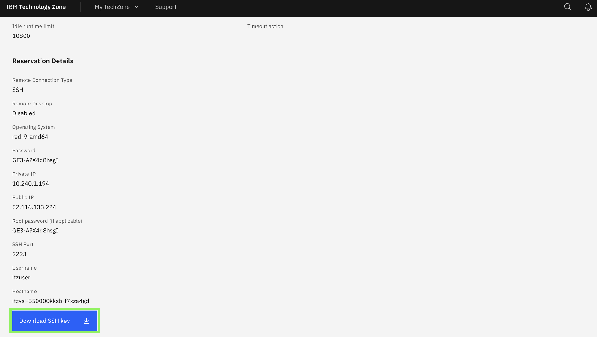
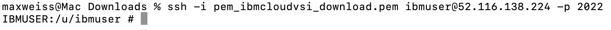

### Set RACF Passphrase for `IBMUSER` ID on zD&T

1. Click on the **Student URL** provided by the instructor for the **zD&T** environment and when prompted, enter the password. 

2. Once done, you should be taken to the environment details page for your **zD&T** environment which will look something like this:
   
    {width=50%}

3. Locate and record the **Public IP** field for your environment.
   
    {width=50%}

4. At the bottom of the reservation page, click on **Download SSH key** to download the SSH key locally.

    {width=50%}

5. In order to set a new Passphrase for your IBMUSER zOS user, you will first need to SSH into z/OS USS, using port 2022.
   
    On your local machine's command line, navigate to the directory of your downloaded SSH key from the previous step, for example:

    `cd Downloads`

6. Set the permissions of your downloaded key to allow SSH access:

    `chmod 600 <ssh-key.pem>`


7. Then SSH into z/OS UNIX, by running the below command, replacing `<ssh-key.pem>` with the name of your downloaded key, and replacing `<public ip>` with the IP you recorded in the above section:

    ```
    ssh -i <ssh-key.pem> ibmuser@<public ip> -p 2022
    ```

    Once SSH'ed in successfully, you should see something similar to below:

    {width=50%}

8. Next, set a new zOS Passphrase for your **IBMUSER** zOS user by running the following command. This is the RACF Passphrase that you will use to log into TSO as the IBMUSER ID.
   
    Once you're SSH'ed into zOS USS, enter the following command, substituting a passphrase of your choice for the string `YOUR PASSWORD PHRASE`:

    ```
    tsocmd "ALTUSER IBMUSER PHRASE('YOUR PASSWORD PHRASE') NOEXPIRE RESUME"
    ```


    ??? Tip "Syntax rules for RACF Password Phrases (below)"
    
        - minimum length: 9 characters
        - Must contain at least 2 alphabetic characters (A - Z, a - z)
        - Must contain at least 2 non-alphabetic characters (numerics, punctuation, or special characters, including spaces)
        - Must not contain more than 2 consecutive characters that are identical
  
    **Note:** *if you typed the command yourself, be sure to include the single-quotes before and after the password.* ***Record the passphrase as it will be needed later.***

    Afterwards, you should see something similar to the following:

    {width=50%}

9. Exit out of z/OS USS by entering `exit` on the command-line. 