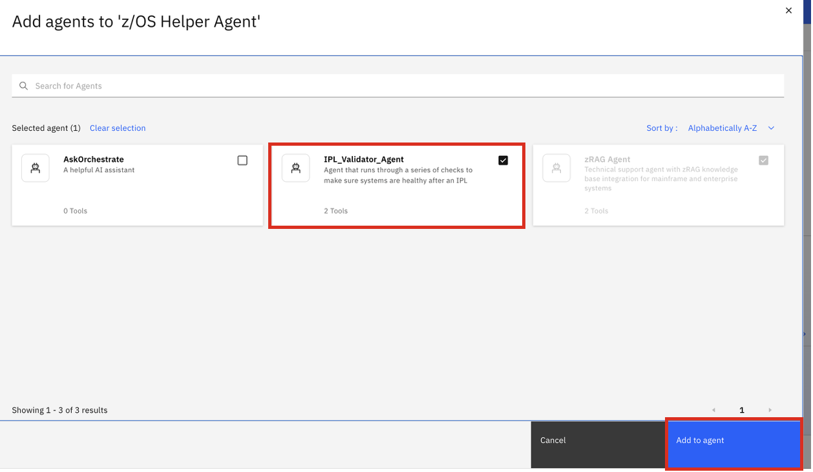

### Enabling `IPL Validator Agent` collaboration

The last step in the scenario is to enable collaboration with the previous **IPL Validator Agent** you imported using the ADK. 

1. To accomplish this, navigate to the **Agents** section of the Agent builder UI and click on **Add agent**.

    {width=50%}


2. Then select **Local instance**. From the list, select your **IPL Validator Agent** and click **Add to agent**. 

    {width=50%}


3. Once done,you should now see your **IPL Validator** agent added as a collaborator (in addition to the previously added **zRAG Agent**).
   
    {width=50%}


4. You will lastly need to modify the **Instructions** to prioritize collaboration. 
   
    Navigate back to the **Instructions** field and append the following section to the existing set of Instructions:

    ```
    When the user asks something about running an "IPL check" or a "health check", route the request to the "IPL_Validator_Agent". Wait until the agent finishes all steps in the process, then display the EXACT and COMPLETE output from the agent back to the user.
    ```

5. Once modified, test your agent by entering the following query:

    ```
    run IPL health check
    ```
    
6. When the agent completes the response, it should look something like what's shown below:
  
    {width=50%}
    

    It should look very similar to what was returned from the **IPL Validator Agent** in the previous section. 

7. Click on **Show reasoning** to view the steps in the reasoning process.