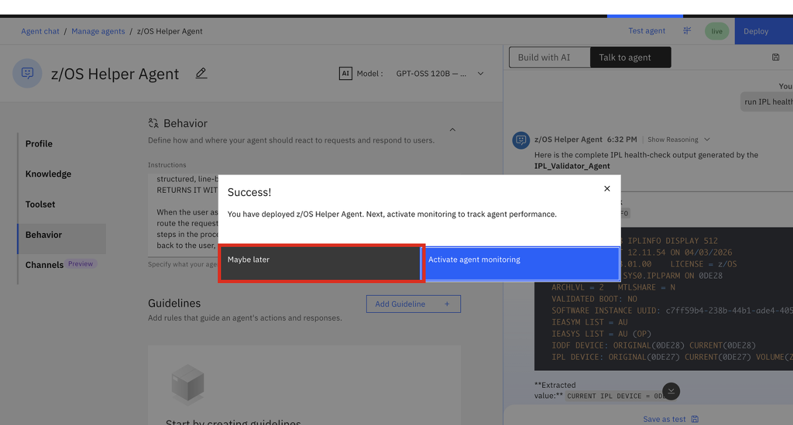
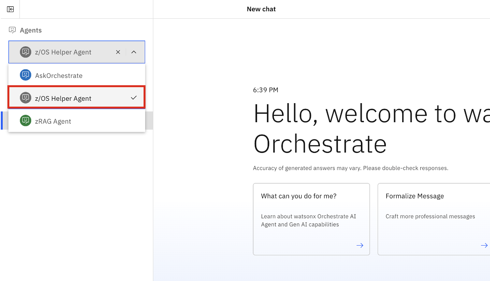

### Publish your `z/OS Helper Agent` 

If you're satisfied with the behavior of your agent, you can now publish it to the **Live** version. This makes it available across all your deployed channels in order to make it accessible to end-users. 

Follow the steps below to deploy your agent. 

1. Within the Agent Builder UI of your **Draft** agent, click on **Deploy** in the top-right corner.
   
    {width=50%}

2. On the **Pre-deployment summary** page, click **Deploy** once more. 
   

    {width=50%}

3. After waiting a few seconds, you should then get a success message as shown below. Click on **Maybe later**:
   
    {width=50%}

4. Then navigate to your deployed agent by clicking on the hamburger menu and selecting **Chat**. 

    {width=50%}

5. Finally, click on the **Agents** drop-down menu and select your deployed agent. 
   
    {width=50%}