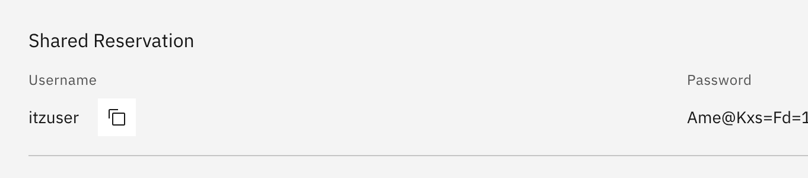
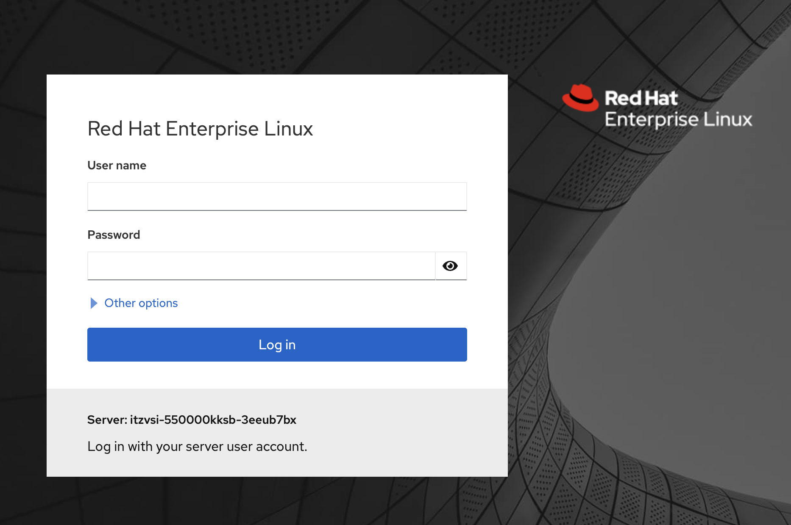
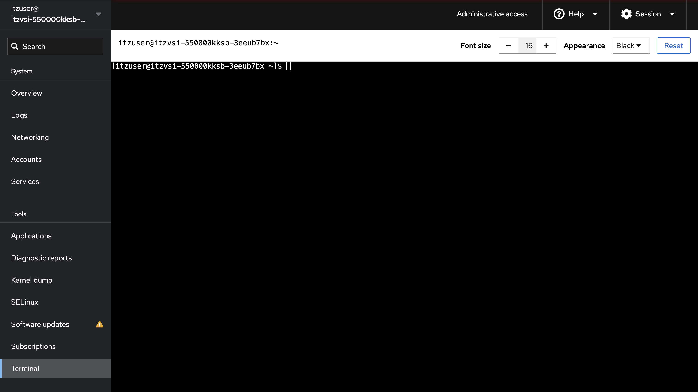
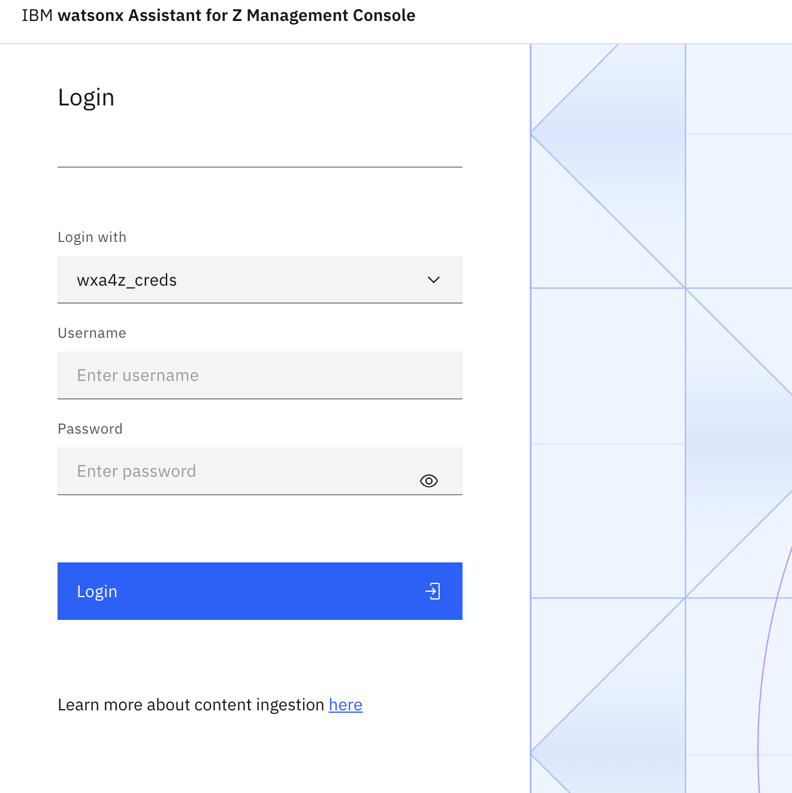
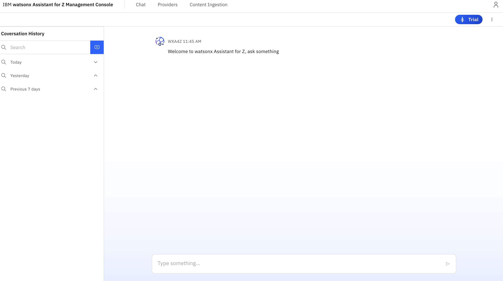

# Access the environment

## Access the Linux VM environment

You will first be instructed to access your **Linux VM** on IBM Cloud. This Virtual Machine is pre-configured with the core Assistant for Z Trial stack services. You will next access the command shell of your Linux VM in order to verify access, as this will be needed for deploying agents later on. 

1. Navigate to the URL provided by the instructor and authenticate using your IBM ID. 

2. You should then be taken to a page with your environment details. 
   
    Take note of your `linux-ip`, the public IP address of your environment. Record this somewhere locally. 

    Also, take note of your Linux VM's `Username` and `Password` credentials that are recorded at the top of your environment details. For example:

    

    *You will need these details later*.
    
3. Next, access the **Red Hat Web Console** by navigating to the following URL on your local machine's web browser, replacing `<linux-ip>` with the Public IP address of your Linux VM that you recorded earlier:
   
    ```
    https://<linux-ip>:9090    
    ```
   
4. You should then be taken to the login page as shown below:
   
    

5. Log in by entering your **User name** and **Password** credentials you recorded above, then click **Log in**. 
   
6. After logging in, click on the **Terminal** option at the bottom of the left-hand menu. You should then see your Linux terminal session opened:
   
    
   

### Access the `lite-stack` directory

Assuming you are in the default directory when accessing the remote desktop as described above, navigate to the `lite-stack` directory by issuing:

`cd lite-stack`

Once done, enter `ls` and you should get output similar to what's shown below:

```
[itzuser@itzvsi-550000kksb-3eeub7bx lite-stack]$ ls
L-SPZB-LUABWX  LAB-S3-BUCKET.txt  LAB-ZDT-ENV.txt  agents  compose  core  deploy.sh  version
```

#### Record your **zDT** details

Later on in the Lab, you will be prompted to locate and provide your environment details for your **zD&T** z/OS environment that was pre-provisioned for you. To locate these details, run the following command from the `lite-stack` directory in your Linux terminal:

```
cat LAB-ZDT-ENV.txt
```

You should then see something similar to below:

```
zdt Public IP: x.x.x.x
Username: IBMUSER
Password: <your password>
```

#### Locate your **S3 bucket** connection details

Also later in the Lab, you will be prompted for a set of connection details to a remote **S3 source** to implement the document ingestion capability. To locate these connection details, run the following command from the `lite-stack` directory in your Linux terminal:

```
cat LAB-S3-BUCKET.txt 
```

You should see something similar to below:

```
URL: <URL>
Access Key ID: <access key>
Secret Access Key: <secret key>
Bucket Name: <bucket name>
```

## Access the IBM watsonx Assistant for Z Management Console

The **watsonx Assistant for Z Management Console** provides capabilities to activate agents, create agent connections, activate agents, and ingest content to be used in conversations. It also provides a front-end for testing your agent deployment. 

To access the Management console externally, navigate to the following URL in a web browser on your personal machine, replacing `<linux-ip>` with the Public IP address of your Linux VM that you recorded earlier:

`https://<linux-ip>:8443`


1. Once you're navigated to the login page of the Management Console, you should see something similar to below:
   
   
   

2. Sign in by selecting the `wxa4z_creds` login option.
   
    - For `Username`, enter `basicuser`
    - For `Password`, enter `basicpass`
   


3. After entering your credentials, click **Login** to access the console. You should then see the **Chat** page of the Management Console:
   
    
   
    
    Keep this window open as you'll be using it later on in this Lab. 