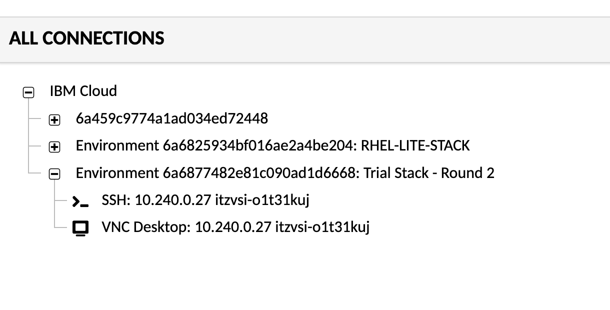
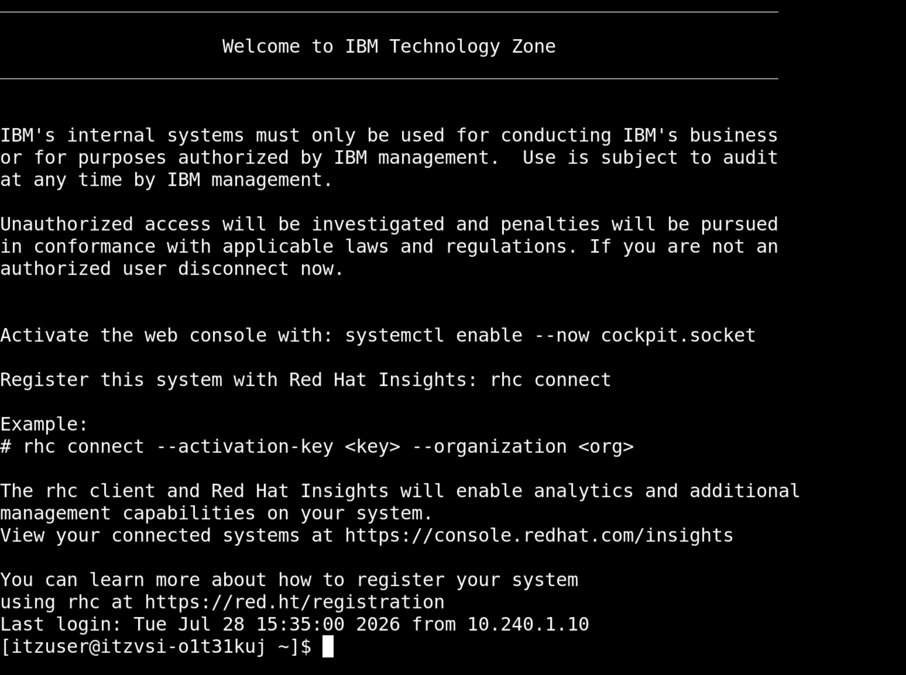

# Access the environment

## Access the Linux VM environment

You will first be instructed to access your **Linux VM** on IBM Cloud. This Virtual Machine is pre-configured with the core Assistant for Z Trial stack services. You will next access the command shell of your Linux VM in order to verify access, as this will be needed for deploying agents later on. 

1. Navigate to the URL provided by the instructor and authenticate using your IBM ID. 

2. You should then be taken to a page with your environment details. 
   
    Take note of your `Linux-ip`, the public IP address of your environment. Record this somewhere locally. 

3. Next, access the **Guacamole remote desktop** by clicking on the link on the environment details page, i.e.:
   
    `https://vdi.cloud.techzone.ibm.com/guacamole`

4. Once there, expand the connections and click on the `SSH:` option as shown below:
   
    

5. You should then be redirected to the remote desktop UI where you can access the Linux command-prompt as shown below:
   
    


### Access the `lite-stack` directory

Assuming you are in the default directory when accessing the remote desktop as above, navigate to the `lite-stack` directory by issuing:

`cd lite-stack`

Once done, enter `ls` and you should get output similar to what's shown below:

```
[itzuser@itzvsi-o1t31kuj lite-stack]$ ls
L-SPZB-LUABWX  agents  compose  core  deploy.sh  version
[itzuser@itzvsi-o1t31kuj lite-stack]$ 
```

#### Record your **zDT** details


#### Locate your **S3 bucket** connection details


## Access the IBM watsonx Assistant for Z Management Console

The **watsonx Assistant for Z Management Console** provides capabilities to activate agents, create agent connections, activate agents, and ingest content to be used in conversations. It also provides a front-end for testing your agent deployment. 

To access the **Management Console**, you have two options:

   - Option 1: Access externally on personal machine

   - Option 2: Access within the Linux VM

**Option 1:**

To access the Management console externally, navigate to the following URL in a web browser on your personal machine, replacing `<linux-ip>` with the Public IP address of your Linux VM that you recorded earlier:

`https://<linux-ip>:8443`

**Option 2:**

- Navigate to the **VNC Desktop** for your Linux VM
- Open up `https://localhost:8443`

1. Once you're navigated to the login page of the Management Console, you should see something similar to below:
   
   
   

2. Sign in by selecting the `wxa4z_creds` login option.
   
    - For `Username`, enter `basicuser`
    - For `Password`, enter `basicpass`
   


3. After entering your credentials, click **Login** to access the console. You should then see the **Chat** page of the Management Console:
   
    
   
    
    Keep this window open as you'll be using it later on in this Lab. 