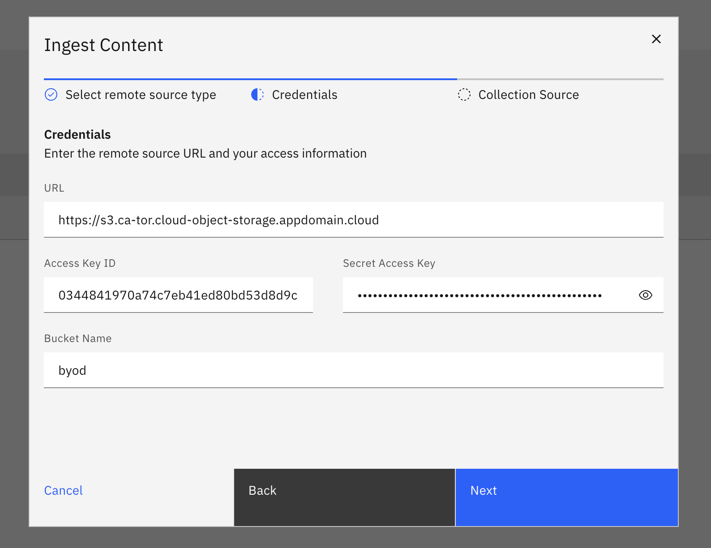
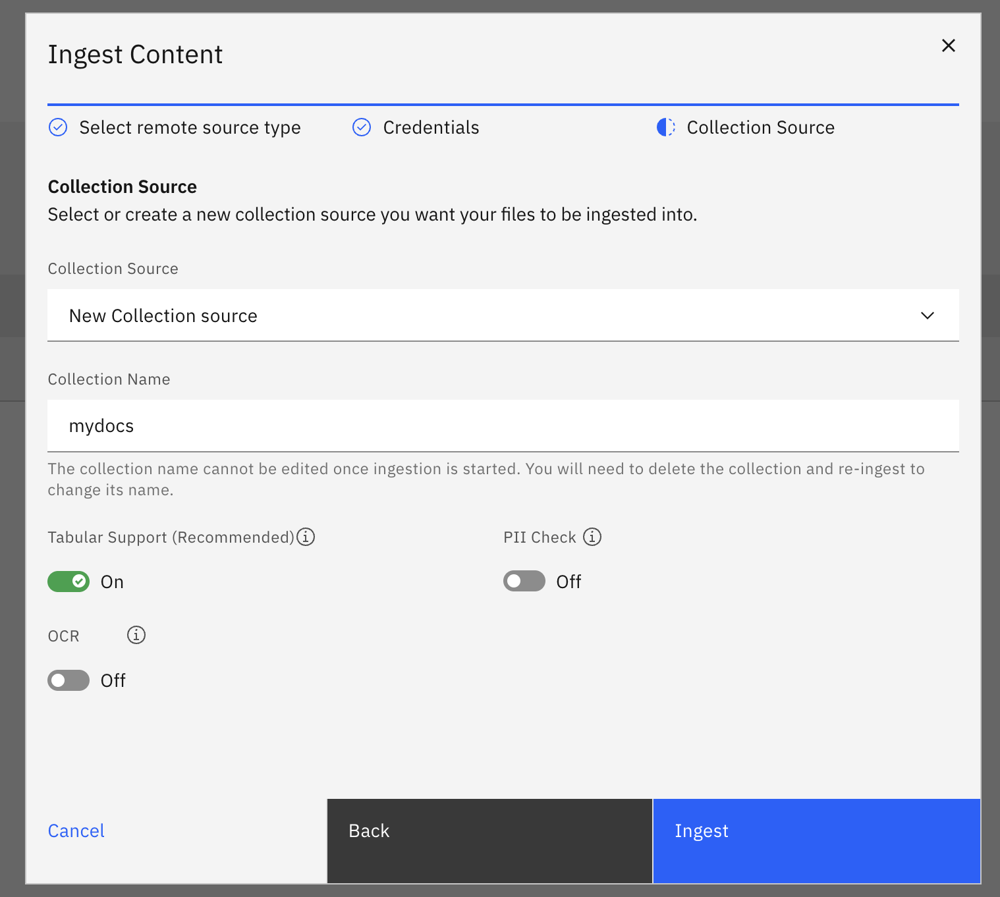
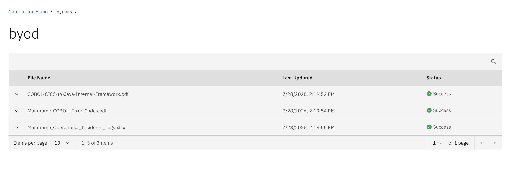
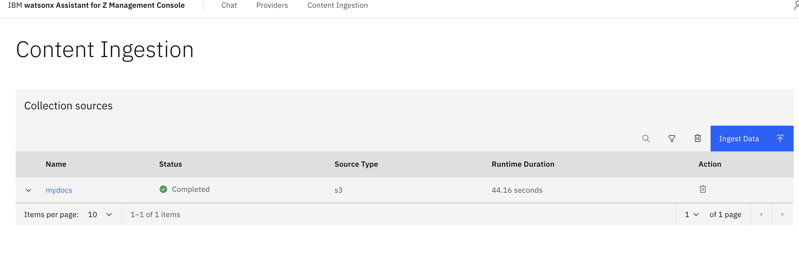

# Ingest Documents

1. To begin the Document Ingestion process, navigate back to the **IBM watsonx Assistant for Z Management Console** and select the **Content Ingestion** tab at the top:

    **IMAGE**

2. Click **Ingest Data**

3. In the pop-up screen, select **S3 Bucket** as the source type, then click **Next**. 

4. In the screen that follows, enter the following connection details for your S3 bucket. 
   
    *Each of these values can be found in the `LAB-S3-BUCKET.txt` file within the `lite-stack` directory as described [here](../02-env-access.md#locate-your-s3-bucket-connection-details).
   
    - `URL`
    - `Access Key ID`
    - `Secret Access Key`
    - `Bucket Name`

    Then click **Next**.

    

5. On the last page, choose a **collection source** where you want to ingest your content. 
   
    Select `New Collection source` then enter any name (i.e. `mydocs`)

    Additionally, ensure the `Tabular support` toggle is left enabled, and **disable** the toggle for **PII Check**.

    

6. Then finally click **Ingest**. 

    Data in the processing stage appears under your defined collection source name from the specified bucket.

    Once the ingestion completes, the collection source appears on the Content Ingestion page. 

    

    You can then:

    - Search for a collection source by name using the search icon.
    - Filter collection sources by type or ingestion status by using the filter icon.
    - Delete collection sources by selecting them and clicking Delete.

    Confirm you can see the Completed Ingestion source on the **Content Ingestion** page as shown below:

    
