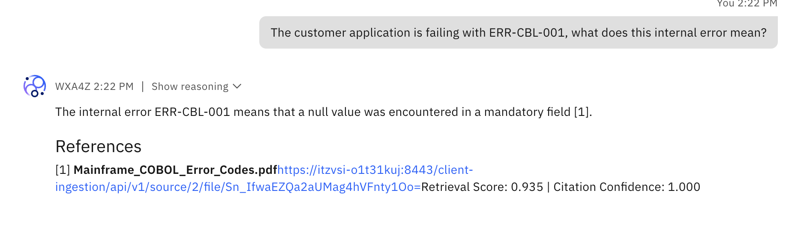
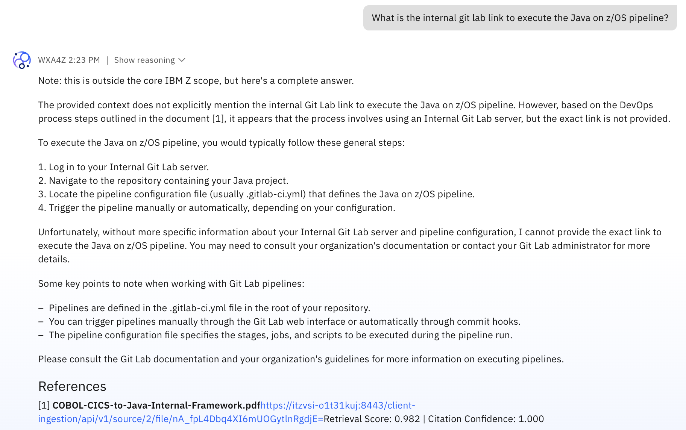
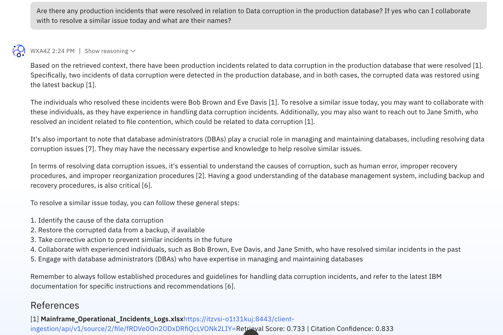

# Test Document Ingestion

Now that you’ve successfully ingested the sample customer documents, you’ll be able to test the agent's ability to answer company-specific questions related to the internal documents.

Test some example queries that are related specifically to the documents you just ingested. For example:

```
The customer application is failing with ERR-CBL-001, what does this internal error mean?
```



```
What is the internal git lab link to execute the Java on z/OS pipeline?
```




```
Are there any production incidents that were resolved in relation to Data corruption in the production database? If yes who can I collaborate with to resolve a similar issue today and what are their names?
```



***Take this time to review the responses, taking note of the generated references. These are the same documents you previously ingested that are being used to formulate a response***. 

Optionally, click on the ingested doc source to view the contents. 