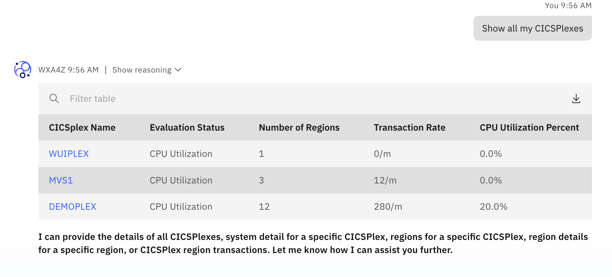
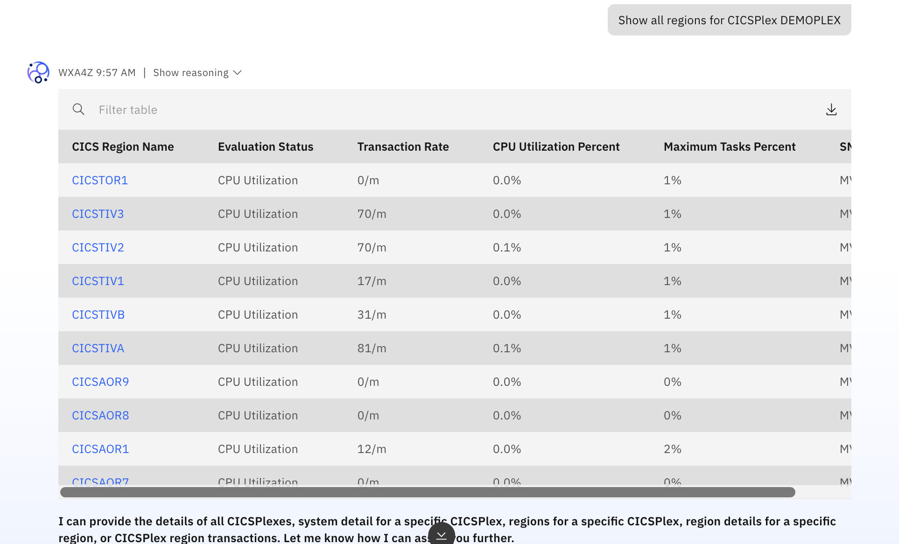
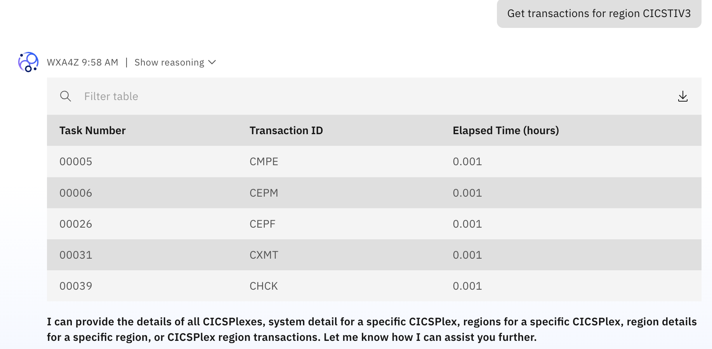

# Test the IBM Z OMEGAMON Insights Agent

Now that you've successfully activated the OMEGAMON Insights Agent, you can test some example queries. 

Firstly, **navigate back to the Chat** view by selecting **Chat** at the top. 

Start a new chat (by clicking on the blue icon), then begin prompting the agent around it's capabilities as described ***[here](./overview.md)***.

As an example to prompt about CICS resources, one could ask:

- `Show all my CICSPlexes`
  
    

- `Show all regions for CICSPlex DEMOPLEX`
  
    

- `Get transactions for region CICSTIV3`
    
    

Continue prompting the agent across various topics before moving on to the Upgrade Agent. 