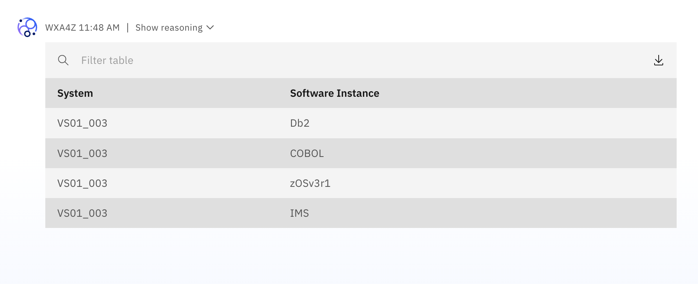
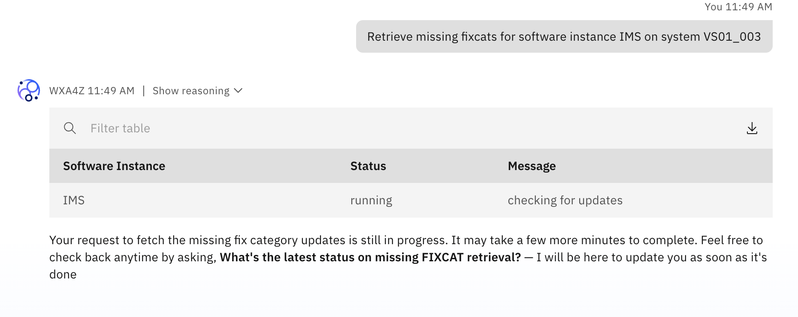
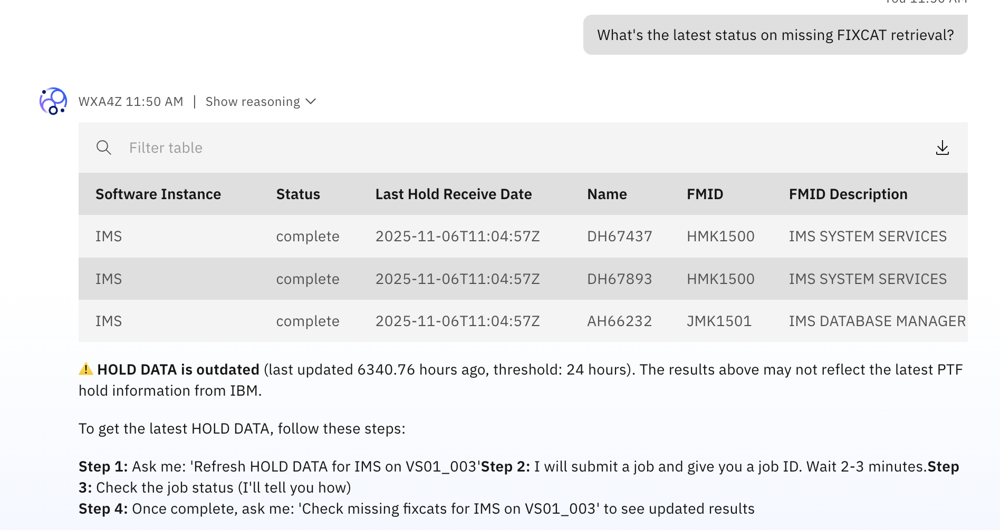
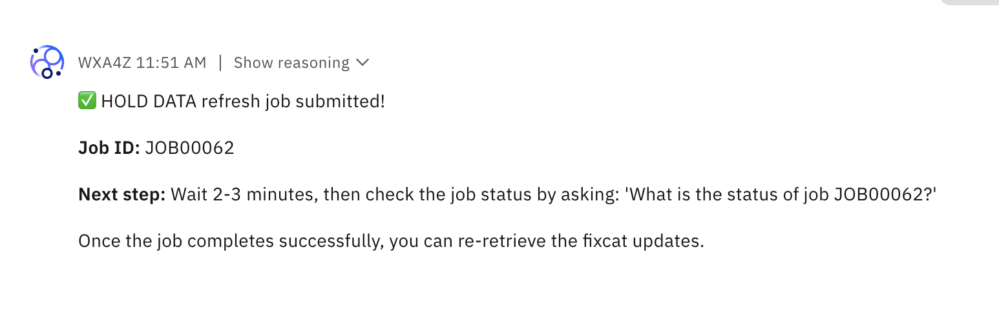
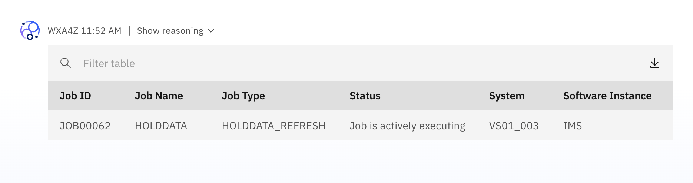

# Testing IBM Z Upgrade Agent

Questions:
- What are the steps to upgrade to z17?

### **Retrieve all software instance**:

`Show all software instances defined on my z/OS system`

### **Retrieve missing fixcats for a software instance**:

For example:

`Retrieve missing fixcats for software instance IMS on system VS01_003`

### **Fetch the latest status of missing FIXCAT retrieval**:

`What's the latest status on missing FIXCAT retrieval?`

### **Refresh HOLD DATA**

`Refresh HOLD DATA on software instance IMS on system VS01_003`

### **Get status of job**:

For example:

`What is the status of job JOB00062?`

*Continue checking status until the job successfully completes*.

### **Get refreshed list of missing FIXCATS**

For example:

`Retrieve missing fixcats for software instance IMS on system VS01_003`

### **Receive the missing PTFs for FIXCAT xxx**

### **Ask about upgrade workflow-related queries using the ingested docs**

`What are the steps to upgrade to the z17?`
