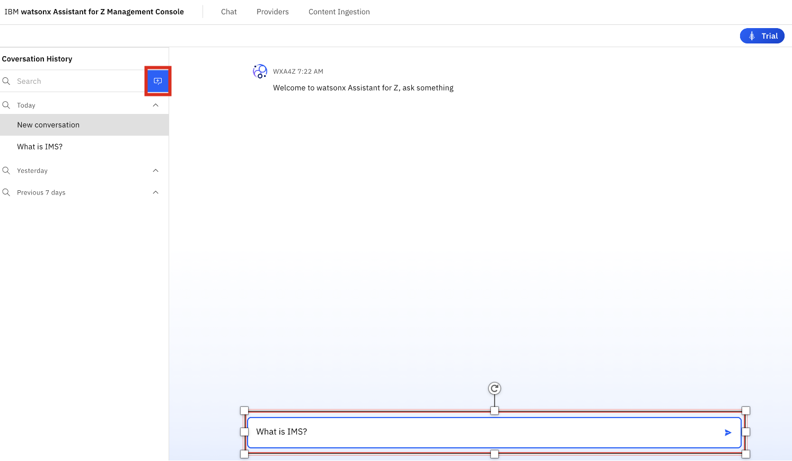
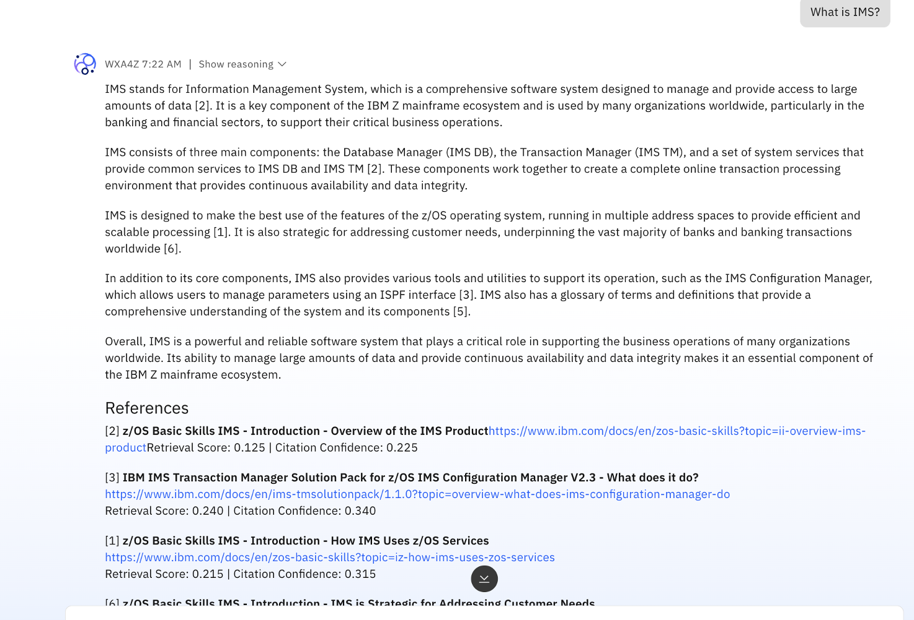

# Test the zRAG Agent

Now that you've activated the zRAG Agent, you can test some example queries. 

1. Firstly, **navigate back to the Chat** view by selecting **Chat** at the top of the Management Console. 
   

2. Once at the **Chat** page, click the blue icon to start a new chat, then enter a prompt in the agent chat, for example `What is IMS?`:
   
    

3. Wait for an answer to be generated, then you should get a response back similar to what's shown below:
   
    

4. Continue prompting the agent with various queries to test the zRAG capabilities. 

    When finished testing, move on to the other agent deployments. 
