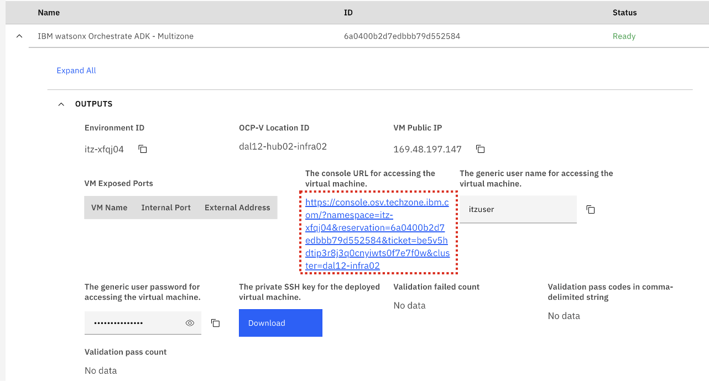
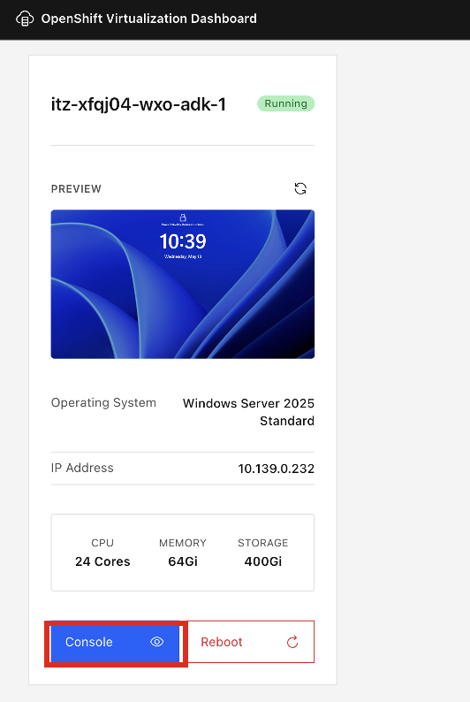
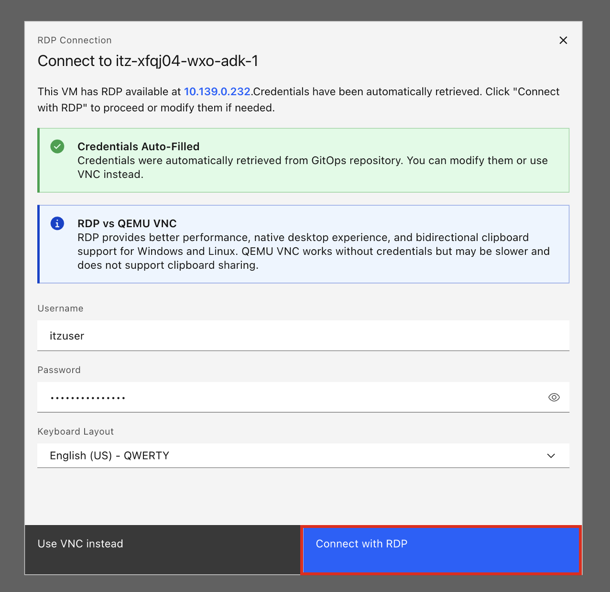
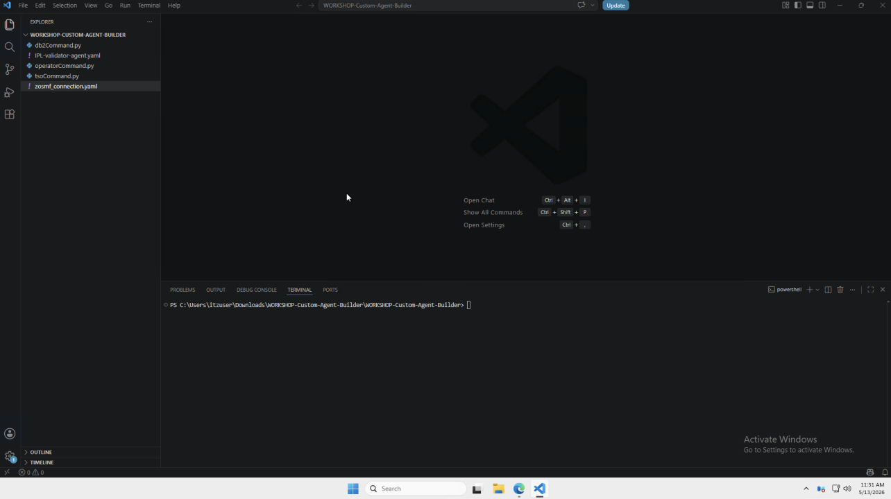
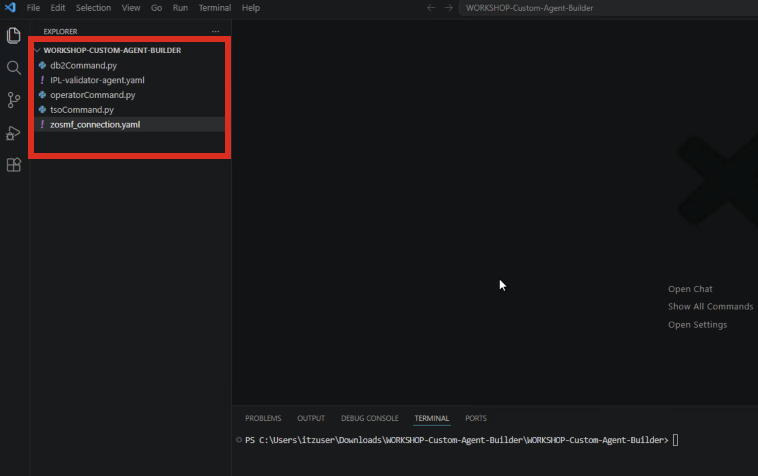
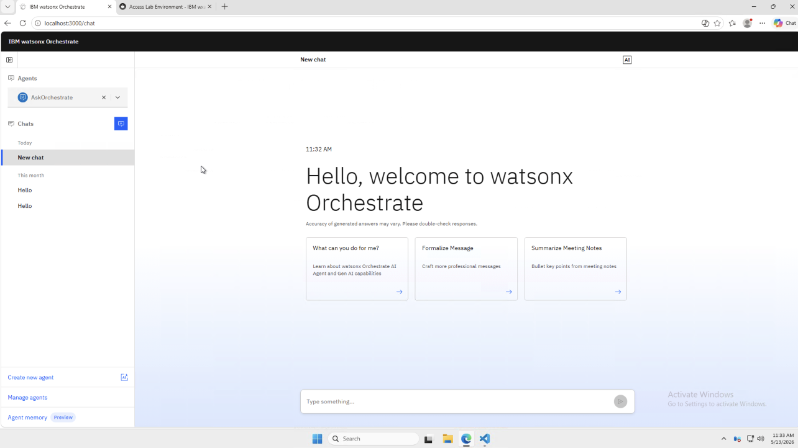
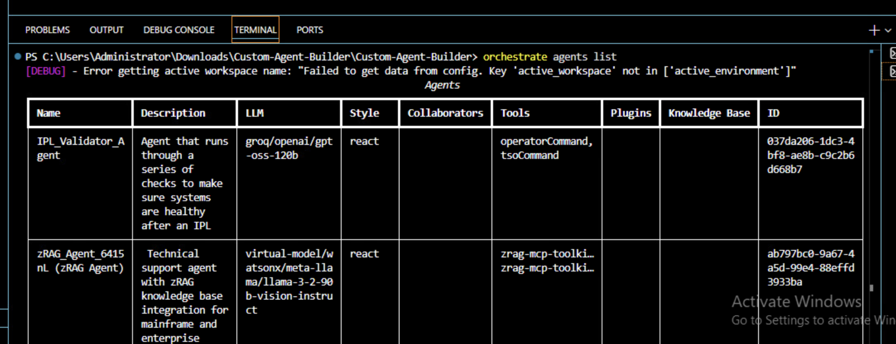

# Access Windows ADK and Environment Overview

In order to execute the Lab exercises, there are two environments provisioned for you:

  - Windows VM
  - Z Dev & Test for z/OS (zD&T) 

The Windows VM is pre-configured with the **Agent Development Kit(ADK)** and all necessary tools to quickly get started with building your own agents. This is the environment you will be accessing for this Lab. 

You will not be accessing the **zD&T** environment directly, but rather using the environment details provided to you in order to connect your agents to it through the ADK. 

### Access the Windows VM

1. Click on the **Student URL** provided by the instructor for the **Windows ADK** environment, and when prompted, enter the password.

2. Once done, you should be taken to the environment details page for your **Windows ADK** environment.

3. In the Environment Details drop-down, click on the **Console URL for accessing the virtual machine**.
   
    


4. A new tab should open showing the VM Dashboard. Click on **Console** in blue to open up the VM. 

    


5. Then click **Connect with RDP** in blue once more. 

    


6. You should then be taken to a new tab displaying the Windows VM Desktop (with VS Code pre-opened):

    


### Windows VM Layout 

When first accessing, you should immediately see the **VS Code** window already opened with a folder opened titled `WORKSHOP-CUSTOM-AGENT-BUILDER` as shown below:




This VS Code Workspace contains the various agent configuration files needed to build your agents using the ADK, and will be used in the following section. 

Additionally, there should be a **Microsoft Edge** browser window in the toolbar with a tab opened for the **watsonx Orchestrate Chat UI** as well as the Lab guide within the Windows VM itself.



Lastly, on the Desktop of the Windows VM, there are two important text files for this Lab:

- `zD&T env details.txt`
- `Lab commands.txt`

The `zD&T env details.txt` file will be needed in the next section when creating a connection to your **zD&T zOS** environment. It contains the **public IP** of your zD&T instance and the RACF Passphrase for the **IBMUSER** ID for accessing z/OSMF. 

The `Lab commands.txt` file contains the commands referenced in this Lab guide for easier copy and pasting within the Windows VM.


### Verify whether ADK is configured 

Before moving on, verify that the ADK is successfully configured by **running the following command in the Terminal of your VS Code window** (in Windows VM):

```
orchestrate agents list
```

If configured as expected, it should return something like what's shown below:



If so, you can proceed to the following section. If not, let an instructor know before moving on. 