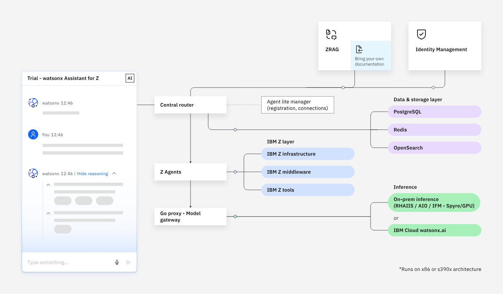

# Lab Introduction

The **watsonx Assistant for Z Trial** provides agentic capabilities across Z systems, offering faster deployment, ease of setup, and lower infrastructure demands.

watsonx Assistant for Z Trial integrates a central router, agents, and supporting services to deliver intelligent, conversational automation and insights across IBM Z environments.

At the core of its architecture is the central router, which acts as the primary coordination and routing layer between agents.

## watsonx Assistant for Z Architecture

| Core architecture component                                 | Description                                                                                                                 |
| ------------------------------------------------ | --------------------------------------------------------------------------------------------------------------------------- |
| Central router                 | A unified, AI-powered routing layer that interprets user intent, gathers context, and coordinates tasks across multiple agents.    |
| Agent Lite Manager                 | A centralized interface for registering, configuring, and managing agents, ensuring streamlined onboarding, consistent settings, and efficient connectivity management.        |
| AI Agents         | Includes foundational agents, enabling domain-specific processing and supporting immediate deployment and experimentation.    |
| Chat Interface   | A conversational interface that allows users to interact with the system using natural language, providing intuitive and responsive access to platform capabilities.   |
| Model Gateway                  | A lightweight, Go-based proxy that acts as the central entry point for all model inference requests, routing them to either on-premises environments or IBM Cloud watsonx.ai while abstracting backend complexity.                         |
---

## Sections of this Lab

- [Getting environment access](./WXA4Z-LAB-TRIAL-STACK/02-env-access.md)

- Agent configuration, deployment and testing
    - [zRAG Agent](./WXA4Z-LAB-TRIAL-STACK/zrag-agent/overview.md)
    - [IBM Z OMEGAMON Insights Agent](./WXA4Z-LAB-TRIAL-STACK/omegamon-agent/overview.md)
    - [IBM Z Upgrade Agent](./WXA4Z-LAB-TRIAL-STACK/upgrade-agent/overview.md)

- [Content Ingestion of external documents](./WXA4Z-LAB-TRIAL-STACK/doc-ingestion/overview.md)

## Disclaimer

The watsonx Assistant for Z Trial is a **proof of concept (PoC)** designed to demonstrate core orchestration and routing capabilities. It is **not production** ready and has not been hardened, performance-tuned, or certified for production use. It should not be deployed in customer-facing or business-critical environments. Production-level nonfunctional requirements, such as high availability, resilience, security hardening, and operational monitoring, are outside the scope of this release.

