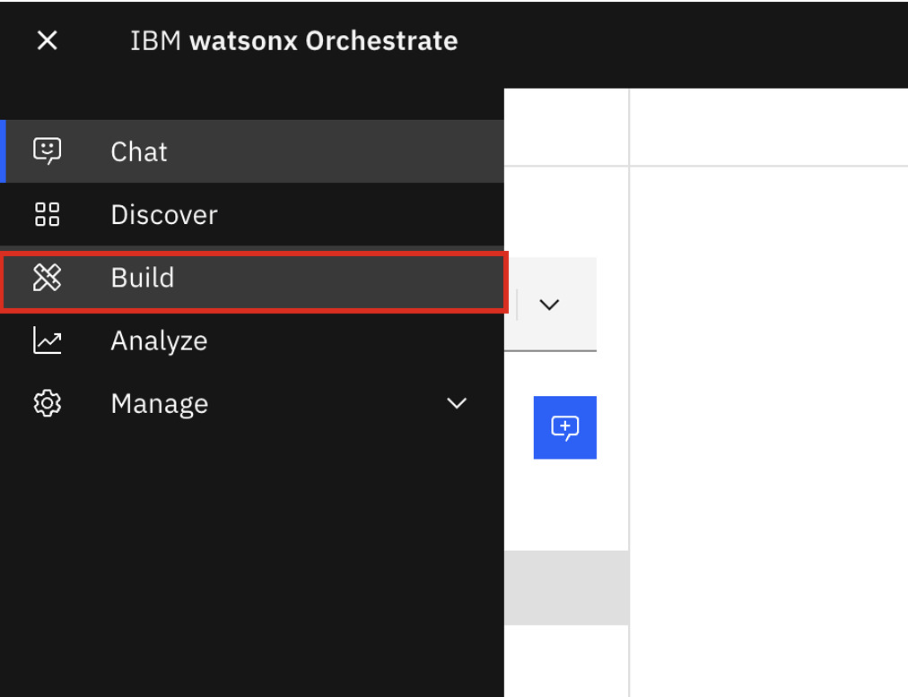
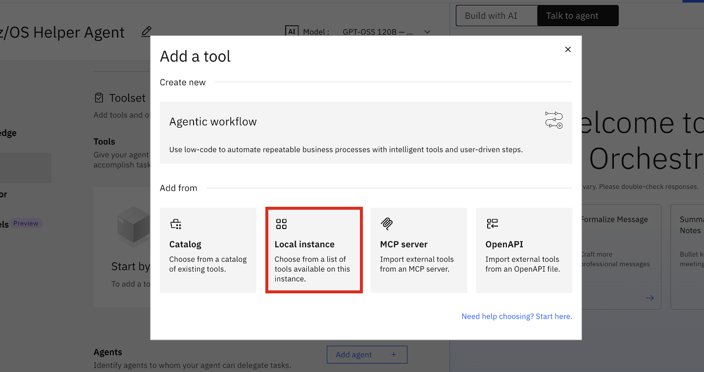
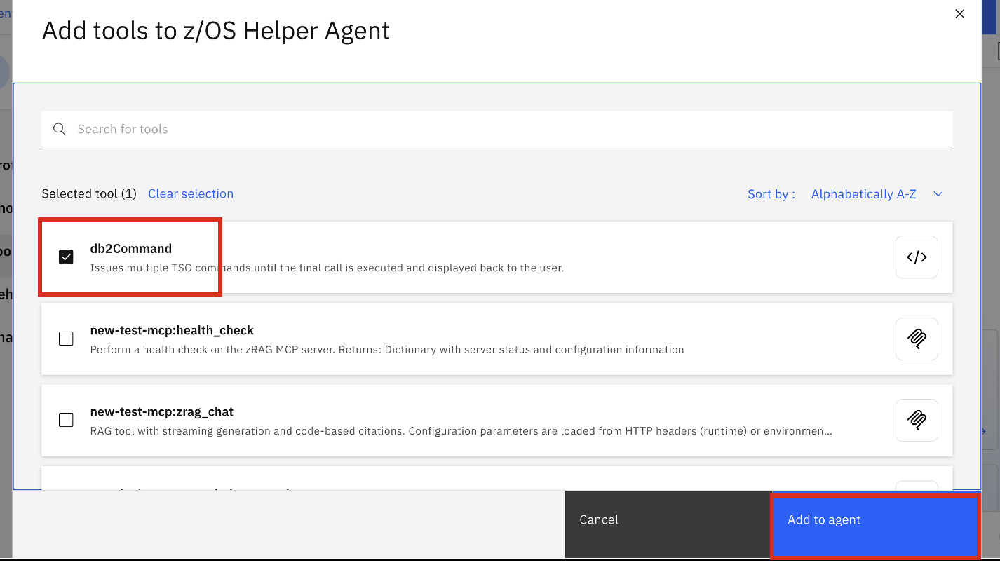

## Multi-agent Collaboration

Now that you have your `IPL_Validator_Agent` created using the ADK, you will now create an **Orchestrator Agent** via the Agent Builder Experience (WxO UI) that provides multi-agent orchestration in order to accomplish various tasks. 

In this scenario, you will create an agent named **z/OS Helper Agent** that collaborates with:

- `IPL_Validator_Agent` 
  - **Purpose**: to provide post-IPL health checks
- `zRAG Agent` which you previously deployed with watsonx Assistant for Z
  - **Purpose**: to retrieve commands used to display certain information about the Db2 for z/OS subsystem
- `db2Command` tool you previously imported in order to run Db2 for z/OS commands using the DSN TSO/E interface

### Creating your new agent within watsonx Orchestrate

The steps in this section assume you're already logged into the watsonx Orchestrate UI. 

1. From the **Agent chat** window, click on the hamburger menu icon and select **Build**

    {width=50%}


2. Click on **Create agent** in the top-right corner.

    {width=50%}

3. Select **Create from scratch**
   
    - In the **Name** field, give your agent a descriptive name that describe it's functionality. For this scenario, name your agent: `z/OS Helper Agent`
    - In the **Description**, copy and paste:
      ```
      Agent that runs various z/OS and Db2 commands to retrieve information, and leverages the zRAG to retrieve command syntax. 
      ```
    - Then click **Create**

        {width=50%}

4. Scroll down to the **Agent style** section. Select the **React** style. This style of agent allows the LLM to learn and refine its behavior. 

    {width=50%}

5. The first tool you'll test to build the scenario is the `db2Command` tool. 

    Scroll down to the **Tools** section and click **Add tool**. 

    {width=50%}

    Select **Local Instance**, as you have already imported the `db2Command` tool into your instance previously. 

    {width=50%}

    Then select the **db2Command** tool from the list and then click **Add to agent**. 

    {width=50%}

    You should then see the `db2Command` tool added to your new agent's tool list. 

    {width=50%}