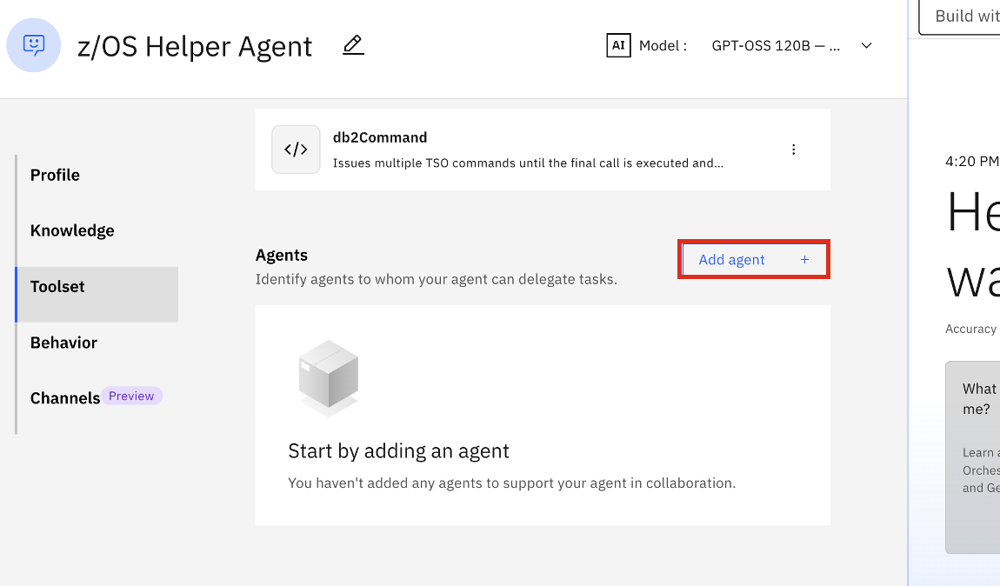
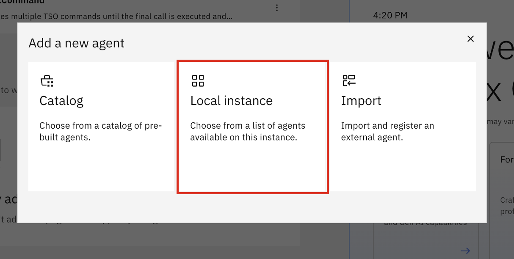
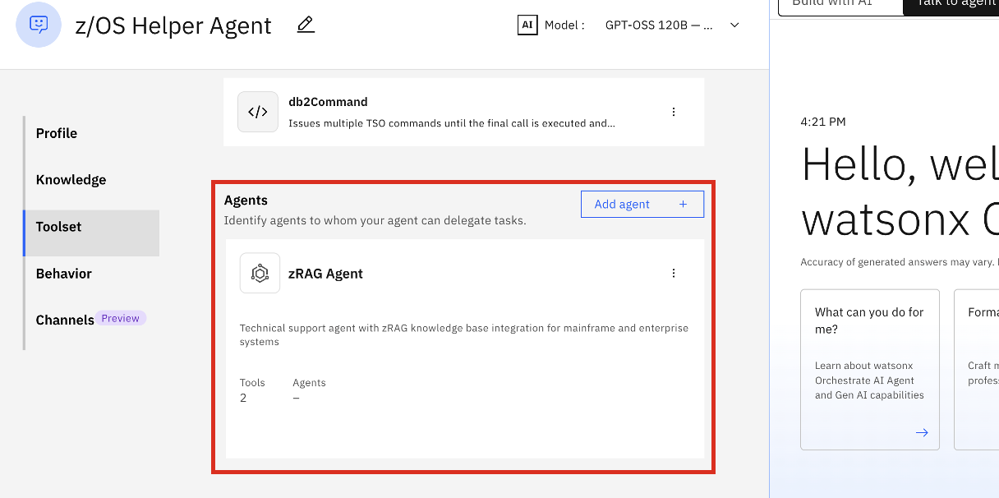
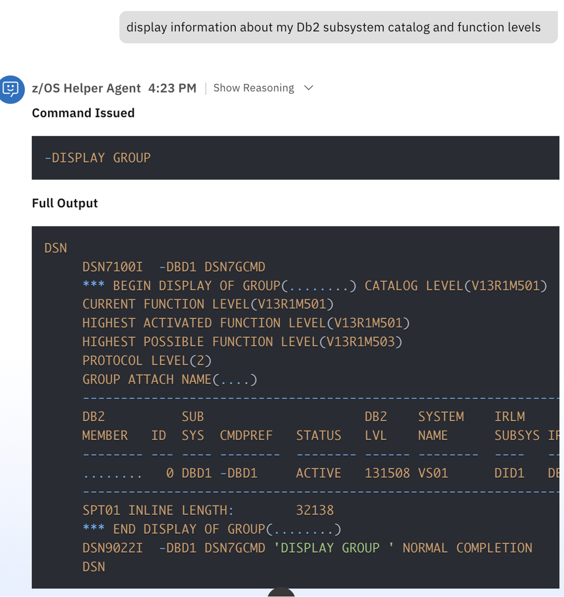
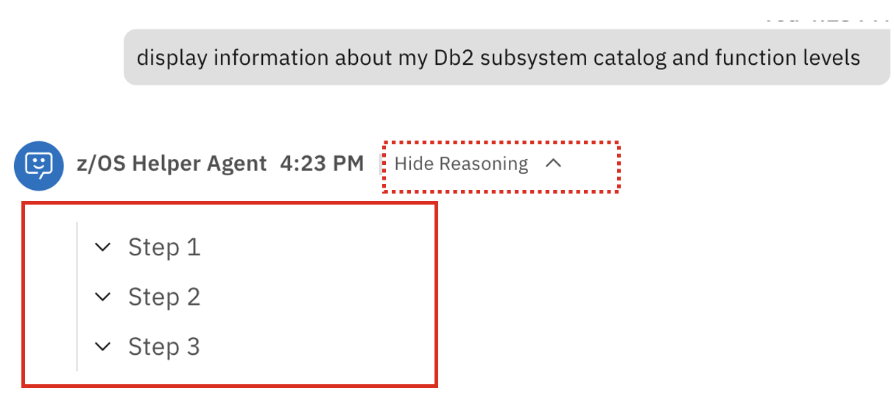
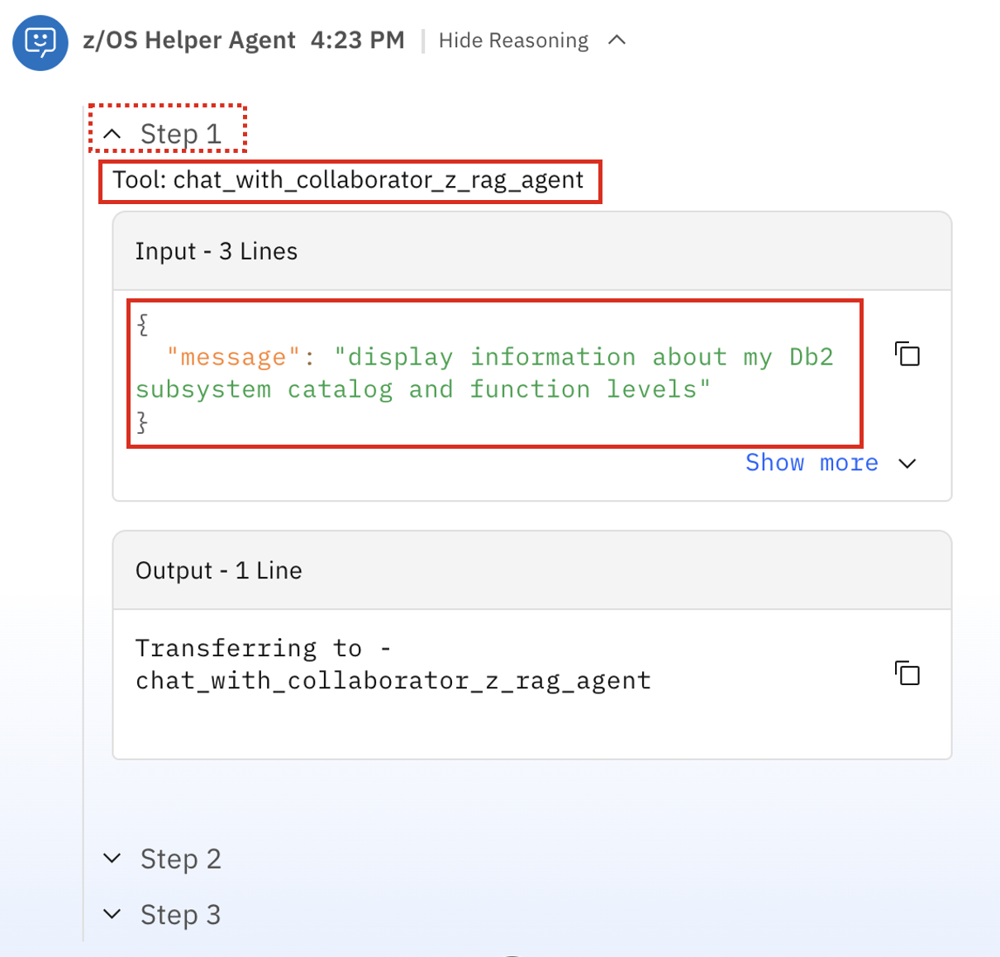
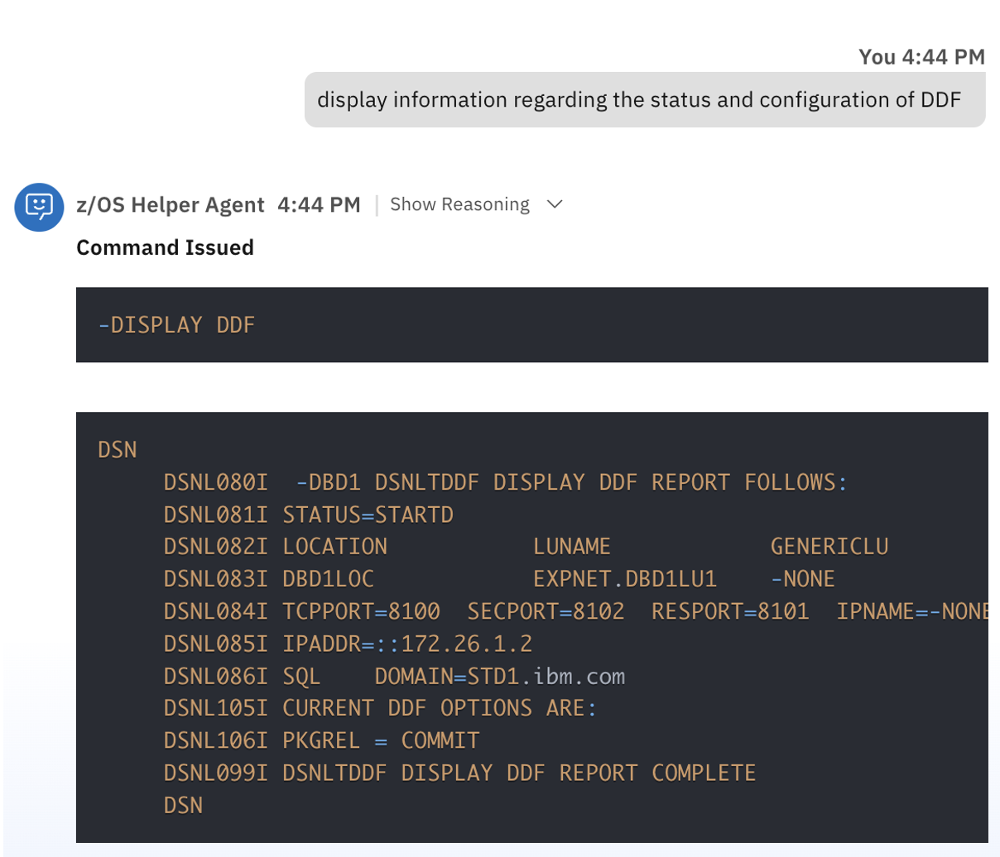

### Enabling `zRAG Agent` collaboration

In the previous sub-section, you successfully tested the execution and behavior of your tool using a hard-coded Db2 for z/OS command. 

Now you will enable a workflow where the user can tell the agent what information they'd like to view, and then the agent will retrieve the relevant command to then pass to the tool as input. To accomplish this, you will be leveraging the `zRAG Agent` for agent collaboration. The zRAG Agent is one of the **pre-built Agents supported with watsonx Assistant for Z.**

**For the purpose of this lab, the zRAG Agent was already deployed to your environment.**


1. In the **Agents** section of the Agent builder screen, click **Add agent**. 

    {width=50%}

2. Then select **Local instance** as you already deployed your **zRAG Agent**. 

    {width=50%}


3. From the list, select the **zRAG Agent** and click **Add to agent**. 

    {width=50%}


4. Once done, you should now see your **zRAG Agent** added as a collaborator to your **z/OS Helper Agent**. 


    {width=50%}

5. Next, scroll back down to the **Instructions** text field, and modify the instructions. 

    In your existing instructions, the last section you had previously added was:

    ```
    When the user asks to "get db2 details", use the "db2Command" tool, passing the "-DISPLAY GROUP" command as input. Then return the full output back to the user. 
    ``` 

    This was used to hard-code the input command to the tool. Instead, **replace that section with the following**:

    ```
    If the user asks to get or display information about Db2, call the "zRAG Agent" collaborator agent, passing the user's exact query to the agent. Wait until the zRAG Agent finishes generating a response, then return the exact response back to the user. Then extract the relevant command from the output and display it back to the user. Ensure that every Db2 command begins with "-", i.e. "-DISPLAY GROUP". THEN, pass that command as input to the "db2Command" tool. Wait until the full output is returned, then return the full output back to the user in a pretty, structured, line-by-line format. DISPLAY THE OUTPUT EXACTLY AS THE TOOL RETURNS IT WITH LINE BREAKS.    
    ```

    Now, the full set of agent **Instructions** should look like the following:

    ```
    You are going to run various Db2 for z/OS commands using the tools you have available to issue DISPLAY commands via TSO/E REST API’s and return the command output back to the user. You will print out to the user what command you’re issuing and the full output of the command in a pretty format. ALWAYS INCLUDE THE FULL OUTPUT OF EACH COMMAND. 

    DO NOT GUESS. DO NOT SPECULATE. ONLY USE THE INFORMATION RETURNED FROM RUNNING YOUR TOOLS

    If the user asks to get or display information about Db2, call the "zRAG Agent" collaborator agent, passing the user's exact query to the agent. Wait until the zRAG Agent finishes generating a response, then return the exact response back to the user. Then extract the relevant command from the output and display it back to the user. Ensure that every Db2 command begins with "-", i.e. "-DISPLAY GROUP". THEN, pass that command as input to the "db2Command" tool. Wait until the full output is returned, then return the full output back to the user in a pretty, structured, line-by-line format. DISPLAY THE OUTPUT EXACTLY AS THE TOOL RETURNS IT WITH LINE BREAKS.    
    ```

    These new set of **Instructions** will enable dynamic command input mapping. The tool execution would follow the below flow:

    - The user asks the **z/OS Helper Agent** to display certain information from the Db2 for z/OS subsystem.
    - The Agent then retrieves the relevant command by routing the query to the **zRAG Agent**.
    - The **zRAG Agent** then uses it's available tools to search the back-end watsonx Assistant for Z RAG documentation and return a response including the relevant command the user inquired about. 
    - Once the command is determined, the **z/OS Helper Agent** will pass that command as input to the **db2Command** tool to execute the command via the **DSN TSO/E** interface. 
    - Full output is returned back to the end-user. 

6. Now, test the new flow by click on the Agent Chat in the right-side of the screen and prompt the agent. 
   
    Previously, you had hard-coded the `-DISPLAY GROUP` command as input to the tool. Now let's see what happens if we instead tell the agent what we want to retrieve and allow it to determine the command on its own. 

    Prompt the agent with the following query:
    ```
    display information about my Db2 subsystem catalog and function levels 
    ```

    {width=50%}
    
    **NOTE:** You may need to restart the conversation....

7. View the full output of the response. 
   
    {width=50%}
    

    Notice the command that was issued and the full response - it should be similar to the previous query when "-DISPLAY GROUP" was hard-coded. 

8. At the top of the response, click on **Show reasoning**. 
   
    You should see that there were three steps executed:

    {width=50%}

    
    **Step 1:** Expanding Step 1, you should see the following:

    {width=50%}


    The **z/OS Helper Agent** first sent the user's query to it's collaborator agent (**zRAG Agent**).

    **Step 2:** The **zRAG Agent** then invoked its **zrag_retriever** tool with the same query in order to search the zRAG database for the relevant information and return the corresponding Db2 for z/OS command. 

    {width=50%}


    **Step 3:** The retrieved command is then passed as input to the **db2Command** tool to execute the same exact command as you previously hard-coded. 

    {width=50%}


    Then the output of the command is returned back to the user. 
9. Lets test some more example queries. 
    
     Now, prompt the agent with the following:

    ```
    display all my Db2 for z/OS bufferpools
    ```
   
    Once the full query is completed, you should see something like the following:

    {width=50%}

    We can see that the retrieved command was `-DISPLAY BUFFERPOOL` and the output is returned. 

    Similarly to before, expand the **Show reasoning** steps to review the flow.

10. Test another agent prompt:
    
    ```
    Display all defined databases
    ```

    The output should look similar to what's shown below:

    {width=50%}

    For that query, the agent determined that the `-DISPLAY DATABASE(*)` command was the appropriate command to use.

11. Lastly, test the following prompt:
    
    ```
    display information regarding the status and configuration of DDF
    ```

    The output should look similar to what's shown below:

    {width=50%}

    For that query, the agent determined that the `-DISPLAY DDF` command was the appropriate command to use. 

***Congratulations! You've successfully set up an agent collaboration use case and tested it. If time allows, continue testing other types of queries or altering the instructions***. 
