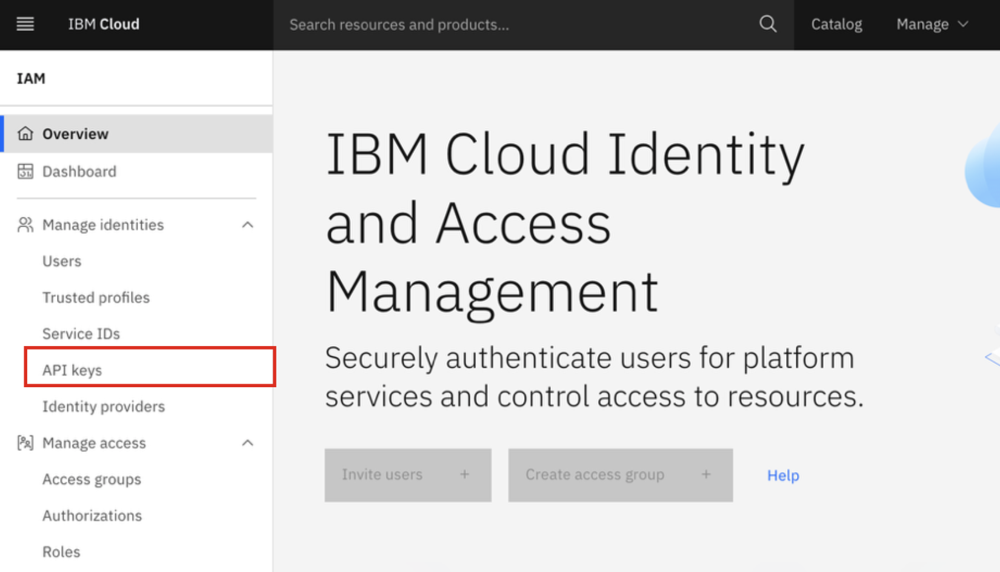
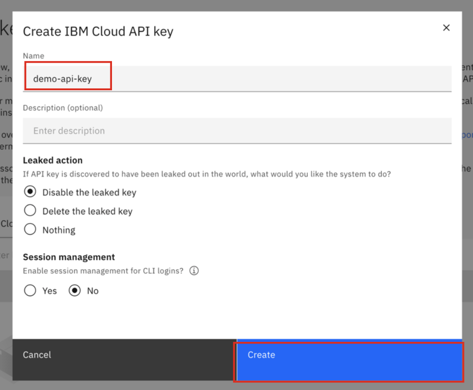
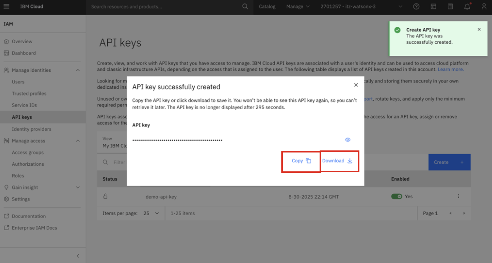
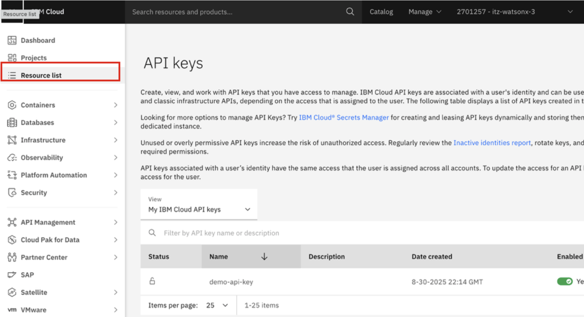
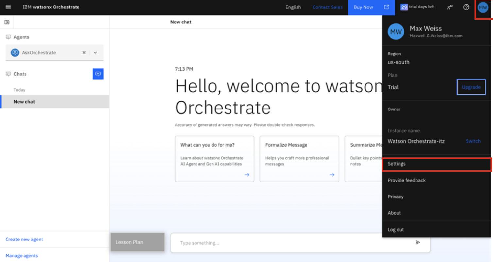

# Logging into watsonx Orchestrate and retrieving connection details

In order to log into the ADK environment, you will need two environment details that you will locate and record in this section:

  - **WxO Service Instance URL**
  - **IBM Cloud API Key**

1. Click on the **Student URL** provided by the instructor for the **watsonx Orchestrate** environment and when prompted, enter the password. 

2. Once done, you should be taken to the environment details page for your **watsonx Orchestrate** environment.

3. As you will use **Student ID's** for accessing your cloud resource, firstly click on the **logout URL** referenced on the page:
    
    {width=50%}

    A pop-up window will open confirming you're logged out. You can then close that tab.

4. Navigate back to the environment details page, and record the **App ID User credentials** towards the bottom of the page. (Copy your **Username** and **Password** to a local notepad for reference). For example:
   
    {width=50%}

    In the above example, my Username would be `student0@techzone.ibm.com` and my Password would be `V14u8#CrmWittakd`. 

5. Then under the **App ID Instructions**, click on the `https://cloud.ibm.com/authorize/...` link in your environment details:
   
    {width=50%}

6. In the new tab, enter your recorded **Username** and **Password**, then click **Sign in**. 
   
    {width=50%}

7. Once logged in, generate a new IBM Cloud **API Key** by clicking on **Manage** --> **Access(IAM)** in the upper right hand corner. 
   
    {width=50%}

8. Once the appropriate Cloud account is selected from the drop-down, generate a new IBM Cloud **API Key** by clicking on **Manage** --> **Access(IAM)** in the upper right hand corner. 
   
    {width=50%}

9. In the **IAM** settings page, select **API keys** from the left-hand menu.
   
    {width=50%}

10. In the **API keys** screen, click on **Create +**. 

    {width=50%}

11. Enter any **Name** for your API Key and click **Create**.

    {width=50%}

12. You’ll then see a window appear ***“API key successfully created”***

    **IMPORTANT**: Make sure to **Download** and **Copy** your API key (this can only be retrieved once).

    {width=50%}

    **Copy and record your API key value in a local notepad on your workstation for later use. This will later be referenced in your agents configuration as a shared secret.**

13. Next you will retrieve and record your watsonx Orchestrate **Service Instance URL**. 
     
    After generating your API key within IBM Cloud in the previous section, click on the ‘hamburger’ menu icon in the top-left corner of the IBM Cloud window and select **Resource list**. 

    {width=50%}

14. Expand the **AI / Machine Learning** section and you should see the following resources available:
   
    {width=50%}

15. Click on the resource shown for the **watsonx Orchestrate** resource: 
    
    {width=50%}

16. Click **Launch watsonx Orchestrate**. 

    {width=50%}

17. In the watsonx Orchestrate UI, click on you **profile icon** in the top-right corner and then **Settings**.

    {width=50%}

16. In the Settings page, click on the **API details** tab, then **copy and record** your **Service instance URL** to a local notepad for later use.

    {width=50%}

    Once recorded, you can minimize the window to come back to later. 