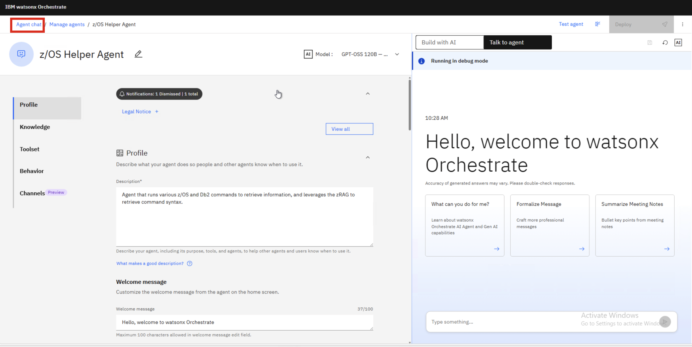
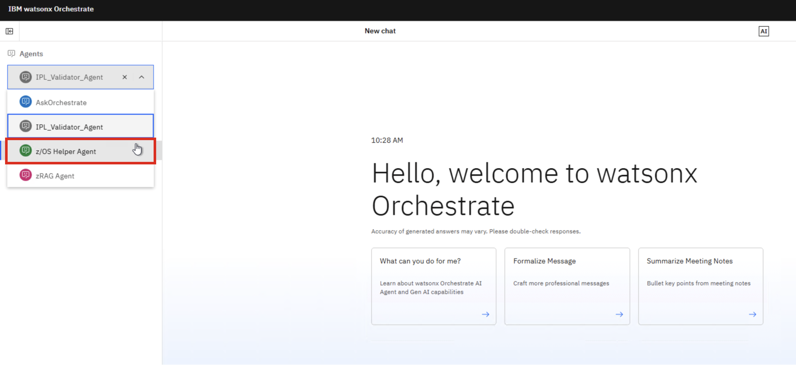
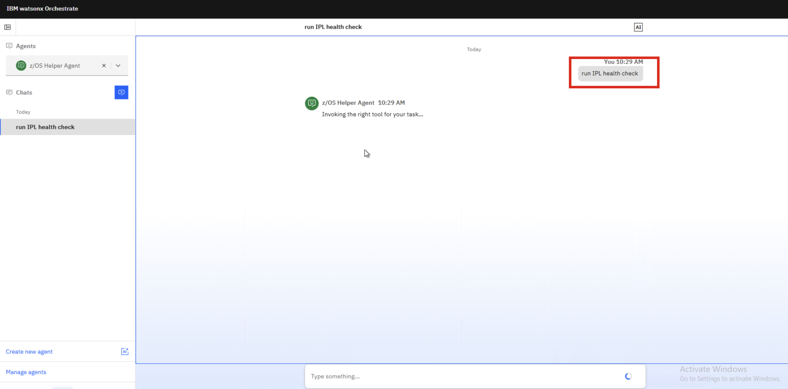

# Test the finalized `z/OS Helper Agent`

If all else went smoothly, you can now test your finalized `z/OS Helper Agent` via the **Agent Chat** view of watsonx Orchestrate. 

To access the Chat UI:

1. Click on the **Agent chat** option in the top-left corner of the Agent Editor page:
   
    

2. In the **Agents** drop-down, select your `z/OS Helper Agent` to open up the chat. 

    

3. Test the agent by prompting it with any of the examples previously mentioned and confirm it's functioning as expected. 
   
    

    *Once done, the lab is completed and you can close out of the environment window.*

